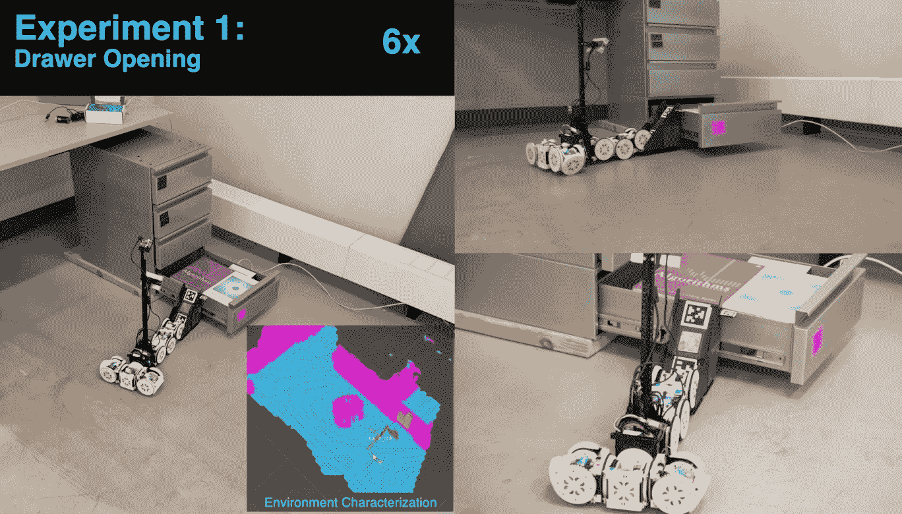

# 观看一个努力工作的机器人即兴爬抽屉和穿过缝隙

> 原文：<https://web.archive.org/web/https://techcrunch.com/2018/05/31/watch-a-hard-working-robot-improvise-to-climb-drawers-and-cross-gaps/>

机器人必须知道自己的局限性。但这并不意味着它必须接受它们。特别是这一个使用工具来扩展它的能力，征用附近的项目来建造坡道和桥梁。这看起来令人满意，但当然，也有点令人担忧。

康奈尔大学和宾夕法尼亚大学的这项研究本质上是让机器人评估周围环境，并识别出它可以用来完成它知道自己无法完成的任务的东西。它实际上更像是一个机器人团队，因为各个部分可以相互分离，独立完成任务。但你不是来这里辩论模块化机器人系统的多样性或统一性的！这是给参加 IEEE 机器人和自动化国际会议的人们的，这篇论文就是在那里发表的(并且 [Spectrum 第一次看到了](https://web.archive.org/web/20230224135636/https://spectrum.ieee.org/automaton/robotics/artificial-intelligence/simple-robots-perform-complex-tasks-with-environmental-modifications))。

SMORES-EP 是这里的机器人，研究人员赋予了它特定的知识广度。它知道如何在环境中导航，也知道如何用它的小主摄像头检查环境，并从检查中获得有意义的数据，如物体是否可以滚动，或者是否可以跨越缺口。

它还知道如何与某些物体互动，以及它们做什么；例如，它可以使用内置的磁铁拉开抽屉，它知道斜坡可以用来卷起给定高度或更低的物体。

一个高层次的规划系统基于对任何单个部件来说都不重要的知识来指导机器人/机器人部件。例如，给定找出抽屉里有什么的指令，计划者知道要完成它，抽屉需要打开；为了打开它，一个磁铁机器人必须从这个或那个角度附着在它上面，等等。如果其他东西是必要的，例如一个斜坡，它也会指示放置它。

本视频中显示的实验让机器人系统演示了在机器人必须使用这一有限但惊人复杂的知识体系来完成高水平任务的情况下，这一点如何发挥作用。

在视频中，机器人被告知检查抽屉中的某些物品。在第一个抽屉中，目标对象不存在，所以它必须向上检查下一个。但是它太高了——所以它需要放在第一个抽屉的上面，幸运的是，这个抽屉装满了书，构成了一个壁架。规划者看到附近有一个斜坡块，并命令将其放置到位，然后机器人的一部分分离，爬上并打开抽屉，而另一部分机动到位，检查内容。发现目标！

在下一个任务中，它必须穿过两张桌子之间的缝隙。幸运的是，有人留下了一座桥的部分。机器人将桥梁组装起来，在检查现场后将其放置到位，并将其向前半滚向目标。

这些案例可能看起来很有戏剧性，但这不是关于机器人本身，也不是关于它判断什么是一座好桥的能力。那是以后的事。这个想法是创建一个基于真实世界数据的逻辑上接近真实世界情况的系统，并使用真实世界的对象来解决它们。能够从零开始建造一座桥是很好的，但是除非你知道桥是用来做什么的，什么时候和如何使用，应该把它带到哪里，如何越过它，等等，否则它只是整体中的一部分。

同样，许多有着非常好的抽屉拉手的机器人不知道你需要打开一个抽屉才能知道里面有什么，或者如果第一个抽屉没有你要找的东西，也许你应该检查一下其他抽屉！

这种基本的问题解决是我们理所当然的事情，但当涉及到机器人大脑时，没有什么是理所当然的。即使在上述实验中，机器人在试图完成其目标时也因多种原因多次失败。没关系——我们都有改进的空间。