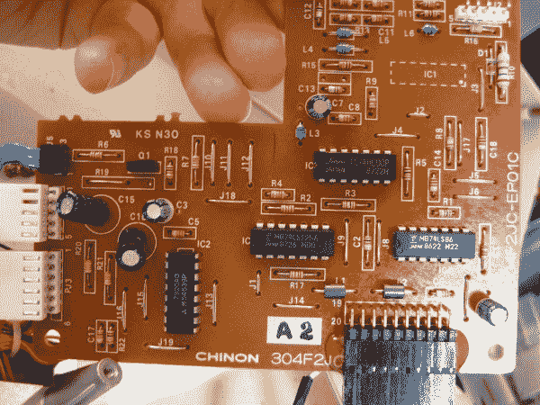

# 观看苹果 IIc 引导超过 20 年后，它最后一次关闭 

> 原文：<https://web.archive.org/web/https://techcrunch.com/2016/01/11/watch-an-apple-iigs-boot-over-20-years-after-it-was-last-turned-off/>

# 观看苹果 IIc 引导超过 20 年后，它最后一次被关闭

【YouTube = https://www . YouTube . com/watch？v=Cx43GEkz2Zs#action=share]

数字考古是我最喜欢的博客形式之一。一个来自 198X 的狂热 X 用户复活了一个旧系统，他或她曾用这个系统创造了一些令人惊奇的东西/建立了一个企业/写了一个游戏/或者进行了一般性的修改。由此产生的材料——照片、视频和评论——是无价的。

Quinn Dunki 发布了她在她妈妈的地下室找到的苹果 IIc 和一系列磁盘的惊人外观。通过拆开她的旧软盘驱动器，然后使用一些现代和旧的工具启动 IIgs，她能够复活，正如她所说，“一小撮磁性比特在我妈妈的地下室里存活了 30 年，准备回来提醒我有多喜欢这个游戏。”

最可悲的是，如今没有什么东西像他们设计的 80 年代的硬件一样。黄铜支架、手工焊接的连接器和布局精美的可修复电路板使这种硬件成为计算机世界的殖民地家具:精心打造，注重效率和美观。

看看这个公告板:

【T2

邓基写道:

这是通孔电子的光辉岁月，就在这里。单层板！跳投、跳水和头球，天啊。你可以用无线电小屋架子上的东西修理这块板的任何部分。当收音机小屋卖收音机的时候。回到夏克电台存在的时候。

最精彩的部分？当邓奇终于启动了这个东西，并展示了一些非常好的 1986 年的老式图形。就像是时隔快 30 年又见到了老朋友。