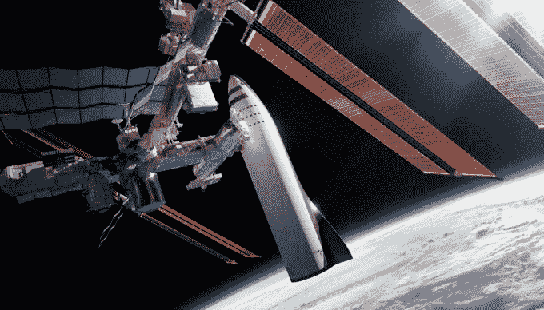

# 观看 Elon Musk 的主题演讲，他在演讲中宣布了 SpaceX 的新火箭和火星殖民 

> 原文：<https://web.archive.org/web/https://techcrunch.com/2017/09/29/watch-elon-musks-keynote-where-he-announced-spacexs-new-rocket-and-mars-colonization/>

# 观看 Elon Musk 的主题演讲，他在演讲中宣布了 SpaceX 的新火箭和火星殖民

[https://web.archive.org/web/20221208212702if_/https://www.youtube.com/embed/S5V7R_se1Xc?feature=oembed](https://web.archive.org/web/20221208212702if_/https://www.youtube.com/embed/S5V7R_se1Xc?feature=oembed)

视频

埃隆·马斯克昨天在澳大利亚阿德莱德举行的国际航空大会上发表了主题演讲。在上面嵌入的 43 分钟的讲话中，马斯克展示了 SpaceX 的未来，包括殖民火星和建造一枚火箭来统治所有人。

这个演讲棒极了。埃隆就是埃隆，他透露了关于 SpaceX 未来计划的无数细节。这就是他在某些圈子里出名的原因。无论是在推特上还是在采访中，他都不会退缩。与其他硅谷公司不同，他似乎对更少的细节保密，更愿意谈论他的公司正在建设的东西。

【T2

## 埃隆·马斯克的 IAC 演讲公告

【图库 ids="1548946，1548938，1548937，1548936，1548935，1548934，1548932，1548931，1548930，1548929，1548928，1548927，1548926，1548910，1548910