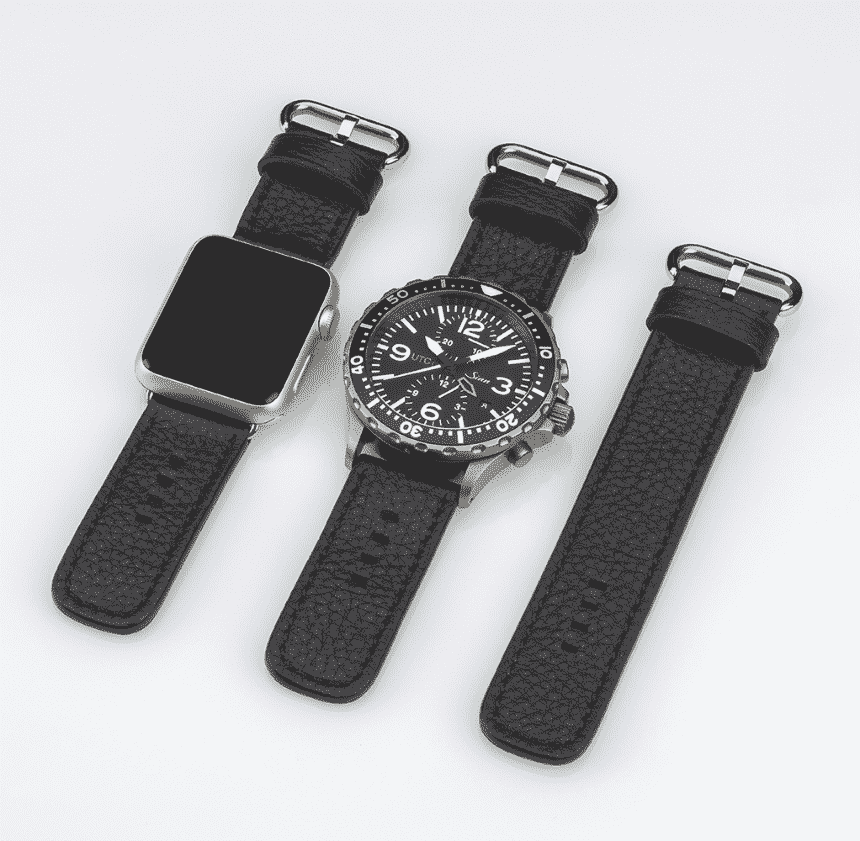

# 手表制造商 Sinn 因混合机械/苹果手表带 TechCrunch 而失去理智

> 原文：<https://web.archive.org/web/https://techcrunch.com/2016/08/15/watch-manufacturer-sinn-loses-its-mind-with-a-hybrid-mechanicalapple-watch-band/>

# 手表制造商 Sinn 因混合机械/苹果手表带而失去理智

随着我们接近即将到来的机械表启示录，奇怪的事情将开始发生。狗和猫应该生活在一起。心爱的手表品牌
[会无缘无故地互相购买](https://web.archive.org/web/20221219155923/http://www.ablogtowatch.com/invicta-acquires-glycine-watches/)。传奇和历史悠久的制表师将屈从于库比蒂诺的意志。

看，然后是第一个骑手:它被称为
[Sinn 双带系统](https://web.archive.org/web/20221219155923/http://www.ablogtowatch.com/sinn-dual-strap-system-apple-watch/)，它由两半带组成。一面是一款漂亮的 Sinn 计时手表—
[Sinn](https://web.archive.org/web/20221219155923/http://www.sinn.de/en/)是一个以其双色飞行员手表而闻名的古老手表品牌，另一面是一款漂亮的 Apple Watch。由此产生的弗兰肯斯坦怪物看起来要么是一个错误，要么是等待发生的事故。

我明白了。真的。Sinn 需要为它的粉丝群提供一些新奇的东西，这似乎是一个和我见过的其他
[janky 智能手表附件](https://web.archive.org/web/20221219155923/https://www.google.com/search?client=safari&rls=en&q=smart+strap+site:beta.techcrunch.com&ie=UTF-8&oe=UTF-8)一样好的主意。但是，如果这看起来不那么愚蠢和危险，那就见鬼去吧。

我最担心的是，其中一只手表——大概就是你戴在手腕内侧的那只——会在漫游广阔的世界时被拍打几次。这整件事看起来就越愚蠢，你会根据情况改变手表的想法是可笑的。如果你这么喜欢你的苹果手表，就戴着它吧。如果你爱你的 Sinn，穿上它。哪个慌乱的手表佩戴者不能决定，而是选择二合一？

此外，不带 Sinn 手表的表带价格为 120 美元(再加几千美元)，不带 Sinn 手表的表带价格为 210 美元。辛恩建议，这支乐队让你生活在两个世界，就像普通人通过鲻鱼获得奢侈的通行证一样。

【YouTube = https://www . YouTube . com/watch？v=z64_-_tWmvo]

我会穿 Sinn。我会戴苹果手表。但两者都在两条粗短的带子上？我宁愿经历天启，看劳力士被化石收购。