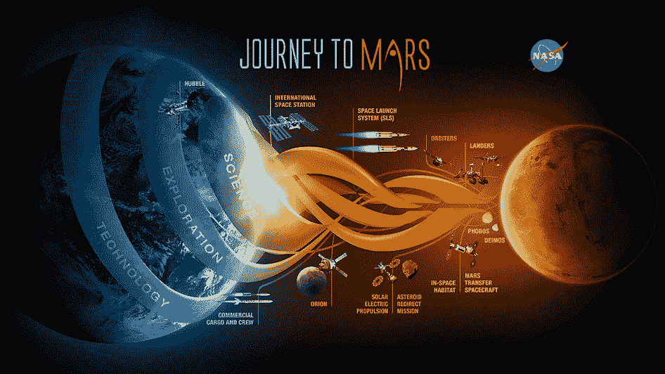

# 观看 NASA 关于载人火星任务进展和猎户座试飞的现场简报 

> 原文：<https://web.archive.org/web/https://techcrunch.com/2014/12/02/watch-nasas-live-briefing-on-manned-mars-mission-progress-and-orion-testflight/>

# 观看美国宇航局关于载人火星任务进展和猎户座试飞的现场简报

[ustream id = 6540154 live = 1 HW Accel = 1 version = 3 width = 680 height = 415]

在 Ustream 上直播流媒体视频

美国国家航空航天局(NASA)正在为其载人火星任务做准备，关键的一步将是周四向距离地球 3600 英里的目的地发射猎户座太空舱，为这次初步试运行装载传感器而不是人。测试发射将在未来使用美国宇航局的重型太空发射系统，但这次试运行将使用现有的德尔塔四重型火箭，从周四上午 7 点 05 分开始，如果一切按计划进行。

这只是实现载人火星之旅的整个轨迹中非常早期的一步 SLS 系统正在准备在未来十年的某个时候首先将人类送往目的地，如深空小行星，最终在稍后的某个日期到达火星。

请在美国东部时间中午 12 点收听上面的视频，了解更多关于美国宇航局本周的任务，以及与载人火星任务相关的更大目标和到达那里所需的技术。

