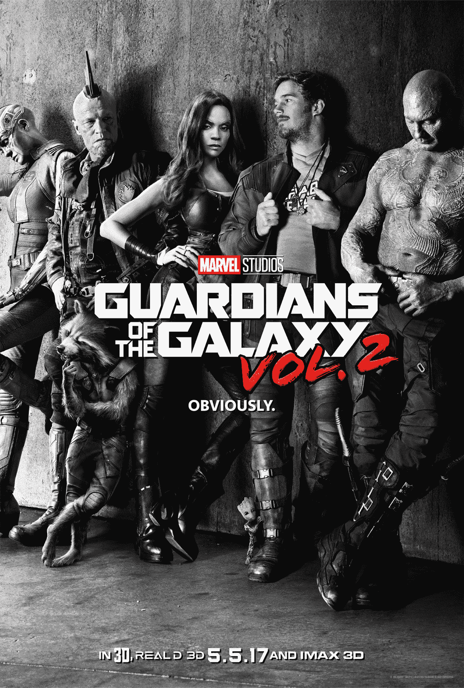

# 观看漫威《银河护卫队》第二卷的第一个预告片 

> 原文：<https://web.archive.org/web/https://techcrunch.com/2016/10/19/watch-the-first-teaser-for-marvels-guardians-of-the-galaxy-vol-2/>

# 观看漫威的银河护卫队第二卷的第一个预告片

【YouTube https://www.youtube.com/watch?v=sD9NVxYRrZs&w=680]

太空不是漫威宇宙中最友好的地方，但至少彼得·奎尔(又名星际领主)和德拉斯拥有彼此。两人在漫威为《银河护卫队》第二卷制作的第一个视频预告中分享了一个时刻，该片将于 2017 年 5 月 5 日上映。

预告片还提供了其余成员的简要介绍，包括 Yondu 和 Nebula，以及 Gamora，Rocket，甚至还有一个可爱的仍在发展中的格鲁特。预告片的第一部分让我们看起来可以期待一些严肃的动作，而第二部分表明我们可以肯定第一部的幽默将会大量出现在这里。

漫威还展示了一张全新的黑白海报，你可以在下面看到。

【T2