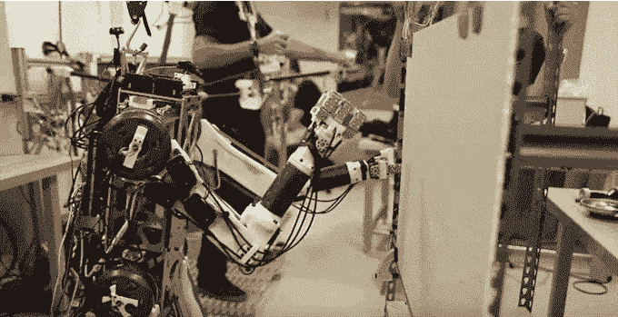

# 观看这个由人类控制的机器人压碎罐子并刺穿干墙 

> 原文：<https://web.archive.org/web/https://techcrunch.com/2015/08/07/watch-this-human-controlled-robot-crush-cans-and-punch-through-drywall/>

# 观看这个由人类控制的机器人粉碎罐头和打穿干墙

“我喜欢考虑这个项目的方式是，我们试图将人类的大脑植入机器人体内”

别担心:这并不像听起来那么像科技恐怖电影。

我们越来越接近可以自己漫游的机器人。DARPA 的 [Atlas 机器人](https://web.archive.org/web/20230207060809/https://techcrunch.com/2015/01/20/darpas-incredible-humanoid-robot-can-now-walk-on-its-own-two-feet-no-support-required/)正在爬楼梯、开门；谷歌的小狗跑来跑去，跳过小障碍，大概还记得每一个试图把它踢过的人的名字，以便以后消灭他们。

即使我们已经解决了制造这些机器人的机械/动力障碍，我们还有几年(几十年？)的人工智能工作，然后他们将能够做更多超出特定的、预先确定的任务。

与此同时:如果机器人不能完全独立行动，而是像木偶一样化身为远程人类来控制呢？

这是一个经典的科幻概念，也是麻省理工学院机器人背后的核心理念。

这是一个两部分的公式:一端，你有机器人；它比大多数人类都强壮，能够捡起物体，并且非常乐意跑进燃烧的大楼。另一方面，你有一个穿着外骨骼风格服装的人，可以捕捉他们的动作，还有一副护目镜，可以反射机器人看到的任何东西。

还记得《环太平洋》里的杰格一家吗？就像那样，除了，你知道，没有摩天大楼那么大。

建造一个由远程服装控制的机器人已经足够酷了，但这一个有一个惊人的额外技巧:倾斜和推挤等感觉通过力反馈从机器人传输回人类操作员，允许人类操作员帮助机器人保持平衡。

当然，目前它仅限于穿透干墙和压碎罐头——但很难想象在我们的有生之年，像这样的机器人会把人从燃烧的建筑物中救出，它们的操作者会在建筑物外摇动外骨骼钻机。

通过 [Gizmodo](https://web.archive.org/web/20230207060809/http://gizmodo.com/a-human-master-gives-this-robot-perfect-balance-and-lig-1722744764?utm_source=feedburner&utm_medium=feed&utm_campaign=Feed%3A+gizmodo%2Ffull+%28Gizmodo%29) 在 Youtube 上的[麻省理工学院](https://web.archive.org/web/20230207060809/https://www.youtube.com/watch?t=72&v=2-5n2IsdCqU)