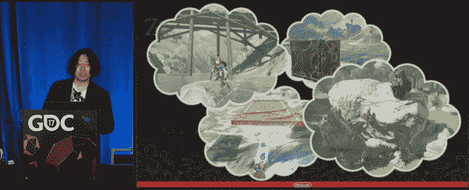

# 观看塞尔达的导演深入创作杰作《野性的呼吸》

> 原文：<https://web.archive.org/web/https://techcrunch.com/2017/03/10/watch-zeldas-directors-go-deep-on-creating-the-masterpiece-that-is-breath-of-the-wild/>

# 观看塞尔达的导演深入创作杰作《野性的呼吸》

最新的塞尔达游戏《荒野之息》是——我这么说并没有夸张的意思——一个即时的杰作。我不会称之为*有史以来最好的游戏*——但如果这样的称号可以客观存在，这款游戏肯定是在竞争中。

很少看到像这样的东西进入这个世界，并如此迅速和广泛地得到认可；更难得的是，当这款游戏发布时，它的创作者对创作过程*进行了深刻的反思。但这正是几周前在一次游戏开发者大会上发生的事情，会议的完整视频现在已经在网上了。如果你喜欢 BotW，这是一个非常好的周末手表。*

(值得注意的是:除非你完成了游戏的大部分，否则我不会看这个游戏。《野性的呼吸》之所以如此壮观，很大程度上是因为测试这款新 Hyrule 的极限带来的无尽发现感；不断的“哦，伙计，如果我能…，那该多好啊”，却发现，嗯，可以。这拉开了帷幕。)