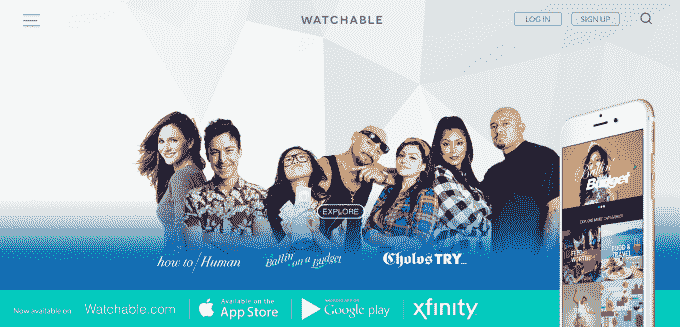

# Comcast 的脐带切割应用 Watchable 增加了原创系列 

> 原文：<https://web.archive.org/web/https://techcrunch.com/2016/08/23/watchable-comcasts-app-for-cord-cutters-adds-original-series/>

康卡斯特去年秋天加入了削减开支的竞争，推出了在线和移动流媒体服务[watcheable](https://web.archive.org/web/20230130230418/http://watchable.com/)的，该服务提供了来自 vice 和 Vox 等热门网站的各种视频，旨在吸引越来越多选择放弃付费有线电视的年轻用户。然而，它的大部分内容可以在网上其他地方找到，而且没有真正令人信服的理由来使用这款可观看的应用程序。现在，该公司希望通过独家节目在[的首次亮相来改变这一局面，这将为 Watchable 的服务带来来自精选合作伙伴的原创系列。](https://web.archive.org/web/20230130230418/http://corporate.comcast.com/comcast-voices/introducing-watchable-exclusives-new-original-content-from-popular-digital-creators-premieres-today)

最初，Watchable 给人的印象更多的是吸引剪线者的实验，而不是认真的努力。尽管发布时有超过 30 家内容合作伙伴，但选择观看而不是 YouTube 或内容合作伙伴自己的网站是没有意义的。

事实上，Watchable 对内容合作伙伴的宣传甚至不是加入一个热门的新流媒体服务，而是它还将通过机顶盒集成向康卡斯特订户分发创作者的视频。《综艺》报道称，谷歌承诺他们将获得比一些竞争对手更大的视频广告收入分成——70%的广告收入流向了创作者。

此外，让事情变得更糟的是，康卡斯特同时投资了另一项针对脐带切割者的流媒体服务:[康卡斯特流媒体](https://web.archive.org/web/20230130230418/https://techcrunch.com/2015/07/13/comcast-debuts-stream-a-cable-tv-like-streaming-service-for-cord-cutters/)。

不出所料，这款可观看的应用还没有开始流行。它在 App Annie 的排行榜上没有排名，这意味着它甚至没有进入任何应用商店类别的前 1000 名。那是炸弹。然而，康卡斯特通过指出可观看的移动流量每月增加 40%来掩饰其下载量的缺乏，该应用程序的平均会话时间超过 30 分钟。

如今，康卡斯特正试图给人们一个真正使用 Watchable 的理由:独家内容。与当今市场上的其他流媒体服务一样——从亚马逊(Amazon)和网飞(Alibaba)等知名公司到其他地方看不到的节目——如果它们能够获得成功，可能会有很大的吸引力。

这就是为什么康卡斯特现在推出了“可观看的独家新闻”，这是一些顶级内容合作伙伴的原创系列，包括 Refinery29、mitú和 Cut.com。今年晚些时候，它表示将增加来自 BuzzFeed Motion Pictures、CollegeHumor、Cut.com、POPSUGAR 和 Studio 71 的更多原创系列。

然而，今天只有三部原版电影:《预算中的 Ballin》跟随喜剧演员兼说唱歌手奥卡菲娜，向她展示了如何通过预算过上奢华的生活来自米特的“Cholos Try”针对拉丁美洲人，扩大了其同名在线系列，将跟随来自东洛杉矶的 4 名 Cholos，他们沉浸在美国各地的文化和生活方式中；以及来自 Cut.com 的《如何做人》，这是一部讲述一个年轻女性生活起起落落的脚本喜剧。

即将到来的系列将包括化妆和美容教程，真人秀节目，游戏节目，以及其他针对年轻千年观众的节目。(新系列的完整细节在这里是)。

新内容今天在可观看的 iOS 和安卓应用程序上以及康卡斯特的 X1 机顶盒上直播。