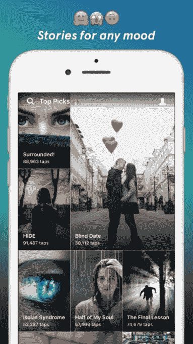
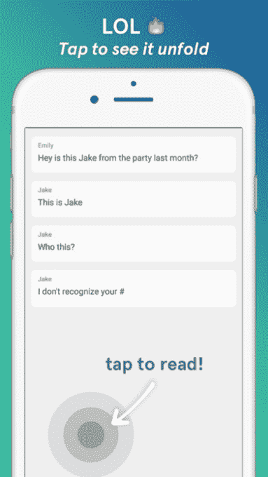

# Wattpad 首次推出 Tap，这是一款阅读聊天式短篇故事的应用程序 

> 原文：<https://web.archive.org/web/https://techcrunch.com/2017/02/22/wattpad-debuts-tap-an-app-for-reading-chat-style-short-stories/>

今天发布的一款名为 [Tap](https://web.archive.org/web/20230213084344/https://www.taptaptap.co/) 的新手机应用引入了一种不同的手机阅读方式:类似短信的聊天。这款应用是来自 [Wattpad](https://web.archive.org/web/20230213084344/https://techcrunch.com/tag/wattpad/) 的最新产品，这是一个面向作者的社交出版平台，其社区目前在全球拥有超过 4500 万读者，他们访问其网站或其旗舰移动应用，阅读其近 2.5 亿篇故事。

有了 Tap，Wattpad 正在摆脱传统的讲故事模式，尝试一种独特的娱乐方式

该应用程序让用户发现“聊天式”的故事——也就是说，当你点击以揭示下一部分时，那些故事就会展开。该公司解释说，这些故事旨在让你感觉像是在阅读别人的聊天对话，它们甚至以短信风格的格式呈现在视觉上。

在推出时，有数百个故事可供选择，包括恐怖、爱情、戏剧等类别。

Tap 还将允许 Wattpad 用户撰写自己的故事，尽管这最初只对平台上的一部分作者开放。该公司表示，写作和出版功能将在未来几周内更广泛地推出。

除了阅读聊天式的故事，用户还可以将故事分享到社交网络。

这一推出代表了 Wattpad 为其社交故事平台创收的另一种方式，因为 Tap 是一种免费增值服务。虽然这款应用本身是免费的，精选的一些故事也是免费的，但它也包括升级到高级服务的选项。在这里，用户将获得无限数量的故事，包括只提供给订户的独家故事。这项服务每周收费 2.99 美元，每月 7.99 美元，每年 39.99 美元。

最近几个月，Wattpad 一直在扩大与好莱坞和娱乐行业的关系，这要归功于与环球影业、T2、特纳、T4 漫画出版商和其他公司的合作。但 Tap 的订阅服务可以为该公司注入另一个更直接、更直接的收入来源。

如今，Tap 并不是唯一一个在这个领域运营的应用。它与其他类似[小说应用 Hooked、](https://web.archive.org/web/20230213084344/https://techcrunch.com/2016/04/07/hooked-2-0/)的应用竞争，后者提供聊天故事和写故事的方法。亚马逊还推出了一项名为 Amazon Rapids 的聊天式故事订阅服务，目标是孩子。更广泛地说，Tap 与其他移动阅读应用程序竞争，如 [Serial Box](https://web.archive.org/web/20230213084344/https://itunes.apple.com/app/serial-box-publishing/id988282641) 、 [Hardbound](https://web.archive.org/web/20230213084344/https://techcrunch.com/2016/11/30/hardbounds-app-uses-visual-stories-to-catch-you-up-on-the-days-news-and-more/) ，甚至是 Snapchat 这样的社交应用程序，Snapchat 也有自己的简短内容。

然而，Tap 的角度是它对聊天式格式的偷窥。每次点击不仅仅是获得故事的片段，感觉就像你拿到了别人的手机，正在阅读他们的个人短信。这可能会吸引十几岁或年轻的成年用户，他们花大量时间与移动设备上的内容进行交互，这也是他们今天社交生活的主要场所。

Tap 可以在 iTunes 和 T2 的 Google Play 上免费下载。