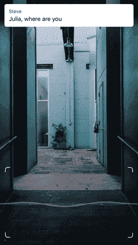

# Wattpad 推出 Tap Originals TechCrunch，让“聊天小说”超越文本

> 原文：<https://web.archive.org/web/https://techcrunch.com/2017/07/28/wattpad-takes-chat-fiction-beyond-text-with-launch-of-tap-originals/>

聊天小说应用[是 App Store](https://web.archive.org/web/20230213084452/https://techcrunch.com/2017/06/13/the-chat-fiction-apps-that-teens-go-crazy-for/) 中最受欢迎的应用之一，这要归功于他们高度参与的粉丝群，主要是青少年到年轻成年人，他们喜欢阅读以短信形式讲述的激动人心的故事。如今，这一领域的一个竞争对手 Wattpad 正在推出其聊天故事的升级版，以使其应用程序与众不同，并进一步吸引读者。该公司在其应用程序 [Tap by Wattpad](https://web.archive.org/web/20230213084452/https://www.taptaptap.co/) 中引入了一组名为“Tap Originals”的精选故事。这些故事超越了文本，整合了视频、声音、图像、语音笔记等媒体，甚至还有“自己选择结局”的功能。

如果你错过了聊天小说的热潮，你可能是一个成年人。这些应用程序在青少年中非常受欢迎——顶级应用程序 Hooked 表示[其应用程序已经被下载了 2000 万次](https://web.archive.org/web/20230213084452/http://www.cnbc.com/2017/05/21/hooked-app-horror-stories-in-text-messages.html)，例如，近 70%的读者年龄在 25 岁以下。

与此同时，Wattpad 的 [Tap 应用程序于 2 月份进入这个市场，](https://web.archive.org/web/20230213084452/https://techcrunch.com/2017/02/22/wattpad-debuts-tap-an-app-for-reading-chat-style-short-stories/)它与排名更高的应用程序 Hooked 和 Yarn 竞争，这两个应用程序现在分别是整个应用商店中排名第 79 和第 106 的免费应用程序。这两家公司还在图书类别中占据了第一和第三的位置，而 Wattpad 的 Tap 排名第九。

自首次亮相以来，Tap 的目录已经增加到 30 多万个故事，在美国以外的其他几个国家(包括英国、加拿大、澳大利亚和新西兰)的图书类别中排名前十。

它的聊天小说故事，就像这个领域的其他故事一样，远没有文学价值。但可以说，它们并不意味着取代阅读小说——它们只是一种新的娱乐形式。

Wattpad 拒绝分享其用户数量，但表示迄今为止已经记录了超过 20 亿次“点击”。(点击是您与故事互动以显示下一行文本的方式。)

随着 Tap Originals 的推出，Wattpad 正在与一些顶级作家合作，以委托的方式制作以这种新形式讲述的故事，包括悬疑、恐怖和戏剧等类型。这些故事也不会一次讲完。相反，每周都会发布新的一章来延续这一传奇——这使得 Tap Originals 看起来更像是电视剧集。

Tap Originals 的概念来源于这样一个事实，即我们使用手机以其他方式交流，而不仅仅是发短信。这意味着这些新故事可能会用一个视频打断他们基于文本的故事，这个视频显示了一个主要人物的 FaceTime 视频通话；或者他们可以播放语音消息，或者在来回的文本对话之间添加其他多媒体。

该应用本身及其故事是免费的，包括新的 Tap Originals，但它通过订阅赚钱。为了不受干扰地阅读，你可以按周(2.99 美元)、月(7.99 美元)或年(39.99 美元)付费。否则，故事会在扣人心弦的地方停顿下来，让你等着看接下来会发生什么。

在推出时，只有少数几个 Tap 原创标题可用，包括“新妻子”，其中一名男子收到他死去的妻子发来的脸书信息；《莫莉:归来》，延续了 Tap 早期关于一个失踪女孩的《莫莉》传奇；《隐藏:无路可逃》是一个流行的踢踏舞故事的续集，其中涉及到阁楼上发出的奇怪声音。

这些故事和其他 Tap 内容一样，有 10 多种语言版本，在 Tap iOS 和 Android 应用程序中都有。