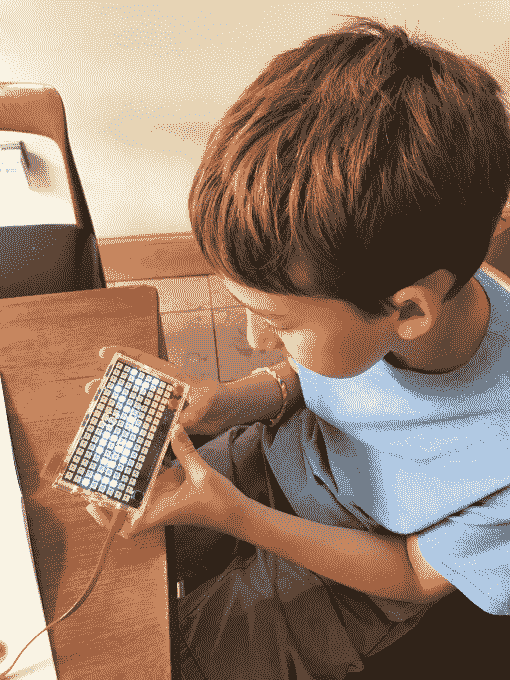
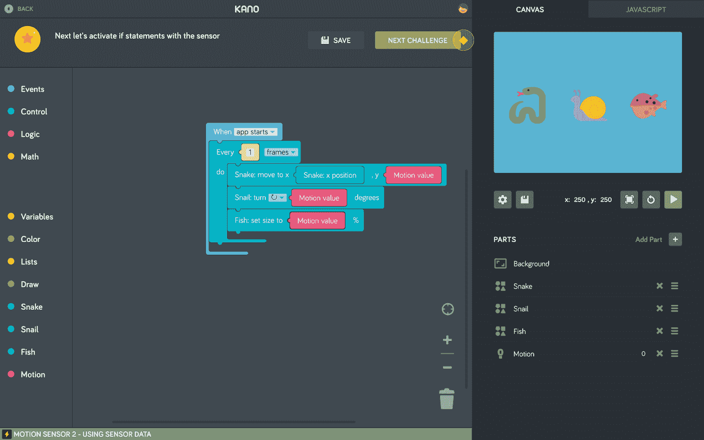
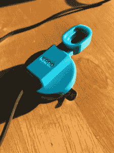
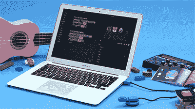

# 向 Kano 的最新代码学习工具——手势控制器——挥手问好

> 原文：<https://web.archive.org/web/https://techcrunch.com/2017/08/15/wave-hello-to-kanos-latest-learn-to-code-tool-a-gesture-controller/>

***作者注**:亚伯·欧文是英格丽九岁的儿子。这些大多是他的话；英格丽德只是帮他们打得快一点。*

我一直在使用电脑和互联网，我真的很喜欢它们。它们是现代生活的重要组成部分。知道它们是如何工作的非常酷。所以当我妈妈让我帮她评论一些 Kano 产品时，我就说，“好的！我们现在就做吧！”

[Kano](https://web.archive.org/web/20230322201030/http://kano.me/) ，如果你还不知道的话，是一家为儿童(和其他人)制造互动编码设备的公司，帮助他们学习更多的技术知识以及计算机和其他电子设备的工作原理。在过去的几周里，我看了两款不同的 Kano 设备，Pixel 套件和运动传感器套件。

我从 Pixel Kit 开始，这是一款手持 LED 灯板，[在 7 月份推出](https://web.archive.org/web/20230322201030/https://techcrunch.com/2017/07/12/the-pixel-kit-is-kanos-latest-product-to-get-your-kids-psyched-about-coding/)。

这非常令人兴奋，因为我正在使用一台真正的机器，用编码来控制它。我喜欢整个东西在盒子里的样子，我们必须把它组装起来，作为使用它的一部分。这让我想起了我爸爸和我玩的一种叫做快速电路的东西。

然后，当它被组装在一起时，你可以使用 Kano 应用程序将它与你的计算机连接起来。您创建一个帐户，然后您的套件和计算机连接。

我以前在学校用过 Scratch，这是一个在小屏幕上制作视频游戏的程序。这有点酷，因为有了 Pixel 工具包，你可以创建控制 Pixel 的 128 个 LED 灯的程序(他们称之为动画，用 Kano 自己的编码块或 JavaScript 制作)。我喜欢制作对声音有反应的灯光表演:鼓掌声或其他大声的噪音会给你带来光的爆发。他们棒极了(我妈妈说我不能一直写“酷”)。

我也按照卡诺的指示做了游戏。一个是关于一个寻找宝藏的英雄。你必须引导英雄找到宝藏。

还有一个加速度计，你可以连接它，让你创建游戏，你可以倾斜像素套件(它适合你的手)来移动灯光。Kano 设置了像任务一样的脚本供你学习，这有助于学习如何去做。我很确定我现在可以为 Pixel 创建自己的简单游戏，而不需要说明书。

几周后，我们为 Kano 系列增添了运动传感器套件。这是一个小型手势控制器，也可以与 Kano 应用程序配合使用。

你不需要 Pixel 套件来使用它。像 Pixel 一样，你可以在 Kano 应用程序上创建脚本。有了运动传感器，当你在运动传感器上挥手时，这些脚本让应用程序对你的动作做出响应。

我做的一个剧本是做一个“弹拨吉他”当你像弹奏吉他一样在运动传感器上挥动你的手时，在应用程序屏幕上你可以看到吉他弦随着你的运动而移动并发出声音。

你也可以制作一些对运动有反应的小图片，旋转的乌龟和上下摆动的蛇。还有其他像这样的:

和 Pixel 一样，你也可以制作游戏。我喜欢的一个游戏是“Pong”，它把我的手变成了乒乓球拍，然后我就可以玩电脑了。

我妈妈想让我也说说我不喜欢这两者的地方。我认为，为了改进 Pixel 工具包，如果有更广泛的事情可以做，也许可以有一种方法将三个以上的你自己的创作装到你的 Pixel 工具包中，这将是很好的。那会使它更令人兴奋。

它也有点脆弱，尤其是因为它是孩子们用的。有一天，电池刚刚从“大脑”上断开(我们不得不把它粘回去)。我妈妈在把电池粘回去的时候弄坏了电源按钮，所以我们也要把它粘回去。

(ed。注意:我们承认这可能是我们的错，而不是 Kano 的。此外，如果能够为 iPad 或谷歌 Chromebook Pixel 开发一个 Kano 应用程序，而不是 Mac，那就太好了。Kano 产品也适用于 Windows 电脑和之前发布的 Kano 电脑套件。)

运动传感器更加坚固，但如果它没有连接到我妈妈的 Mac 电脑上，效果会更好。

[运动传感器套件](https://web.archive.org/web/20230322201030/https://kano.me/store/us/products/motion-sensor-kit)零售价为 29.99 美元/ 29.99 英镑；[像素套件](https://web.archive.org/web/20230322201030/https://kano.me/store/uk/products/pixel-kit)售价为 79.99 美元/ 74.99 美元。

两者都可以直接通过 [卡诺商店](https://web.archive.org/web/20230322201030/https://kano.me/store/us/products/motion-sensor-kit)购买。在美国，他们也将很快登陆 Amazon.com、Barnes & Noble、玩具反斗城、ThinkGeek 和 Gamestop。在加拿大，该产品将在靛蓝，玩具反斗城和来源。在英国，它也将在 amazon.co.uk 上映。

由 Alex Klein、Yonatan Raz-Fridman 和 Saul Klein 创立的 Kano-co-迄今为止已经筹集了 1900 万美元的资金。这包括在 Kickstarter 活动中筹集的资金，该活动迅速走红，以及后来更正式的 1500 万美元的风险投资。支持者包括吉姆·布雷耶、马克·贝尼奥夫、马丁·索罗、Index Ventures、詹姆斯·希格、特洛伊·卡特和莎娜·费舍尔。

我们希望你喜欢这个博客。