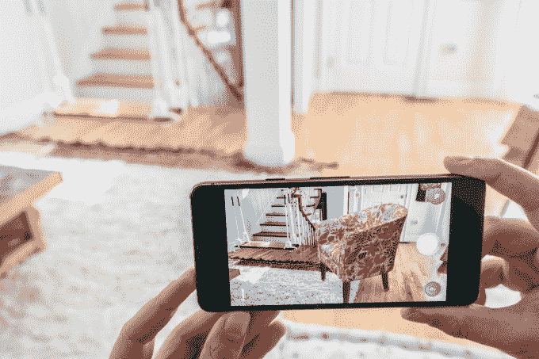
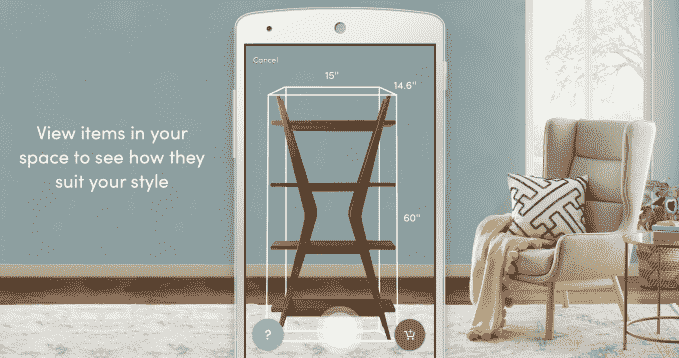
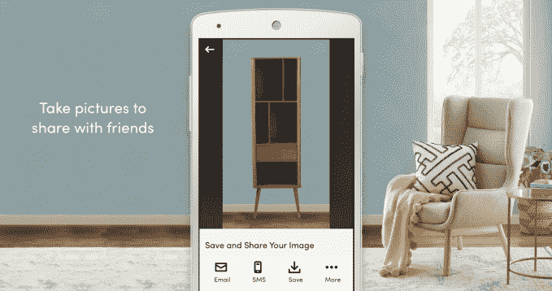
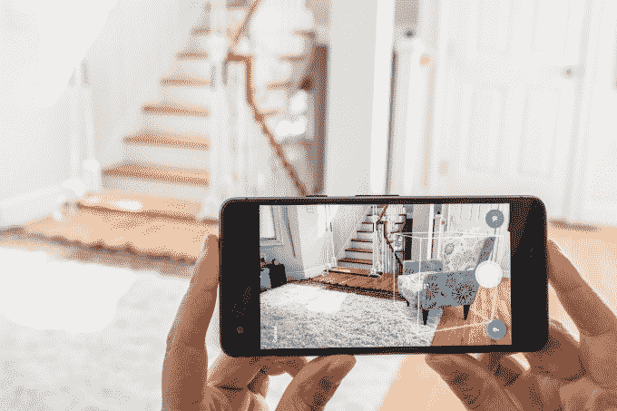

# Wayfair 的 Android 应用程序现在可以让你使用增强现实技术购买家具

> 原文：<https://web.archive.org/web/https://techcrunch.com/2018/03/20/wayfairs-android-app-now-lets-you-shop-for-furniture-using-augmented-reality/>

如今，基于 AR 的购物又开始扩张了。这一次，在线家具零售商 Wayfair 正在其 Android 移动应用程序[中引入一项增强现实功能，让客户在购买前可以看到自己家中的家具，只需举起智能手机。](https://web.archive.org/web/20221111195211/https://play.google.com/store/apps/details?id=com.wayfair.wayfair&hl=en)

这项名为“3D 房间视图”的功能是[之前在 iOS 上提供的，](https://web.archive.org/web/20221111195211/http://investor.wayfair.com/investor-relations/press-releases/press-releases-details/2017/Wayfairs-AR-Powered-Shopping-App-Now-Available-to-Tens-of-Millions-of-Consumers-on-iOS-11/default.aspx)利用了苹果的 AR 平台 ARKit。

现在，Wayfair 正在利用谷歌的 ARCore 向安卓用户提供同样的选择。

ARCore 是谷歌对苹果 AR 平台的回应，上个月在[公开发布](https://web.archive.org/web/20221111195211/https://techcrunch.com/2018/02/23/google-publicly-launches-arcore-1-0-on-13-phones-will-begin-expanding-lens-availability/)，为开发人员提供了一种将 AR 技术集成到他们的 Android 应用程序中的方法，他们可以接触到超过 1 亿 Android 设备的潜在受众。

Wayfair 并不是唯一一个快速推出 ARCore 支持的购物网站—[易贝昨天为卖家推出了一项功能](https://web.archive.org/web/20221111195211/https://techcrunch.com/2018/03/19/ebays-new-ar-tool-helps-sellers-find-the-right-shipping-box-to-fit-their-item/),帮助他们使用 AR 技术找到合适的运输箱，并承诺今年将推出其他 AR 功能。宜家也刚刚[在本周](https://web.archive.org/web/20221111195211/https://www.webwire.com/ViewPressRel.asp?aId=221635)发布了安卓版的 AR 应用程序宜家广场[。](https://web.archive.org/web/20221111195211/https://techcrunch.com/2018/03/16/grokstyles-visual-search-tech-makes-it-into-ikeas-place-ar-app/)

其他零售商也在尝试 AR，包括亚马逊和塔吉特。

零售商对 AR 的兴趣不仅仅是因为它是新的和时尚的——它可以帮助他们解决在线购物者在试图从网站而不是亲自购买家具时面临的真正问题。

非设计师通常很难真正了解一件家具放在房间里会是什么样子。新沙发会和现有的窗帘、地毯和其他家具搭配吗？它能适应这个空间吗？

Wayfair 的应用程序有助于解决这些问题，因为它以全尺寸 3D 投影家具或装饰，并将它们固定在地板上。这让购物者无需拿出卷尺就能看到房间里的物品是否合适。这也有助于他们对添加了新家具的房间有一个直观的感觉。

由于图像是 3D 的，你可以在它周围走动，从不同的角度观看它，这也有助于消费者的购买决定。

“利用增强现实，Wayfair 应用程序允许购物者将他们的家变成虚拟展厅，让他们可以在自己的空间里近距离和从每个角度看到他们最喜欢的产品，”Wayfair 的联合创始人兼联合主席 Steve Conine 在关于 AR 功能发布的声明中说。

“我们很早就知道增强现实有可能彻底改变人们购物的方式，随着它迅速成为主流采用方式，我们很高兴能够在塑造数百万购物者的体验方面发挥不可或缺的作用，”他补充道。

家具一直是最难在网上转型的行业之一，不仅因为沉重物品的运输成本，还因为消费者仍然经常希望在现实生活中看到产品。他们想触摸面料，试试椅子的靠垫是否舒适，看看真实的颜色——而不仅仅是网上的照片。

但随着更多的商业转移到网上，情况正在发生变化——这是千禧一代购物者更喜欢的渠道，他们现在是家具购买市场的最大人口群体 (37%)。

Wayfair 是利用这一转变的公司之一，2017 年净收入达到 47 亿美元。

随着家具展厅的取消，它也迅速采用新技术来帮助客户更好地购物，包括[基于网络的剪贴板](https://web.archive.org/web/20221111195211/https://techcrunch.com/2013/04/08/home-decor-e-commerce-giant-wayfair-debuts-its-own-pinterest-like-clipboard-for-inspiration/)、[视觉搜索、](https://web.archive.org/web/20221111195211/https://techcrunch.com/2017/05/16/wayfair-takes-on-pinterest-with-its-own-visual-search-engine-for-home-furnishings/)、[移动通讯](https://web.archive.org/web/20221111195211/https://techcrunch.com/2016/08/30/wayfair-snatches-up-boston-startup-trumpit-to-bring-photo-video-messaging-to-its-mobile-app/)，以及现在的 AR——所有这些都使它与拥有更多静态网站的传统零售商相比具有竞争优势。

该公司最近还更新了 iOS 应用程序中的 AR 功能，让客户现在可以在 AR 中录制商品的视频，而不仅仅是拍照。这项功能有类似 Snapchat 的感觉，因为您只需按住录制按钮即可进行录制。然后，你可以在视频中的家具周围走动，以便以 3D 形式捕捉它，然后与朋友和家人分享。

据我们了解，这项功能将很快在 Android 版本中推出。

与此同时，Android 版的 [Wayfair 应用程序可在此处获得](https://web.archive.org/web/20221111195211/https://play.google.com/store/apps/details?id=com.wayfair.wayfair&hl=en)。