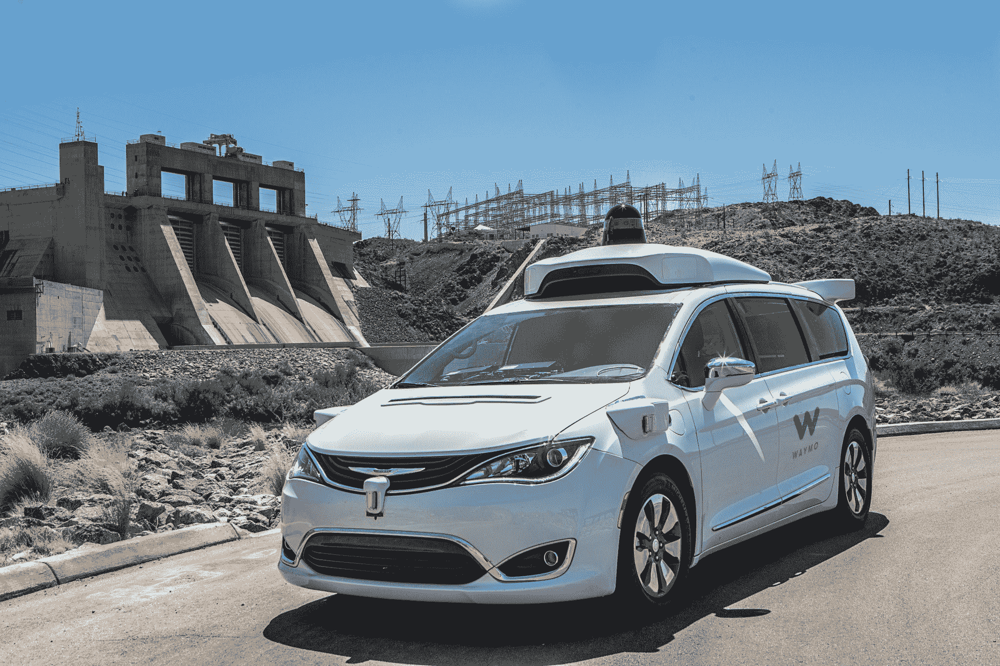

# Waymo 利用英特尔开发完全由内部开发的自动驾驶电脑 

> 原文：<https://web.archive.org/web/https://techcrunch.com/2017/09/18/waymo-taps-intel-for-self-driving-computers-it-develops-entirely-in-house/>

Waymo 已经强调要内部开发其自动驾驶系统的核心技术，这是它在过去专门围绕[其传感器套件谈论的事情。该公司今天透露，它还为传感器融合和自主决策、寻路等构建了自己的计算硬件——并且它正在与英特尔合作开发支持板载计算功能的芯片。](https://web.archive.org/web/20221206153944/https://beta.techcrunch.com/2017/01/08/waymo-reveals-completely-homegrown-sensor-suite-for-pacifica-autonomous-test-car/)

Waymo 的自动驾驶克莱斯勒 Pacifica 小型货车是其最新一代的自动驾驶测试平台，从连接到传感器数据处理，都采用了基于英特尔的计算，这是他们自动驾驶的基础，即使在城市条件下也可以自动驾驶。英特尔表示，它还将与 Waymo 合作，提高系统的整体功率和效率，以帮助它在现实世界的应用中实现真正的 4 级和 5 级自动驾驶。

这是英特尔努力走在自主和自动驾驶前沿的又一个例子；它已经成为这家芯片制造商业务的重要组成部分，尽管许多人通常认为自己的核心技能集中在个人电脑业务上。事实上，通过与 Waymo 的合作(始于 2009 年，当时它仍是谷歌的自动驾驶汽车项目)，英特尔的芯片帮助 Waymo 处理了比目前正在运营的任何其他测试车队更多的累计自动驾驶里程数据。

“作为当今道路上最先进的车辆，我们的自动驾驶汽车需要最高性能的计算来实时做出安全驾驶决策，”Waymo 首席执行官 John Krafcik 在给 TechCrunch 的一份声明中解释道。“英特尔的技术支持我们车辆内部的高级处理，能够满足 Waymo 的大规模需求。”

Waymo 告诉我，虽然近十年来，Waymo 一直以某种形式利用英特尔技术，但他们最近的合作使两家公司更加紧密。这两家公司在开发 Waymo 独特的 compute 时在设计阶段就进行了合作，这是 way mo 专门为其内部传感器堆栈和自动驾驶软件架构从头开始构建的。

在竞争日益激烈的自动驾驶技术市场，Waymo 有几个关键优势，包括其多年来在这个问题上的工作经验。但其内部硬件、传感器套件和计算能力可能最终会成为其最大的优势，因为这使其能够独特地定制系统的所有方面，以实现最大的效率(这就是苹果对其消费科技产品所做的)。

在一个越来越像是有一系列供应商寻求提供现成系统和组件的市场中，Waymo 拥有自己的传感器和计算技术可能是一个主要的区别因素。如果该领域的一名成员有可能在自动驾驶技术成熟后脱颖而出，那么拥有更多的堆栈是一个很好的候选，可以帮助一个解决方案在功效、效率、用户体验等方面脱颖而出。

我们邀请了英特尔首席执行官 Brian Kraznich 出席今天下午 1 点的 Disrupt，因此我们将与他讨论这一合作伙伴关系以及更多内容。请查看以下直播，收听: