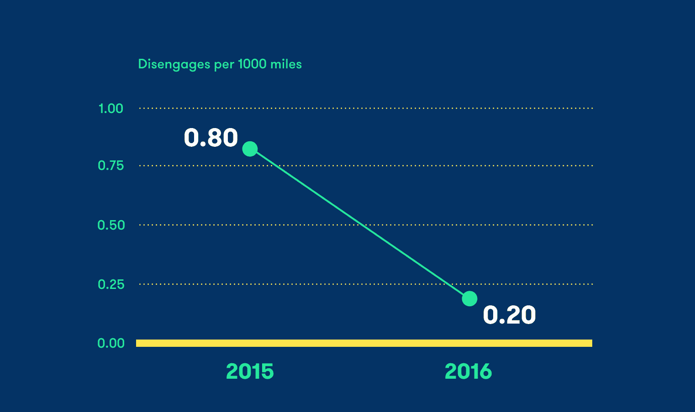

# Waymo 的自动驾驶技术在 2016 年变得更好

> 原文：<https://web.archive.org/web/https://techcrunch.com/2017/02/01/waymos-self-driving-tech-got-a-lot-better-in-2016/>

# Waymo 的自动驾驶技术在 2016 年有了很大改善

2016 年，Waymo 的自动驾驶软件在加利福尼亚州的脱离次数远低于 2015 年，尽管总体驾驶英里数大幅增加。加州机动车辆部[刚刚发布了](https://web.archive.org/web/20230330200550/https://www.dmv.ca.gov/portal/wcm/connect/946b3502-c959-4e3b-b119-91319c27788f/GoogleAutoWaymo_disengage_report_2016.pdf?MOD=AJPERES) Waymo 最新的脱离报告，该报告跟踪了测试车辆中自动驾驶软件系统必须关闭的所有时间——其中大多数甚至不是事故或挡泥板弯曲，但实际上可能需要短暂的暂停来调整软件中的某些东西或快速消除一个错误。

对于 Waymo 来说，这是一个巨大的消息，因为它正在通过量产车或拼车服务向客户提供完全自动驾驶的车辆。Waymo 的自动驾驶技术负责人 Dmitri Dolgov 在一篇庆祝该公司进展的[博客文章](https://web.archive.org/web/20230330200550/https://medium.com/@dmitri_dolgov/accelerating-the-pace-of-learning-36f6bc2ee1d5#.omba77vl7)中解释了原因，他概述了该技术实际上实现了脱离率的四倍提高，以每 1000 英里的事件率衡量。该公司在 2015 年记录了 0.80 起脱离事件(同样，只是自动驾驶软件被关闭的次数，而不是实际的事故)，而 2016 年只有 0.20 起。

多尔戈夫还指出，这主要是在城市和郊区驾驶情况下实现的，这是最复杂的，也是 Waymo 关注的焦点，以确保其技术在向公众开放时能够真正提供上门服务。虽然脱离可能很少，但多尔戈夫也表示，就为系统提供有价值的学习而言，每一次都是至关重要的，有一个建立类似场景的严格过程，每次必须关闭软件时，学习软件都可以从中受益。Waymo 还调整了系统及其测试工程师，在发出脱离呼叫方面偏于保守，这使得 2016 年的低比率更加令人印象深刻。

Waymo 首席执行官 John Krafcik [指出，当该公司宣布将为其未来的车辆制造自己的传感器时，脱离性能提高了四倍](https://web.archive.org/web/20230330200550/https://techcrunch.com/2017/01/08/waymo-reveals-completely-homegrown-sensor-suite-for-pacifica-autonomous-test-car/)，但获得更完整的图片是有趣的，包括 2016 年记录的 124 次脱离，而 2015 年为 341 次，2016 年共行驶了 635，868 英里。