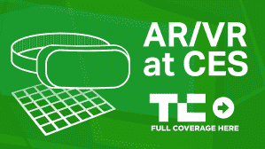
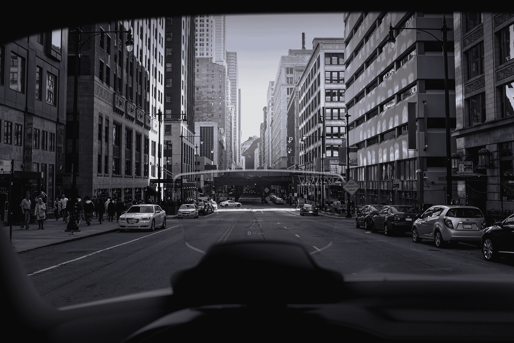

# WayRay 的 AR 车载 HUD 让我相信 HUD 可以更好

> 原文：<https://web.archive.org/web/https://techcrunch.com/2018/01/09/wayrays-ar-in-car-hud-convinced-me-huds-can-be-better/>

瑞士增强现实技术提供商 WayRay 在 CES 2018 上展示了其车载平视显示器解决方案，展示了其独特的方法可以做什么。该公司首次向公众展示了其 NAVION 售后解决方案，并推出了为原始设备制造商设计的全息 AR 挡风玻璃产品，可供任何人尝试。

我自己试了一下，对结果印象深刻。无论是在汽车制造商原始设备制造商设计的直接嵌入挡风玻璃的解决方案中，还是在售后设备中，显示屏都清晰易读。售后版本使用简单的双色覆盖，红色和绿色，但该公司的首席执行官 Vitaly Ponomarev 告诉我，它很快也会推出蓝色。即使只有两种颜色，也很容易识别系统显示的所有重要信息。

【T2

与普通的车内 HUD 相比，WayRay 的技术如此出色的部分原因是它比大多数车内 HUD 具有更宽的视野。驾驶员可以在内置解决方案的 11 度范围内看到它，这比汽车 hud 通常获得的 8 度要好得多。售后版本使用自己的显示器，模拟深度较小，也只提供 8 度的视野，但它仍然更善于使其看起来像它投射的信息实际上是“粘”在路上的。

这是 WayRay 管理其同步定位和地图(SLAM)技术的独特方式。该产品可以结合数据，包括位置和地图信息，以及前置摄像头收集的视觉数据，更有效地将其可视化放在汽车前方的真实世界中。

与我使用过的其他汽车制造商 OEM 产品相比，以及与 Navdy 等其他售后设备相比，WayRay 的系统感觉更好，也更真实地与你作为司机实际看到的东西联系在一起。波诺马廖夫告诉我，这就是为什么他们称他们的产品为“真正的 AR”，以区别于那些因信息不足而捏造效果的低效方法。

WayRay 已经在与原始设备制造商(OEM)就将其技术应用于未来汽车的挡风玻璃进行谈判，其中包括中国的 SAIC、本田(Honda)和其他它还无权讨论的制造商。该公司还计划在今年晚些时候推出其售后解决方案。

同样在 CES 上，WayRay 展示了其 [True AR SDK](https://web.archive.org/web/20230406062504/https://wayray.com/sdk) ，这是一个开发平台，它创建该平台是为了允许其他人为汽车构建 AR 应用程序。这可能包括显示兴趣点、增强导航、提供购买优惠等软件。波诺马廖夫告诉我，他们计划为他们的产品推出一个应用商店。它还表示，它打算拥有这家商店的品牌，即使原始设备制造商选择将它与 AR HUD 硬件一起纳入他们自己的车辆。

WayRay 已经筹集了 3000 万美元，并在硅谷开设了一个新的办事处，总部仍设在瑞士洛桑。Ponomarev 告诉我，他们目前也在筹集 5000 万美元的资金，但他不能透露任何投资者的参与，因为它尚未结束。