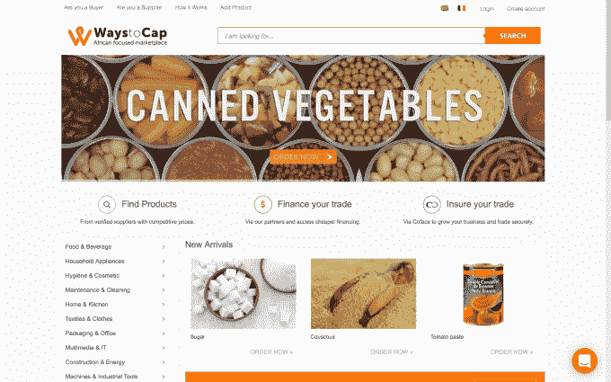

# 非洲交易平台 WaystoCap 在 Y Combinator  毕业后立即融资 300 万美元

> 原文：<https://web.archive.org/web/https://techcrunch.com/2017/06/07/waystocap-raises-3m/>

这家初创公司今天向 TechCrunch 证实，跨境商务平台 WaystoCap 已经筹集了新的资金，以扩大其在非洲的影响力。

[WaystoCap 是美国 Y Combinator accelerator 项目的应届毕业生](https://web.archive.org/web/20230316042730/https://techcrunch.com/2017/02/07/waystocap-africa-cross-border/)，是非洲 B2B 商品买家和卖家的在线目的地。它成立于摩洛哥卡萨布兰卡，旨在将非洲大陆上存在了数百年的跨境贸易行业数字化，并使非洲以外的人更容易进入该地区。

今天的融资没有披露，但一位接近该公司的消息人士告诉 TechCrunch，融资规模在 250 万美元至 300 万美元之间。

对于一家总部位于非洲的公司来说，这无疑是一个重要的种子期，这笔资金来自一系列投资者，包括 Y Combinator、Battery Ventures、Soma Capital、Palm Drive Capital、Amino Capital、bearing Capital、Story Ventures、Lynett Capital、Neon Capital 和 4DX LLC。此外，Y Combinator 合伙人迈克尔·赛贝尔(Michael Seibel)、Golden 创始人裘德·戈米拉(Jude Gomila)、SixDoors 首席执行官帕斯卡尔·利维·加博阿(Pascal Levy Garboua)也是参与投资的天使投资人。

WaystoCap 首席执行官 Niama El Bassunie 表示，WaystoCap 计划通过贝宁的一个办事处将资金扩展到西非，扩大其行业垂直市场(目前为 12 个)，并开发一个新的平台，以更有效地匹配买家和卖家。

El Bassunie 说，该公司选择西非小国贝宁作为战略要地，因为“许多邻近的内陆国家都经过那里”，其中包括利润丰厚的尼日利亚进口产业。

她在一次采访中解释说，“这种存在给了我们当地的商业保障，让我们在当地看起来更好。”

贝宁只是一个开始，WaystoCap 正着眼于在西非增设两到三个办事处，最有可能从尼日利亚开始，此外还有一个通常达成金融贸易伙伴关系的伦敦基地。El Bassunie 解释说，明年，该公司将寻求在东非开设一家办事处，以推动该地区的发展。

目前，四位联合创始人之一的 El Bassunie 表示，该公司的平台上有“数千名”活跃买家。她说，WaystoCap 在 2017 年第一季度处理了 310 万美元的交易，轻松超过了 2016 年全年的 220 万美元。她补充说，公司在决定进行投资以快速增长之前，现金流是积极的。

WaystoCap 首席执行官表示，该公司今年实现的快速增长在很大程度上归功于其在 YC 的参与。

“它们是一个加速器程序，真的可以让你加速，”她说。" YC 帮助你专注于你的信息，他们的帮助是无价的."