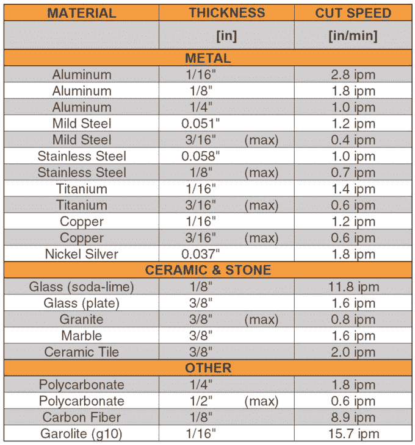

# Wazer 将水射流切割从重工业带到大众市场

> 原文：<https://web.archive.org/web/https://techcrunch.com/2016/09/12/wazer-good-idea/>

在今天的 TechCrunch Disrupt 战地舞台上， [Wazer](https://web.archive.org/web/20230323163258/http://wazercut.com/) 首次展示了其价值 6000 美元的桌面切水器。进入一个与成本超过 10 万美元的大型工业设备竞争的市场，该公司正在启动一项 Kickstarter 活动，以使世界各地的创意灵魂、黑客和工程师都能获得水射流切割机。对于那些激光不能满足要求的人来说，这是一个好主意。

水射流切割机过去常常占据房间的大部分。瓦泽尔的机器小到可以放在车间里。

## 让喷水器变得经济实惠

高压下的水和沙子几乎可以切割任何东西。

在迫使价格下降到高级爱好者、创客空间和小型原型实验室的能力范围内，该公司正在跟随辉煌的脚步。Wazer 正在准备做 [Glowforge](https://web.archive.org/web/20230323163258/https://glowforge.com/?utm_source=google&utm_medium=cpc&utm_campaign=brand&utm_source=adwords&utm_medium=cpc&utm_campaign=Brand-Exact-Geo-US-GP&utm_term=glowforge&gclid=CPSQq5eAgc8CFUVqfgodRBEF6g) 为激光切割机所做的事情，以及 [Formlabs](https://web.archive.org/web/20230323163258/http://formlabs.com/) 为 SLA 3D 打印所做的事情:让每个人都可以获得高端制造技术，迄今为止这些技术只保留给财大气粗的重工业用户。

“激光切割机很有趣，”Wazer 的首席执行官兼联合创始人 Nisan Lerea 说，“但只有在你想切割纸张、木材或某些类型的塑料时才会如此。如果你想做真正的制造业，你需要去别处看看。水射流切割机是切割金属、玻璃和石头的唯一方法。”

从开始到结束，从镜面玻璃中切割出 TechCrunch 独角兽花了大约 7 分钟。在这张 gif 图中，我加快了这个过程，这样你就不必坐在那里看一个喷水器移动 7 分钟。不客气

水切割机通过使用水和磨料颗粒(基本上是奇特的沙子，被称为[石榴石](https://web.archive.org/web/20230323163258/http://www.barton.com/waterjet-abrasives/))的紧密聚焦射流来工作。

水由泵加压，在水从喷嘴喷出之前，石榴石被加入到腔室中。该公司不愿证实机器在什么压力下运行，“直到我们的专利被授予”，但证实它低于该公司竞争的工业机器。

因为泵是机器中噪音最大的部分，Wazer 巧妙地设计了这台机器，使它可以放在另一个房间里。

“Wazer 最初是宾夕法尼亚工程学院的一个高级设计项目，”该公司的联合创始人马修·诺维茨基说。在大学里，创始人是一个团队的成员，他们为了乐趣和利益制造赛车。说实话:主要是为了好玩。该团队建造了第一个小型水射流原型，然后想知道该项目是否超越了学术实验。

一面切成独角兽形状的镜子。上面有 TechCrunch 的标志。这里有很多值得喜欢的地方。

该公司受到了 Hax 加速器的欢迎，并在此过程中给了他们一大笔现金和大量制造技术。该团队在过去一年的大部分时间里都在深圳构建原型，并为其在 Kickstarter 上的发布做准备。

Wazer 的产品将推出两个版本；一款带支架，另一款可放在桌子上。

“在 Kickstarter 活动中，我们预计销售数百台，”Lerea 说，透露他不相信水刀会像其他制造技术一样广泛传播。虽然该团队是第一个承认水射流切割技术是一个利基产品，但他们对谁可能采用该技术有一个清晰的了解。“我们希望让这项技术变得更容易获得，也有助于教育那些不太熟悉水射流切割的人。”

## 成吨的不同材料

[gallery ids="1384209，1384216，1382982，1382983，1382984，1382985，1382986，1382987，1382988，1384210，1384211，1384212，1384213，1384217，1384208"]

“3D 打印的问题在于，”Lerea 说，“你是在用相对易碎的塑料制造东西。有了水射流技术，你可以用最终产品所用的材料制作原型。如果你需要有限的生产运行，你甚至可以用这台机器进行小批量制造，这与大多数 3D 打印技术不兼容。”

Wazer 可以切割金属、陶瓷、石头、碳纤维和大量其他材料。水压保持不变，但对于较硬或较厚的材料，切割机以较慢的速度移动射流。

因为，坦白地说，如果你有一个喷水切割机，你为什么不把仿制的劳力士切成两半呢？

该公司向我展示了许多使用其原型机制造的东西，展示了制造商如何使用他们可能无法使用的材料。

Wazer test 的用户已经使用该刀具创建了从自行车零件到刀具的任何东西，还创造性地切割了瓷砖和珠宝。而且，正如该公司今年早些时候在 YouTube 上展示的那样，如果你喜欢的话，这台机器也可以将[肉](https://web.archive.org/web/20230323163258/https://www.youtube.com/watch?v=niUXE_CpM7w)切成有趣的形状。

## 来到 Kickstarter

TechCrunch Disrupt 战地法官质问该公司是否真的有足够的加价来赚钱。

“我们肯定在机器上赚钱，”勒雷亚说，把他的卡片放在图表旁边，优雅地回避了这个问题。

石榴石很容易添加在瓦泽尔的坦克旁边。用过的切割磨料可以放在机器前面的小桶里清除。

“我们的目标受众是那些原本会手工制作材料的人。“我们的一个测试用户是一个珠宝制造商，他用硬币制作出漂亮的作品，”Lerea 说，并解释了目前花费数小时在锉刀或旋转工具上的人如何能够节省大量时间。除了速度之外，喷水切割机还增加了可重复性和通过计算机控制切割的能力。“她制作的每件作品价值 5-600 美元。问题是她做每一件作品都要花很长时间。我们可以帮助她更快、更一致地制作更多珠宝。”

该公司仍在做最后的为制造而设计的原型，并正在开发一款软件，以便更容易地将你的形状上传到机器上进行切割。它接受任何 [DXF](https://web.archive.org/web/20230323163258/https://en.wikipedia.org/wiki/AutoCAD_DXF) 或 [SVG](https://web.archive.org/web/20230323163258/https://en.wikipedia.org/wiki/Scalable_Vector_Graphics) 文件。

要开始切割过程，用户将文件导入 Wazer 的软件，然后配置一些东西，如材料、材料厚度及其在切割床上的位置。

“我们已经做了很多工作来确保切割机易于使用，”Lerea 解释说，承认他渴望人们看到机器能做什么。“我们在这方面已经努力了很长时间。我们迫不及待地想看看人们会创造出什么。”

该公司将在接下来的几个小时内推出 Kickstarter 活动，所以如果高压水从微小的缝隙中喷出让你心跳加速，[这是你第一次参与的机会](https://web.archive.org/web/20230323163258/https://www.kickstarter.com/projects/1294137530/the-first-desktop-waterjet-cutter)。也有一些不错的早期优惠，但你必须要快！