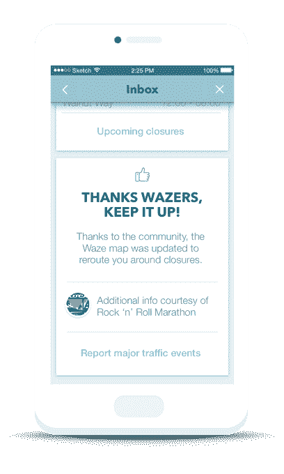

# Waze 的新活动计划将帮助司机在体育场和音乐会交通中导航 

> 原文：<https://web.archive.org/web/https://techcrunch.com/2016/08/11/wazes-new-events-program-will-help-route-drivers-around-stadium-and-concert-traffic/>

# Waze 的新活动计划将帮助司机在体育场和音乐会交通中绕行

Waze 在最近几个月一直在稳步扩展到企业，今天推出了一个针对体育场、马拉松和其他活动组织者的新计划，该计划将允许合作伙伴在 Waze 的地图上添加道路封闭，实时监控交通状况，并通知 Waze 司机封闭和其他活动信息。

官方名称为的 Waze 全球活动合作伙伴计划(Waze Global Event Partner Program)扩展了该公司不断增长的企业服务阵容。今天，这还包括 [Waze 互联公民计划](https://web.archive.org/web/20221007035612/http://www.waze.com/ccp)，该计划看到 Waze 与市政组织合作；[Waze for Broadcasters](https://web.archive.org/web/20221007035612/http://www.waze.com/broadcasters)；以及 [Waze Transport SDK](https://web.archive.org/web/20221007035612/http://www.waze.com/transportsdk) ，其中[允许 Transport 和 Lyft 等其他按需公司](https://web.archive.org/web/20221007035612/https://beta.techcrunch.com/2016/01/26/lyft-cabify-99taxis-others-to-integrate-wazes-routing-software-in-their-own-apps/)将 Waze 与他们自己的原生应用程序集成。

然而，新推出的活动计划中的工具与互联公民计划最为相似。例如，现在活动合作伙伴也可以使用 Waze 封闭工具，这种软件可以让他们将计划中的道路封闭添加到 Waze 的实时地图中。他们可以提前或在赛事直播时与 Waze 合作，向 Waze 及其超过 6500 万的月活跃用户添加转弯限制、车道反向、停车场位置和其他与赛事相关的信息。

这种实时地图甚至可以通过 iFrame 嵌入到他们自己的网站上，使他们能够向参加活动的人传达交通信息。

该计划还允许合作伙伴向司机发送关于道路封闭和活动的应用内品牌信息，并在[Waze.com/events](https://web.archive.org/web/20221007035612/http://www.waze.com/events)为活动提供定制的登录页面，在那里可以获得封闭和其他信息。

该公司已经安排了 20 多个合作伙伴参加，包括 E15(Levy Restaurants 的子公司)，它将与 Waze 及其体育团队合作伙伴一起管理活动地点周围的交通。这份名单包括亚特兰大猎鹰队(佐治亚圆顶)、华盛顿红人队(联邦快递场)、底特律雄狮队(福特场)、华盛顿国民队(国民公园)和亚特兰大老鹰队(飞利浦球馆)。

另一个合作伙伴是摇滚马拉松系列赛，在全球举办 30 场比赛，通常为期三天。

Waze 表示，该计划对任何规模的活动组织者都是免费的，但接受程度取决于 Waze 在当地的网络质量，以及组织者推动参与者使用 Waze 的承诺。