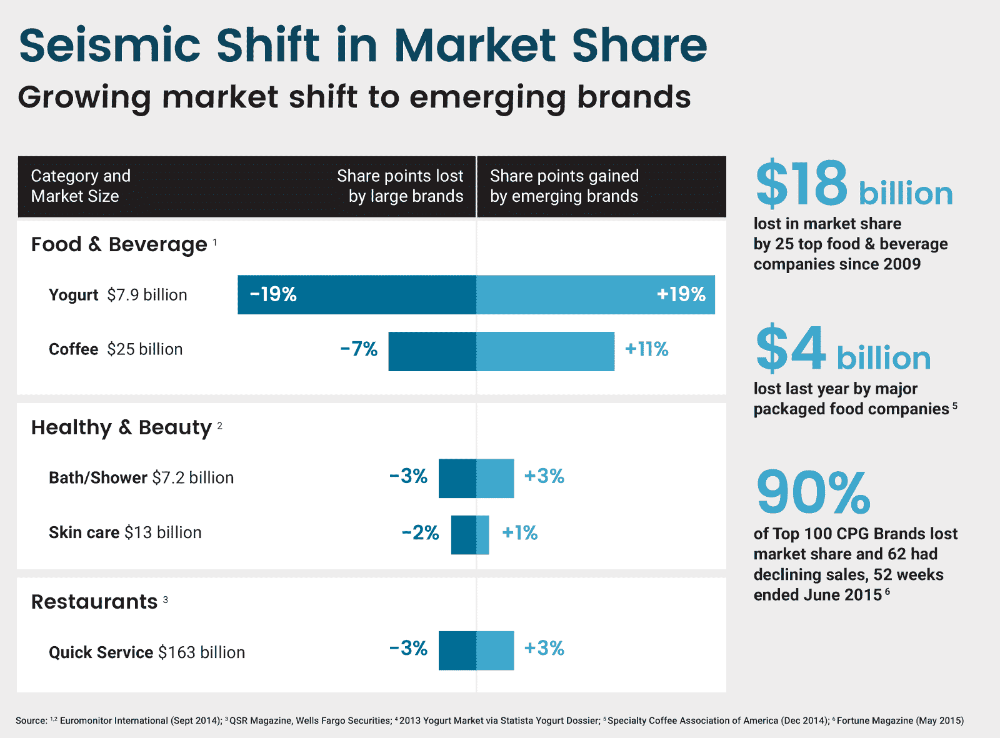
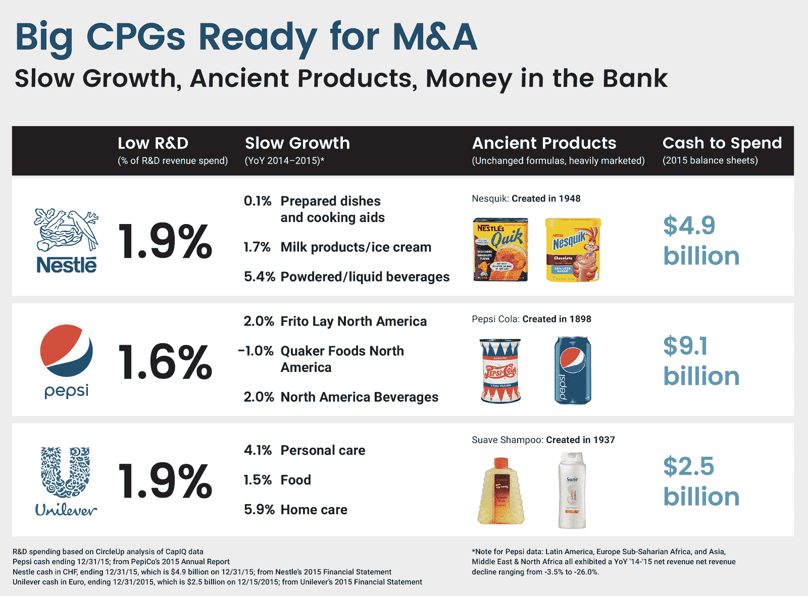

# 我们正处于消费者 M&A 雪崩的边缘

> 原文：<https://web.archive.org/web/https://techcrunch.com/2016/11/12/we-are-on-the-verge-of-a-consumer-ma-avalanche/>

莱恩·考德贝克撰稿人

[Ryan Caldbeck](https://web.archive.org/web/20221206123052/https://www.linkedin.com/in/ryancaldbeck)

是消费者和零售投资市场的创始人和首席执行官

[CircleUp](https://web.archive.org/web/20221206123052/https://circleup.com/)

.

More posts by this contributor

如果你相信“创新或死亡”的咒语，你可能会得出结论，最大的消费者和零售品牌已经病入膏肓。像卡夫和 Clorox 这样的巨头似乎都太慢了，而且受制于股东，无法创新。与此同时，它们可能太大而不会灭亡……至少目前如此。

我们这里的是对并购A消费者(M&A)雪崩的完美风暴。

大型消费品包装公司正在努力向新一代消费者销售他们的产品。快速浏览一下各个产品领域的销售情况，就会发现大品牌的销售稳步下滑。根据 Jefferies 的数据，在过去的五年里，在 54 个最相关的食品类别中，有 42 个大品牌的市场份额被小品牌夺走。侵蚀几乎发生在每一个消费者类别中。

随着消费者越来越渴望符合个人喜好的独特、真实的品牌，营销和分销成本正在大幅下降。消费者正在研究和寻找产品，而不是对广告做出反应。

资料来源:CircleUp

主要的 CPG 公司正在失去数十亿的市场份额。他们对此没有做太多。上一次一个大型消费者品牌推出一款创新产品引起人们注意是什么时候？研发应该比以往任何时候都更重要，但却不那么受重视。

## CPG 公司的 R&D 问题有多严重？

在 CircleUp，我们最近提取了一些数据，说明研发问题已经变得多么糟糕。我们发现，平均而言，最大的消费者包装商品公司在 R & D 上的花费不到收入的 2 %,而在营销和广告上的花费接近 15%。在创新处于前沿和中心的技术领域，支出几乎相反:大约 13%用于研发，2%用于营销和广告。

资料来源:CircleUp

大品牌并没有忘记他们面临的挑战。那么，他们为什么不加大对新产品开发的投资呢？

**大品牌还不需要创新**

几十年来，大品牌一直受到进入 CPG 市场高昂成本的保护。前社交媒体、前亚马逊时代使得小公司获得分销和宣传其产品的成本极其昂贵。对创新的需求非常低，因为消费者太习惯于在货架上看到相同的产品(T2)。

**创新有风险**

创新之路——开发和测试新产品并权衡市场反应——充满风险。这可能会导致季度和年度亏损，未来的收入需要数年才能显现(如果真的出现的话)。负责 R&D 决策的品牌经理通常有不承担风险的短期动机。我们是应该实现我们的季度数字，还是应该在 上创新一个新产品，直到我被调到另一个部门几年后才能显示出对收入的影响？

**大品牌没有人事变动**

这么多年来，改变的动力如此之少，以至于大多数大品牌都没有强大的 R&D 团队或经验。这些庞然大物还没有做好试水和制造伟大新产品的准备。

这些公司有几十年的历史，有时甚至是一个世纪，他们不习惯改变。你祖父在舞池中的形象浮现在脑海中。克雷·克里斯滕森的《创新者的困境》也是如此，该书称这种趋势为。大品牌花费了太多精力来销售他们现有的产品，以至于他们没有为未来做好计划，然后努力转变来解决一个他们并非生来就有的问题。

资料来源:CircleUp

## M & A 正在替换 R & D

并购实际上是大型消费品牌对研发的替代，随着市场份额的急剧萎缩、增长缓慢以及资产负债表上的巨额现金储备，我们肯定会看到更多的并购。而且还有更多的早期投资，因此他们可以在和品牌生命的早期参与更多的增长。

联合利华去年在研发上只花了 1.9%的费用(T2)，但它并不羞于在其他地方对冲赌注，攫取了 T4 的美元剃须俱乐部(10 亿美元)、T5 和 T6 的第七代(7 亿美元)。由于无法超越创业品牌，大的消费者品牌正在将他们的游戏作为外包研发的一种方式，并将创新的风险留给做得最好的创业公司。

这一趋势已经在制药业站稳了脚跟。那里的企业集团几乎完全跳过 R&D，疯狂地获取新配方，然后把这些产品塞进他们庞大的分销管道，同时他们专注于广告和监管问题。大的消费者品牌正在走上同样的道路。

但是决定性的因素，也是我们尚未看到的，是这些大品牌如何保持他们新收购产品的质量和真实性。人们越来越需要个性化的产品，无论是有机的、环境可持续的、公平交易的，还是民族多样化的——清单在上继续。现在，选择家用清洁液这个看似简单的行为是一种自我表达的行为。如果大品牌不能保持独特性，它们将回到起点。

雪崩背后的力量已经积累了好几年。仅去年一年，消费和零售总额就达到了 2380 亿美元，几乎是科技行业总额的两倍。雪崩信号已经出现，而且只会越来越强。准备好上路吧。