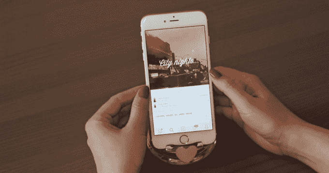
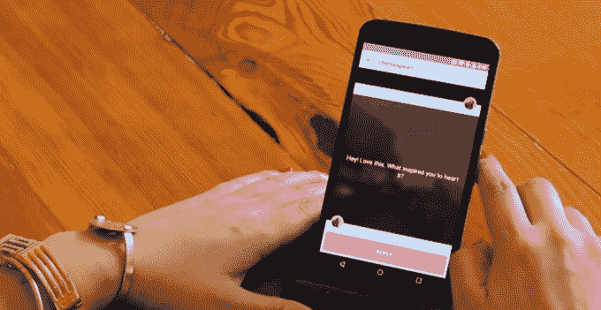
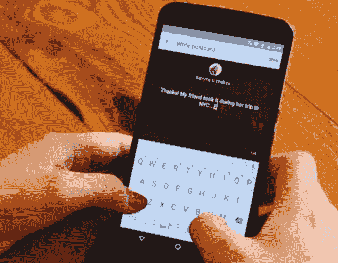

# 有 3000 万年轻女性使用的图片分享应用 We Heart It 补充道

> 原文：<https://web.archive.org/web/https://techcrunch.com/2015/03/26/we-heart-it-an-image-sharing-app-used-by-30m-young-women-adds-messaging/>

深受十几岁女孩欢迎的视觉书签服务，正在通过推出名为[明信片](https://web.archive.org/web/20221208035640/http://weheartit.com/about/postcards/gallery)的新功能，将自己转变为一款信息应用。

在以前的时代，年轻女孩们围坐在一起，拿着时尚杂志和剪刀，剪下她们最喜欢的励志图片，将它们变成拼贴画或艺术品，挂在卧室的墙上。在当今的数字时代，十几岁的女孩转而使用在线服务，包括 Pinterest、Tumblr 和 We Heart It 等应用程序。

尽管《我们的心》最初并不是为了吸引年轻女性观众而推出的服务，但随着时间的推移，它逐渐成为一个受欢迎的视觉灵感来源，尤其是在这些人群中。如今，这项服务已经发展到 3000 万注册用户，年龄从 15 岁到 24 岁不等，平均年龄在 18 岁左右。

这些年轻女性在很大程度上也在她们的移动设备上使用这项服务——现在大约 80%到 90%的 We Heart It 活动发生在手机上，iOS 和 Android 各占一半。

在某些方面，这项服务更像是一个更面向年轻人的 Pinterest 版本。有一个图片缩略图的 feed，类似于 Pinterest 的“boards”的收藏，用户资料，以及通过点击心形来收藏图片的能力，或者将它们添加到你自己的收藏中。但是，尽管 Pinterest 通常专注于链接到某个来源的图像——例如，你可以购买该商品的产品页面或杂志文章，但我们认为它实际上只是关于图像本身。

在这里，女孩们收集她们觉得有个人魅力的图片，无论是最喜欢的名人或乐队的照片，可爱的服装，鼓舞人心的或情感的名言，自然或户外的照片，动物，美甲之类的美容灵感，有趣的谚语，食物和食谱，家居装饰，原创艺术，等等。

但现在，该公司希望将其产品提升到一个新的水平——超越目前的社交服务，进入私人移动通讯这一更大的趋势。

对于明信片，我们 Heart It 引入了一项功能，允许网站上的任何用户使用网站上亿张托管图像中的一张向另一个用户发送私人信息。该公司希望，最终结果将是一个更积极的用户群，更经常地使用 We Heart It 应用程序。

“这极大地扩展了我们的使用案例，就我们如何或何时使用我们用心对待的人而言，”We Heart It 总裁戴夫·威廉姆斯解释道。他说，公司非常乐意迎合年轻女性群体，现在正致力于提供这些用户想要和需要的服务。

“我们推出了明信片，因为我们从用户那里听到的是，他们希望彼此交流……但他们不需要另一个消息应用程序，”他说。“明信片是体验的核心——您可以从任何图像启动明信片……这不是我们所说的‘让我们添加信息’的东西。"

该功能本身使用简单，而且它似乎并没有破坏 We Heart It 的整体体验，这在很大程度上仍然是视觉灵感，而不是信息。但如果该公司成功地让用户更频繁地回到应用程序，这可能会影响我们的底线。

最近，该公司开始与一些品牌合作，这些品牌在网站上植入自己的图像，以此来吸引这些令人垂涎的人群。此外，品牌可以付费在 We Heart It 的主要提要和搜索结果中推广自己的形象，该公司已经与迪士尼、狮门影业/哥伦比亚广播公司电影公司、霍利斯特、梅西百货、维拉王等公司达成了十几项相关交易。

虽然威廉姆斯不能具体谈论交易的规模，但他会说它们是“实质性的”，许多都是“六位数”

此外，几个品牌在试点测试完成后又回来做广告了。

威廉姆斯解释说，该公司通过品牌形象收到的“心率”来衡量成功。也就是说，广告受到用户的“喜爱”,然后这些用户的追随者也会看到并喜爱它们。“我们看到高达 30%的赢得印象，在某些情况下甚至更高，”威廉姆斯指出。

为了启动明信片的发布，该公司有许多品牌和名人参加，包括[夏奇拉](https://web.archive.org/web/20221208035640/http://www.weheartit.com/shakira)、[青少年时尚](https://web.archive.org/web/20221208035640/http://weheartit.com/teenvogue)、[星巴克](https://web.archive.org/web/20221208035640/http://weheartit.com/starbucks)等。

这项新功能现已对 We Heart It [iOS 和 Android 应用](https://web.archive.org/web/20221208035640/http://weheartit.com/about/postcards/gallery)的所有用户开放。