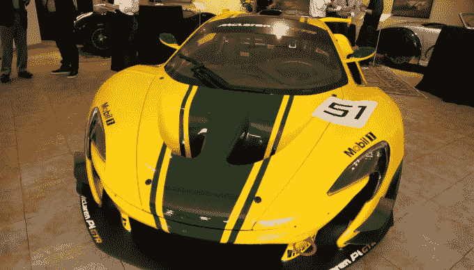

# 我们参加了迈凯轮价值 300 万美元的新车 TechCrunch 的预展

> 原文：<https://web.archive.org/web/https://techcrunch.com/2015/06/19/we-went-to-a-preview-event-for-mclarens-new-3m-hypercar/>

# 我们去参加了迈凯轮价值 300 万美元的新款超级跑车的预展

“硅谷混蛋”神话的一个方面是不可避免地购买一辆鲜红色的超级跑车——年轻企业家利用他或她的公司的新估值购买他们一直想要的法拉利。

因此，几周前，当我们随机收到麦克拉伦价值 300 万美元的新 P1 GTR 在湾区的预展活动邀请时，我们不得不参加。谁会在那里？我们会遇到一些熟悉的创业面孔吗？一些成功击败标准普尔 500 的风险投资家想要奖励自己？

在驱车前往马林的一个下午之后，我们的视频团队来到了一个停车场，那里停满了价格是我的小卡罗拉 15 到 60 多倍的车。有麦克拉伦、法拉利、莲花和几辆保时捷。这些不仅仅是汽车迷希望看到一款花哨的新车型——我开玩笑地问一些与会者，他们是否考虑支付六位数的首付(因为在我看来这很荒谬)，得到了几个干脆的“是”答复。

迈凯轮 P1 GTR，一辆为买得起湾区房产的人准备的车。

但是人群中肯定没有 20 多岁的年轻人想要花掉他们新的几百万。整个晚上我们发现，被邀请购买迈凯轮新款[P1·GTR](https://web.archive.org/web/20221207132140/http://cars.mclaren.com/featured-articles/mclaren-p1-gtr-to-debut-at-gms.html)的人都是街头合法 P1 的顾客。这本身就是一辆超级跑车，所以这些人有购买疯狂过度车辆的历史，他们想要一辆性能如此疯狂，只能在赛道上行驶的车。虽然有一些人涉足科技行业，但他们是风投和帮助公司上市的银行家。

在与客人闲聊之后，我们有机会采访了迈凯轮首席试车手克里斯·古德温。除了拿出原型车来看看它们在赛道上的表现，他还为 P1 GTR 的工程设计做出了贡献，从碳纤维内饰到混合动力系统，混合动力系统可以在汽车减速时收集能量，在需要时按需增加扭矩。

古德温的故事呼应了硅谷经常听到的故事。在牛津大学学习机械工程几年后，他说他想到了一个更好的主意:以开车为生。他为迈凯轮和其他汽车公司驾驶赛车 30 年，现在他将这一经验与他的技术培训相结合，帮助设计一些人们可以购买的最令人印象深刻的汽车。