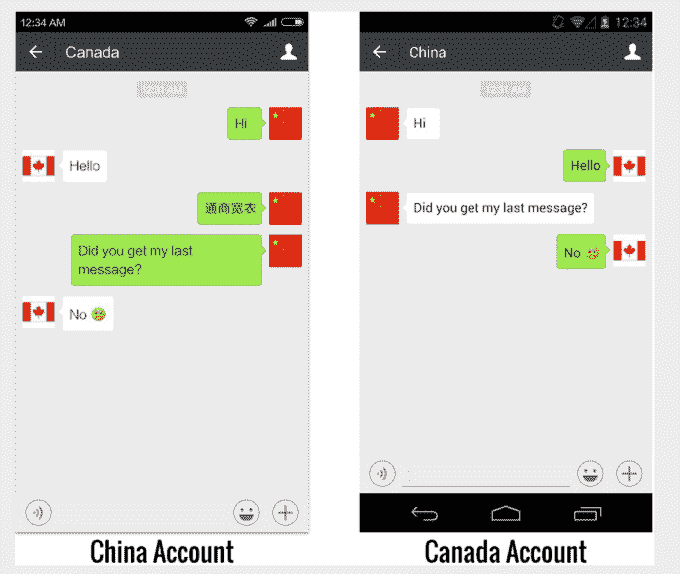

# WeChat, China's top messaging app, no longer tells users when it censors their messages • 

> 原文：<https://web.archive.org/web/https://techcrunch.com/2016/12/02/wechat-censorship-citizen-labs/>

Users of WeChat, China’s most popular messaging app, have stopped being informed when their messages are being censored in a move that further erodes user privacy, [according to a new report from Citizen Lab](https://web.archive.org/web/20221025020150/https://citizenlab.org/2016/11/wechat-china-censorship-one-app-two-systems/).

Tencent, the $232 billion dollar giant that operates WeChat, has always practiced forms of censorship on its users — that’s an inevitable part of running a popular online service in China — but at some point in recent years it ceased informing users when their messages were blocked. In the past, [the app would notify users](https://web.archive.org/web/20221025020150/http://thenextweb.com/asia/2013/01/11/tencents-wechat-comes-under-fire-for-international-censorship-practices/) when a message they intended to send wasn’t delivered because it was controversial, such as references to free speech groups or the Tiananmen Square massacre. Now, however, censored messages are simply not delivered with no notification for either sender or recipient.

“By removing notice of censorship, WeChat sinks deeper into a dark hole of unaccountability to its users,” [wrote Ron Deibert](https://web.archive.org/web/20221025020150/https://deibert.citizenlab.org/2016/11/wechat/), who is director of Citizen Lab, a research unit within the Munk School of Global Affairs at the University of Toronto, Canada.

The development is troubling, but even more so when you consider the scale of WeChat, which has [over 840 million active users each month](https://web.archive.org/web/20221025020150/https://beta.techcrunch.com/2016/11/16/tencent-q3-2016/) and has become an essential platform that includes payments, taxi-hailing, news services and food delivery.

That notification change is one of a number of alarming findings from the report, which Deibert believes is “essential because it helps pull back the curtain of obscurity that, unfortunately, pervades so much of our digital experiences.”

> 公民实验室利用在中国、美国和加拿大创建的一系列微信账号测试了审查制度

正如你所料，微信的审查机构是中国最强的。(尽管我们知道对国际用户也有审查已经有一段时间了。)该报告显示，它追踪了更多中国用户和说中文的人的关键词。与海外用户相比，中国用户在应用内浏览器(从应用内部打开链接时的默认设置)中会阻止更多的网址加载。

然而，最有趣的一点是，微信的审查系统——由存储在服务器端的一组不断演变的关键词触发——追踪全球用户与中国的链接。也就是说，如果一个账户与一个中国电话号码配对，那么它将继续受到中国的审查，即使它在中国以外的网络上使用，或者它与一个海外手机号码关联。

因此，从本质上来说，“微信中国用户”这个标签是终生不变的。这意味着旅行的学者、去海外学习的学生以及基本上任何离开中国的人都将留在中国互联网审查制度的范围内。

腾讯没有提供微信有多少海外用户的指导，但其中大部分可能位于中国，据估计，微信占中国消费者在线时间的三分之一。有鉴于此，公民实验室发现其审查力度在中国最大，尤其是已经成为越来越受欢迎的社交工具的群发信息。

微信允许多达 500 名参与者加入一个小组，他们通过为家人、同事、行业同行和其他所有人提供交流空间，在许多方面取代了社交网络。公民实验室发现，关键字审查在群体中更加活跃，可能是为了淡化在大量用户中传播信息的更高潜力。

腾讯在提供给 TechCrunch 的一份声明中没有直接回应该报告的具体发现:

> 腾讯尊重并遵守我们运营所在国家的当地法律法规，为我们的用户提供安全可靠的通信生态系统。微信已经并将永远坚持腾讯的核心使命，即通过提供高质量、安全的用户体验为我们的用户创造价值。

在[《纽约时报》报道](https://web.archive.org/web/20221025020150/http://www.nytimes.com/2016/11/22/technology/facebook-censorship-tool-china.html)[脸书已经开发出一套可以在中国部署的内容审查系统](https://web.archive.org/web/20221025020150/https://beta.techcrunch.com/2016/11/22/chinabook/)之后，关于中国审查制度的讨论最近升温了。这家美国社交网络从未回避其对中国的兴趣，但正如我上周所写的那样，微信等成熟服务的流行意味着，如果脸书能够找到一份适合中国政府的协议，那么在中国保持影响力将是一个巨大的挑战。

完整的公民实验室报告可在线阅读[点击](https://web.archive.org/web/20221025020150/https://citizenlab.org/2016/11/wechat-china-censorship-one-app-two-systems/)。