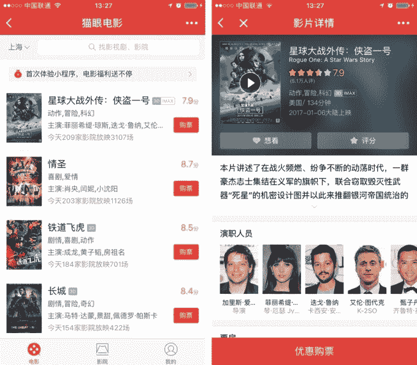

# 中国腾讯推出微信 TechCrunch“迷你程序”,挑战应用商店

> 原文：<https://web.archive.org/web/https://techcrunch.com/2017/01/09/wechat-mini-programs/>

今天是 iPhone 十周年纪念日，这款设备本身实际上创造了智能手机的类型，但在中国，移动行业的现代领头羊展示了自己的未来愿景。

市值 2400 亿美元的中国互联网巨头腾讯介绍了其对移动应用的看法——微信中的应用，这是一款轰动一时的聊天应用，每月用户数为 8 . 46 亿。腾讯去年推出了一个应用测试程序，它们本质上是更基本的精简版 iOS 和 Android 应用，可以即时下载，可以在微信中运行和存储。

它们看起来和感觉上都像应用程序，但腾讯称它们为“迷你程序”，因为苹果不允许它使用“应用程序”这个术语。迷你程序建立在微信巨大成功的基础上，微信是中国 iOS 和 Android 的顶级应用程序——[腾讯表示](https://web.archive.org/web/20230221155555/http://blog.wechat.com/2016/12/29/the-2016-wechat-data-report/)12 月，该应用程序拥有 7.68 亿每日用户，其中一半每天使用 90 分钟。

开发者已经可以使用官方账号和机器人来接触用户并与用户互动，但现在的体验更加丰富。没有应用程序商店来存放这些程序——苹果不允许应用程序存放应用程序商店——所以它们只能通过在微信中搜索或扫描二维码来找到，比如那些印在城市或其他地方地铁广告上的二维码，这在中国很流行。

> 通过微信迷你程序可以预订电影院[ [Credit: Tech In Asia](https://web.archive.org/web/20230221155555/https://www.techinasia.com/wechat-mini-programs-launch)

大量研究表明，智能手机用户对应用程序又爱又恨。[Nielsen](https://web.archive.org/web/20230221155555/https://techcrunch.com/2015/06/22/consumers-spend-85-of-time-on-smartphones-in-apps-but-only-5-apps-see-heavy-use/)的一项研究发现，消费者 85%的移动浏览时间都花在了应用程序上，但只有不到 12 个应用程序吸引了他们的大部分注意力。首先，让人们下载一款应用很难，但留住用户是另一个挑战。 [Localytics 发现](https://web.archive.org/web/20230221155555/https://techcrunch.com/2016/05/31/nearly-1-in-4-people-abandon-mobile-apps-after-only-one-use/)通常情况下，四分之一的人在使用一次后就会放弃新闻应用。

在西方，聊天机器人已经被提议作为信息过载的答案，或者至少是一个答案，因为它们可以将数据和对话简化为单行的可理解文本，并且不需要下载，这需要时间和密码。然而，尽管前景不容置疑，机器人还没有以一种有意义的方式起飞。

脸书已经尝试了应用内互动，推出了可以在即时通讯应用内玩的即时游戏。但微信可以通过迷你程序将这一概念提升到一个新的水平。它们像机器人一样容易下载，但它们可以提供更多类似应用程序的功能，以潜在地吸引用户。

> 微信内的一款图片分享应用【Credit: [亚洲科技](https://web.archive.org/web/20230221155555/https://www.techinasia.com/wechat-mini-programs-launch)

与策划类似计划的脸书和其他聊天应用不同，微信在分众市场上占据绝对主导地位，这意味着微信迷你程序绝对会成为任何开发者未来战略的一部分。不仅有潜在的受众，而且这些应用程序可以跨平台为 iOS 和 Android 微信用户工作。

这可能有助于企业应对在中国开发谷歌和苹果操作系统的挑战。虽然谷歌的安卓系统占所有设备的 85%，但由于谷歌 Play 商店在中国被屏蔽，分发是通过一系列第三方应用商店进行的。苹果 15%的份额倾向于占更富裕的消费者，他们更愿意消费。微信可以在这两者之间架起一座桥梁，吸引更多用户，并在未来随着迷你程序变得更加复杂，实际上与 iOS 和 Android 正面竞争。