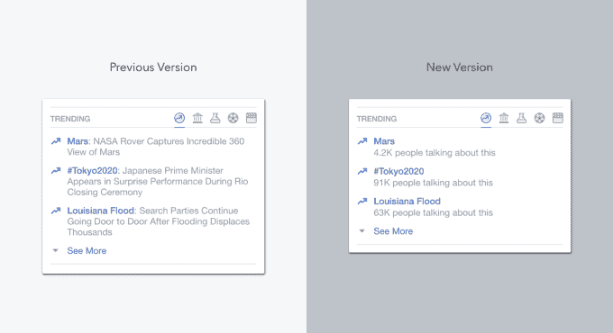

# 每周综述:SpaceX 爆炸摧毁脸书卫星，谷歌挑战优步 

> 原文：<https://web.archive.org/web/https://techcrunch.com/2016/09/02/weekly-roundup-spacex-explosion-destroys-facebook-satellite-google-takes-on-uber/>

本周，脸书的第一颗卫星在猎鹰 9 号爆炸中被摧毁，脸书改变了其热门话题布局，关于 Dropbox 密码泄露的新信息被披露。这些是本周的头条新闻，你可以[在你的收件箱](https://web.archive.org/web/20230131004053/http://link.beta.techcrunch.com/join/134/signup-all-newsletters)里收到这篇文章，如果这能让你的生活更轻松的话。

**1。** SpaceX 在完成一次常规静态测试点火时经历了一次[毁灭性爆炸](https://web.archive.org/web/20230131004053/https://techcrunch.com/2016/09/01/a-spacex-falcon-9-rocket-just-exploded-at-cape-canaveral/)，摧毁了脸书价值 2 亿美元的 Internet.org 卫星。SpaceX 证实没有人员在爆炸中受伤，但火箭和有效载荷被摧毁。当火箭爆炸发生时，有三个阶段的问题要经过，下面是我们目前所知道的。

在《脸书邮报》上，马克·扎克伯格写道，他对这次失败感到“深感失望”,但[下面是对话大概是如何进行的](https://web.archive.org/web/20230131004053/https://techcrunch.com/2016/09/01/a-totally-real-conversation-between-elon-musk-and-mark-zuckerberg-about-a-rocket/)。

> [猎鹰 9 号爆炸](https://web.archive.org/web/20230131004053/https://www.facebook.com/techcrunch/videos/10154606907922952/)
> 
> 一枚 SpaceX 猎鹰 9 号火箭爆炸。这是我们目前所知的:http://tcrn.ch/2c86Srv
> 
> 由 [TechCrunch](https://web.archive.org/web/20230131004053/https://www.facebook.com/techcrunch/) 于 2016 年 9 月 1 日星期四发布

**2。**滴答，滴答。现在是 9 月 7 日吗？苹果公司发出了 9 月 7 日(T3)周三在 T2 召开新闻发布会的邀请，届时它很可能会发布下一代 iPhone。泄露[显示](https://web.archive.org/web/20230131004053/https://techcrunch.com/2016/07/11/this-could-be-the-iphone-7/)iPhone 7 可能会采用流线型天线和更突出的摄像头，以及更大型号的双镜头相机系统。看起来音频端口也要消失了。有许多传言称，新款 MacBook Pro 将配备触控 ID 传感器和键盘上方的有机发光二极管迷你屏幕。Apple Watch 也应该会收到更新。一如既往，我们会在活动现场，通过博客和推特为您带来所有的更新。

**3。**让英语浏览用户感到沮丧的是，[脸书删除了趋势主题下的描述](https://web.archive.org/web/20230131004053/https://techcrunch.com/2016/08/26/confusing-topics/)以增加产品的可扩展性，并解雇了策划趋势部分的人类编辑。没多久[算法就搞砸了。至少我们从中获得了一些俳句。](https://web.archive.org/web/20230131004053/https://techcrunch.com/2016/08/29/facebooks-trending-topics-algorithm-mistake/)

**4。【Dropbox 和 Last.fm 都披露了四年前密码泄露的全部情况。还记得 [Dropbox 密码泄露](https://web.archive.org/web/20230131004053/https://blogs.dropbox.com/dropbox/2012/07/security-update-new-features/)吗？该公司最初表示，用户电子邮件是唯一被盗的数据，但这个数字可能比我们最初想象的要高得多。原来，密码也被窃取，导致超过 6000 万用户凭证被盗。 PSA:请启用双因素身份验证。**

**5。**苹果公司被[勒令支付高达 145 亿美元的非法税收优惠。欧盟委员会表示，苹果公司从其欧洲业务的非法税收优惠中受益，爱尔兰必须收回所谓的“非法援助”。苹果首席执行官蒂姆·库克在一封致顾客的信中回应称，T4 的举动是“前所未有的”、“有害的”、“没有事实和法律依据的”敬请关注。](https://web.archive.org/web/20230131004053/https://techcrunch.com/2016/08/30/apple-ordered-to-pay-up-to-145-billion-for-illegal-tax-benefits-in-ireland/)

**6。小心，优步。谷歌现在在旧金山运营自己的拼车服务。这项新服务使用 Waze 应用程序连接通勤者进行共享拼车，据说比优步便宜得多。**

**7。**起初，[亚马逊在给联邦快递](https://web.archive.org/web/20230131004053/http://www.bloomberg.com/features/2016-amazon-delivery/)生意。但是，随着该公司整合其交付业务(包括不断增长的航运业务、集中枢纽、航空运输和最后一英里交付)，电子商务巨头[实际上可能会杀死联邦快递](https://web.archive.org/web/20230131004053/https://techcrunch.com/2016/08/31/after-boosting-fedex-is-amazon-about-to-pull-an-aws-in-shipping/)。

**8。**脸书再次克隆了 Snapchat，为 Messenger 添加了新的[“即时视频”功能](https://web.archive.org/web/20230131004053/https://techcrunch.com/2016/09/01/facebook-clones-snapchat-once-again-lol/)。Messenger 已经允许您进行视频通话，但这项新服务可以让您和朋友立即相互分享实时视频。

9。你的 [iPhone 6 或 6 Plus 是否突然反应迟钝，屏幕上方出现一个闪烁的灰色条](https://web.archive.org/web/20230131004053/https://techcrunch.com/2016/08/29/sufferers-of-iphone-6s-touch-disease-may-soon-have-a-class-action-lawsuit/)？嗯，iFixit 的一份报告断言，该问题是设计缺陷的结果，一项“触摸疾病”诉讼希望将该案件升级为集体诉讼。

10。对于那些懒得/有钱到把洗衣服外包给 Washio 的人来说，这是个坏消息，因为 Washio 服务宣布[将立即关闭](https://web.archive.org/web/20230131004053/https://techcrunch.com/2016/08/30/washio-on-demand-laundry-service-shuts-down-operations/)。这家初创公司总共筹集了 1680 万美元的资金。

**11。柏林 IFA[发布了一系列新玩意](https://web.archive.org/web/20230131004053/https://techcrunch.com/events/ifa-2016/)。一些亮点包括奇怪迷人的[联想瑜伽书](https://web.archive.org/web/20230131004053/https://techcrunch.com/2016/08/31/yoga-book-hands/)、Fitbit Charge 2 和[三星最新智能手表 Gear S3](https://web.archive.org/web/20230131004053/https://techcrunch.com/2016/08/31/samsung-gear-s3) 。我们还带着 Sphero 的 BB-8 力带兜了一圈。**

> [BB-8 力带](https://web.archive.org/web/20230131004053/https://www.facebook.com/techcrunch/videos/10154606098422952/)
> 
> 带着 Sphero 的 BB-8 力量乐队去 http://tcrn.ch/2bKV7qm 兜风
> 
> 由 [TechCrunch](https://web.archive.org/web/20230131004053/https://www.facebook.com/techcrunch/) 于 2016 年 9 月 1 日星期四发布

12。蓝色围裙的农场蛋——包装在自己小箱子里的单个蛋——引发了一些重要的问题。估值超过 20 亿美元并可能寻求首次公开募股的蓝色围裙，既是一家食品初创公司，也是一家航运公司；因此，必须考虑碳排放、食品运输和包装废物等问题。但是公司是问题的一部分还是解决方案的一部分呢？TBD。

13。深陷法律纠纷的梦幻体育初创公司 DraftKings 获得了由 DC 革命资本(Revolution Capital)领投的 1.5 亿美元新融资。