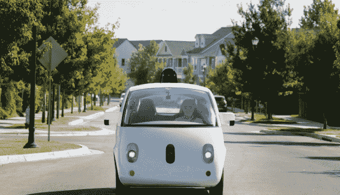

# 每周综述:特朗普会见科技领袖，雅虎遭遇又一次大规模黑客攻击 

> 原文：<https://web.archive.org/web/https://techcrunch.com/2016/12/16/weekly-roundup-trump-meets-with-tech-leaders-yahoo-suffers-another-massive-hack/>

# 每周综述:特朗普会见科技领袖，雅虎遭受又一次大规模黑客攻击

本周，如果你住在三藩市，你可以在一辆无人驾驶的优步上玩 iOS 版的《超级玛丽》。你也可以第一次在 Instagram 或 Snapchat 上向一群人直播。这些都是本周科技领域的头条新闻，集中在一个地方。*你也可以在你的收件箱中以[简讯的形式获得这篇文章，因为即使在 2016 年，电子邮件也不会消亡。](https://web.archive.org/web/20221206153854/http://link.beta.techcrunch.com/join/134/signup-all-newsletters)*

**1。当选总统唐纳德·川普本周会见了一些科技行业最杰出的高管，包括谷歌的埃里克·施密特和拉里·佩奇，苹果的蒂姆·库克，微软的塞特亚·纳德拉和脸书的雪莉·桑德伯格。甲骨文首席执行官萨弗拉·卡兹[加入川普的过渡团队](https://web.archive.org/web/20221206153854/https://beta.techcrunch.com/2016/12/15/oracle-ceo-safra-catz-joins-trump-transition-team/)，战略与政策论坛[挑选优步首席执行官特拉维斯·卡兰尼克和特斯拉的埃隆·马斯克为董事会成员](https://web.archive.org/web/20221206153854/https://beta.techcrunch.com/2016/12/14/trump-hails-ubers-kalanick-and-rockets-spacexs-musk-to-positions-on-strategic-and-policy-forum/)。虽然优步战略性地签约以确保 IPO 过程顺利似乎是有利的，但马斯克的动机仍不清楚。**

**2。雅虎又遭受了一次大规模黑客攻击。该公司被执法部门警告有 10 亿个账户被盗，并在外部法医专家的帮助下检查了数据。这似乎与我们在 9 月份了解到的另一个[漏洞完全无关。威瑞森一定感觉棒极了。](https://web.archive.org/web/20221206153854/https://beta.techcrunch.com/2016/09/22/yahoo-confirms-state-sponsored-attacker-stole-personal-data-of-at-least-500-million-users/)**

**3。**优步的自动驾驶汽车[开始在三藩市](https://web.archive.org/web/20221206153854/https://beta.techcrunch.com/2016/12/14/ubers-self-driving-cars-start-picking-up-passengers-in-san-francisco/)搭载乘客，[随即被勒令停止](https://web.archive.org/web/20221206153854/https://beta.techcrunch.com/2016/12/14/uber-ordered-to-stop-self-driving-vehicle-service-in-san-francisco/)。优步开始推出配备传感器和超级计算机的沃尔沃 XC90 SUVs，作为匹兹堡自动驾驶试点项目的扩展。优步没有在公共道路上测试自动驾驶汽车所需的必要的州许可，但无论如何还是启动了，并且现在拒绝停止运营这些汽车。

**4。**谷歌宣布，它正在剥离其无人驾驶汽车部门，成为一家名为 Waymo 的独立公司。它将在 Alphabet 下运营，并将更专注于自动驾驶技术，而不是汽车本身。

**5。**脸书采取行动打击假新闻问题。在 Snopes、FactCheck.org、Politifact、ABC News 和美联社 T5 的外部事实审查员的帮助下,[现在将标记并降低假新闻的等级。婴儿学步？](https://web.archive.org/web/20221206153854/https://beta.techcrunch.com/2016/12/15/facebook-now-flags-and-down-ranks-fake-news-with-help-from-outside-fact-checkers)

**6。**挪过去，神奇宝贝 GO。热门的新[超级马里奥跑游戏](https://web.archive.org/web/20221206153854/https://beta.techcrunch.com/2016/12/15/super-mario-run-review/)在 iOS 和 iPad 的应用程序商店上可用。它带回了人们所希望的所有马里奥怀旧情结，售价 10 美元。它还打破了 Pokémon GO 第一天游戏下载量的记录，[超过 500 万](https://web.archive.org/web/20221206153854/https://beta.techcrunch.com/2016/12/16/super-mario-run-sees-2-85-million-downloads-on-day-one-but-half-reviews-are-just-one-star/)。

> [超级马里奥跑分回顾](https://web.archive.org/web/20221206153854/https://www.facebook.com/techcrunch/videos/10155005672442952/)
> 
> 评论:《超级马里奥 Run》是任天堂 http://tcrn.ch/2hTSvrR 手机野心的一瞥
> 
> 由 [TechCrunch](https://web.archive.org/web/20221206153854/https://www.facebook.com/techcrunch/) 于 2016 年 12 月 15 日星期四发布

**7。**比尔·盖茨、杰夫·贝索斯、马云、约翰·杜尔登和其他 16 位知名投资者成立了一家名为突破能源风险投资的新风险公司，将在未来 20 年内向清洁技术公司投入至少 10 亿美元。他们表示，他们正在投资任何阶段的科技企业，从种子到商业化，并将专注于电力、制造、农业、建筑和交通。

8。苹果的 AirPod 无线耳机在苹果网站上以 159 美元的价格上涨[，并且他们收取 69 美元来替换一个丢失的“Pod”。找到我的 AirPods 功能，有人吗？](https://web.archive.org/web/20221206153854/https://beta.techcrunch.com/2016/12/15/apple-will-charge-69-to-replace-a-lost-airpod/)

**9。** Instagram 势如破竹。该应用成为最新的引入直播的社交平台，它向所有美国用户发布了其[直播视频广播功能](https://web.archive.org/web/20221206153854/https://beta.techcrunch.com/2016/12/12/instagram-opens-live-video-broadcasts-to-all-u-s-users/)。该应用程序还[超过了 6 亿次下载](https://web.archive.org/web/20221206153854/https://beta.techcrunch.com/2016/12/15/instagram-surges-past-600m-users-fueled-by-algorithmic-feed/)，这是一个巨大的里程碑，由其算法馈送推动。Instagram 值得一看，各位。

10。Snapchat 悄无声息地发布了新的群组功能，可以让你与多达 16 个人交换照片、视频和信息。开创性？不会，但当一个应用程序的日用户超过 1 亿时，这样的功能可能会影响 Messenger、WhatsApp 或 iMessage 等其他消息服务的使用方式。

**11。**随着 [Brendan Iribe 辞去首席执行官一职](https://web.archive.org/web/20221206153854/https://beta.techcrunch.com/2016/12/13/oculus-ceo-brendan-iribe-steps-down-will-now-lead-pc-based-vr-division-within-company/)领导公司内基于 PC 的虚拟现实部门，Oculus 发生了人事变动。