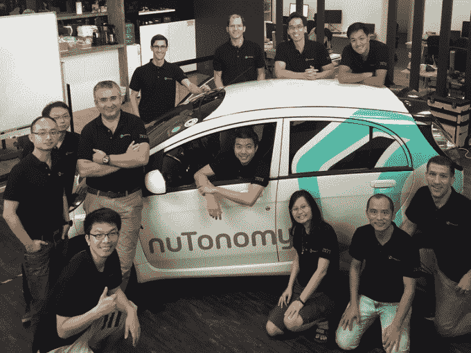

# 每周综述:零日黑客攻击撼动苹果，WhatsApp 改变隐私政策 

> 原文：<https://web.archive.org/web/https://techcrunch.com/2016/08/27/weekly-roundup-zero-day-hacks-rock-apple-whatsapp-changes-privacy-policy/>

八月，几个月中的周末。本周，零日黑客攻击震惊了苹果，WhatsApp 宣布了一项重大隐私变化，特斯拉宣布了一种新模式，将可笑模式提升到了一个新的水平。你更愿意在收件箱里收到每周综述吗？同样的，TBH。

**1。**黑客们正在[移动设备上磨砺](https://web.archive.org/web/20221206124009/https://beta.techcrunch.com/2016/08/25/apple-zero-days-hacking/)。最近的一个例子是针对活动家艾哈迈德·曼苏尔的苹果零日黑客攻击，该攻击使用了三个零日漏洞，而不是一个[而是*个*，并通过一个补丁](https://web.archive.org/web/20221206124009/https://beta.techcrunch.com/2016/08/25/exploits-patched-by-apple-today-hint-at-years-of-surreptitious-government-hacks/)解决。调查表明，这些是一家可疑的网络安全公司的工作，该软件可能已被寻求妥协政治目标的政府使用多年。因此，如果你还没有这样做，请将你的 iOS 设备更新到 9.3.5。

**2。** WhatsApp 对其隐私政策进行了重大调整。脸书旗下的消息应用现在将与脸书共享用户数据，用于广告定位。你有几个选择:停止使用 WhatsApp，或者利用该应用为用户提供的短期部分退出服务。以下是如何选择退出的步骤。

**3。谷歌宣布对其搜索结果进行重大调整。该公司将开始通过降低搜索结果中的排名来惩罚那些带有侵入性广告的网站。当你打开一个网站，占据了整个页面，并且用最小的按钮来删除它们时，这些广告就会出现。谢天谢地。**

**4。**苹果能社交吗？[苹果可能正在开发一款视频录制和编辑应用](https://web.archive.org/web/20221206124009/https://beta.techcrunch.com/2016/08/25/apple-may-be-building-a-snapchat-like-video-app/)，可能类似于 Snapchat。没有提到短暂的内容，但[报道称](https://web.archive.org/web/20221206124009/http://www.bloomberg.com/news/articles/2016-08-25/apple-weighs-iphone-video-editing-app-in-renewed-push-on-social-isa5rhlu)该应用应该易于单手视频录制，并提到了过滤器和绘图功能。

**5。特斯拉没有减速。在埃隆·马斯克在推特上调侃了一则公告，然后展示了一款闪亮的新车型后，该公司的股票飙升。[特斯拉有一款新的型号 S P100D](https://web.archive.org/web/20221206124009/https://beta.techcrunch.com/2016/08/23/teslas-new-model-s-p100d-adds-range-and-cranks-ludicrous-mode-up-a-notch) ,将滑稽模式的 0-60 英里/小时时间提高了 0.1 秒。**

**6。优步被麻省理工学院的一个小衍生公司抢了风头。一家名为 NuTonomy 的低调得多的公司推出了世界上第一辆自动驾驶出租车，其自动驾驶汽车在新加坡上路。这家成立三年的公司自 4 月以来一直在新加坡私下测试无人驾驶汽车。优步，[你说呢？](https://web.archive.org/web/20221206124009/http://www.quickmeme.com/p/3vmt31)**

**7。**Hyperloop One 的真实情况是什么——这一未来交通系统计划以每小时 750 英里的速度将人类从 A 点送到 B 点？(除了领导层变动、诉讼、反诉和 8000 万美元的资助。)该公司仍处于早期阶段，但[正在积聚巨大的潜力来改变运输行业](https://web.archive.org/web/20221206124009/https://beta.techcrunch.com/2016/08/23/a-look-inside-hyperloop-ones-wildly-fast-future/)——如果该公司能够加快速度的话。

**8。**天文学家首次发现了一颗围绕太阳最近邻居运行的行星，比邻星。比邻星 b 是正式的离地球最近的系外行星，但重要的是，它离太阳的距离合适，可以支持液态水…和潜在的外星生命。欢迎来到比邻星 b！

这幅艺术家的印象展示了比邻星 b 的表面视图，它围绕着离太阳系最近的红矮星比邻星运行。

**9。** [安卓牛轧糖出 beta](https://web.archive.org/web/20221206124009/https://beta.techcrunch.com/2016/08/22/android-nougat-comes-out-of-beta/) 。它适用于谷歌自己的 Nexus 设备(Nexus 6、Nexus 5X、Nexus 6P、Nexus 9、Nexus Player)、Pixel C 平板电脑和通用移动 4G 手机。最明显的变化是通知系统，更接近谷歌的材料设计准则。

**10。Y Combinator 举办了 2016 年夏季展示日 [1](https://web.archive.org/web/20221206124009/https://beta.techcrunch.com/2016/08/22/y-combinator-demo-day-summer-2016/) 和 [2](https://web.archive.org/web/20221206124009/https://beta.techcrunch.com/2016/08/23/yc-demo-day/) ，展示了从农用无人机、自主安全卫士到下一代卫生棉条等创业公司的产品。从第一天开始，飞行中的虚拟现实娱乐和安全警卫无人机就在[最有前途的初创公司的最佳照片中。从第二天](https://web.archive.org/web/20221206124009/https://beta.techcrunch.com/gallery/yc-demo-day/)开始，枪击探测器、销售团队分析和移民信用报告就是我们的最爱。**

**11。哈佛商学院的学生学习风险投资的艺术。在去年学习的一个案例研究中，实际上是[Rothenberg Ventures](https://web.archive.org/web/20221206124009/https://beta.techcrunch.com/2016/08/23/for-hbs-students-a-case-study-in-what-not-to-do/)的故事，该公司由一名 HBS 毕业生创立，是最近风投失败的的[主题。](https://web.archive.org/web/20221206124009/https://beta.techcrunch.com/2016/08/18/at-rothenberg-ventures-the-rise-and-fall-of-a-virtual-gatsby/)**