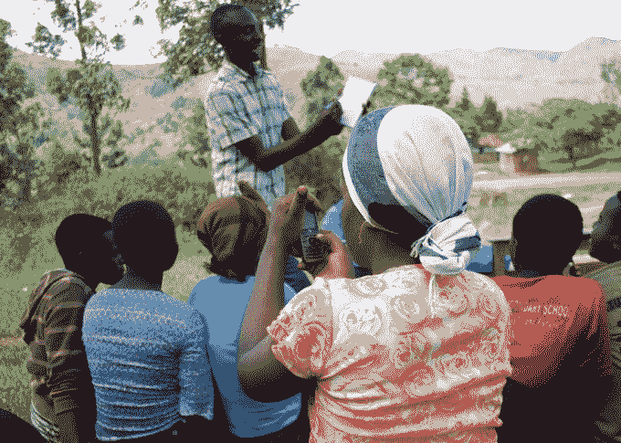

# WeFarm 的“Quora for farmers”在非洲扩大规模，获得了 local globe TechCrunch 的 160 万美元

> 原文：<https://web.archive.org/web/https://techcrunch.com/2016/11/16/wefarms-quora-for-farmers-scales-up-in-africa-with-1-6m-from-localglobe/>

农业科技，简称 agtech，已经逐渐成为初创公司的一个迷人的垂直领域。这是一个巨大的传统市场，只是在等待云提供的新工具。在欧洲这个巨大的食品生产国，这一点尤其重要。但在新兴市场，它可能会产生最大的影响。

全世界大约有 5 亿小农提供了世界上 70%以上的食物。但是，高达 90%的人无法访问互联网，并且经常与世隔绝，甚至无法获得基本的农业信息。与此同时，在气候变化的背景下，到 2050 年，世界需要养活另外 30 亿人(抱歉，唐纳德)。

这就是为什么快速发展的小型创业公司会蜂拥而至解决这个问题。

在英国，农业科技初创公司 [WeFarm](https://web.archive.org/web/20221208230429/http://wefarm.org/) 现在已经在由 [LocalGlobe](https://web.archive.org/web/20221208230429/https://www.crunchbase.com/organization/localglobe) 牵头的一轮融资中获得了 160 万美元(130 万英镑)的种子资金，这家总部位于英国的种子风险投资公司此前投资了 Citymapper、Lovefilm、Moo、TweetDeck、TransferWise 和 Zoopla。2015 年，WeFarm 是伦敦 Wayra 加速器的一部分。

那么什么是 WeFarm 呢？这是一个点对点的农业科技网络，使小规模农民能够访问和分享重要的农业信息，这一点至关重要，即使他们的互联网接入受到限制。

它允许农民通过短信和互联网获得任何农业问题的准确答案。然后，该服务使用机器学习技术将问题与系统上拥有最相关知识的用户联系起来。网络上讨论的话题从如何阻止小鸡死亡到哪里可以找到卖洋葱的市场。综艺！

因此，小规模农民可以学习如何提高作物产量或如何创办微型企业，从而增加家庭收入。把它想象成“农民的 Quora”

WeFarm 于 2015 年启动，现已覆盖肯尼亚、乌干达和秘鲁的 10 万多名农民，他们分享了超过 1500 万条信息。

竞争对手包括 iCow、mFarm 和 mShamba，但尽管大多数人倾向于使用“询问专家”的发布模式，WeFarm 使用 P2P 问答，因此可以无限扩展。它还拥有很高的参与率，每月有超过三分之一的用户积极贡献知识。

WeFarm 创始人兼首席执行官肯尼·伊万(Kenny Ewan)表示，众包信息“释放了农民中几代人的基层知识、想法和经验”，比在主要以功能手机为主导的地区使用移动应用程序更有效。

通常情况下，WeFarm 最初是由 Cafedirect 生产者基金会(CPF)开发的一个项目，该基金会是一个与世界各地的小农合作的非营利组织，后来作为一家创业公司分离出来。