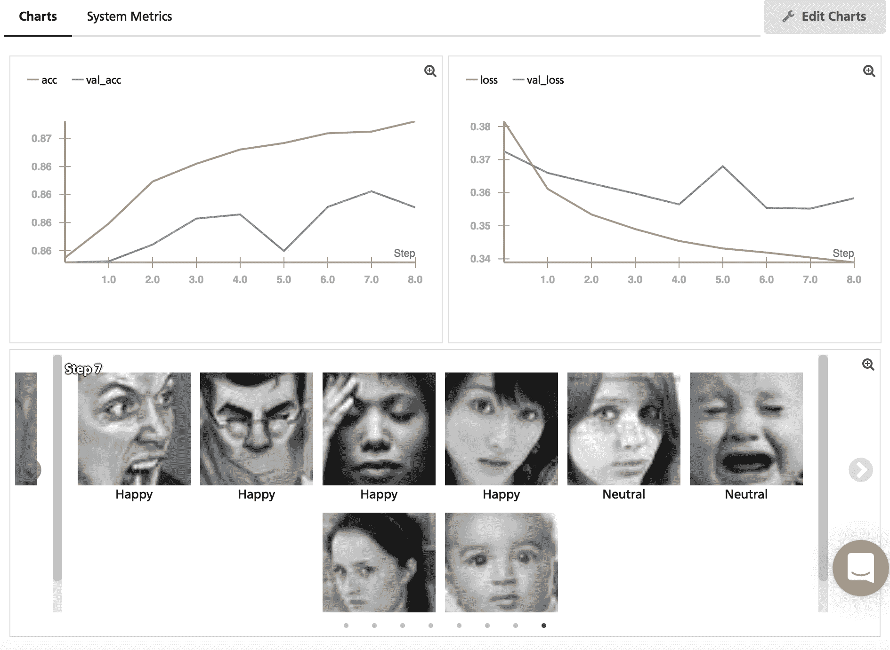

# Weights & Biases 筹集了 500 万美元来开发机器学习工具 

> 原文：<https://web.archive.org/web/https://techcrunch.com/2018/05/31/weights-biases-raises-5m-to-build-development-tools-for-machine-learning/>

# Weights & Biases 筹集了 500 万美元来开发机器学习工具

机器学习是如今几乎每个科技公司都喜欢抛出的时髦词汇之一，但根据 Lukas Biewald 的说法，它代表了一种真正的新编程方法。

“软件已经吃掉了世界上的很多东西，而机器学习正在吃掉软件，”Biewald 说。

在他看来，这两种方法之间存在“根本”差异:“一个重要的差异是，如果你拥有的只是用来训练程序的代码，你并不真正知道发生了什么……如果我拥有用来训练自动驾驶汽车算法的所有代码，但我没有数据，我不知道发生了什么。”

Biewald 和 Chris Van Pelt 一起创建了 CrowdFlower(现在被称为[Figure 8](https://web.archive.org/web/20230124090338/https://www.figure-eight.com/)，它在近十年前的 TechCrunch 50 大会上推出，并且[创造了用于训练人工智能的工具](https://web.archive.org/web/20230124090338/https://techcrunch.com/2016/06/07/crowdflower-series-d/)。

Biewald(我从大学就认识他)和 Van Pelt，加上前谷歌工程师 Shawn Lewis，现在已经创办了一家名为[Weights&bias](https://web.archive.org/web/20230124090338/https://www.wandb.com/)的新公司，为机器学习开发者开发新工具。他们还从三一投资公司和彭博贝塔投资公司获得了 500 万美元的首轮融资。

“人工智能有如此大的潜力，但很少有公司实施它，因为开发过程对于除了少数受过良好训练的工程师之外的所有人来说都太复杂了，”Trinity 的 Dan Scholnick 说，他将加入这家初创公司的董事会。(Scholnick 之前支持 CrowdFlower。)“W&B 的目标是大幅简化机器学习软件开发流程，以便人工智能的好处可以在各行各业得到释放，而不再局限于今天能够雇佣技能极其娴熟、价格极其昂贵的人工智能开发人员的少数公司。”

最终目标是创建一整套开发工具，但 Weights & Biases 的第一个产品记录并可视化了训练机器学习算法的过程。Biewald 解释说，这使得开发人员可以回头看看他们一个月前在做什么，并与队友分享这些信息。非营利研究公司 [OpenAI](https://web.archive.org/web/20230124090338/https://openai.com/) 已经在使用它。

Biewald 补充说，当他和他在这个领域的朋友谈论他们最大的问题时，这是首先出现的问题。这也是他希望开发未来产品的方式——与开发者合作，找出他们真正需要的东西。

“我不想帮助炒作，”他说。“我想帮助解决真正的问题，让这些东西真正发挥作用。”

Biewald 还在[的博客文章](https://web.archive.org/web/20230124090338/https://medium.com/@l2k/starting-a-second-machine-learning-tools-company-ten-years-later-21a40324d091)中提供了他对公司愿景的更多细节:

> 你不能用蹩脚的画笔画得很好，你不能用蹩脚的 IDE 写好代码，你也不能用我们现在拥有的工具来构建和部署伟大的深度学习模型。我想不出比改变这一点更重要的目标了。