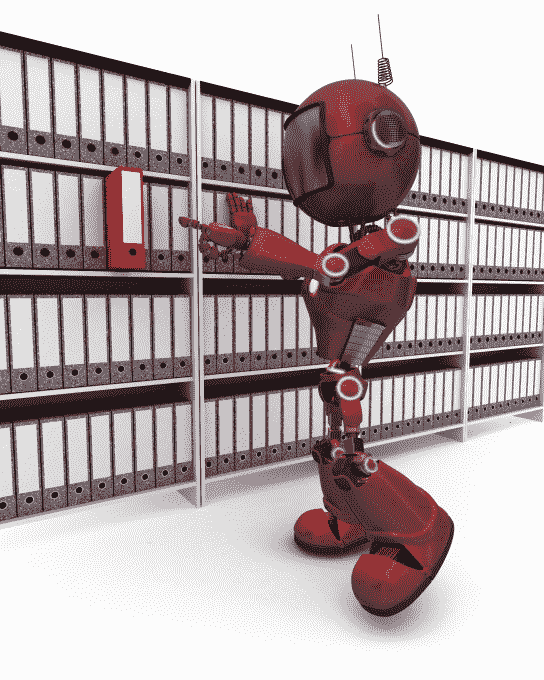
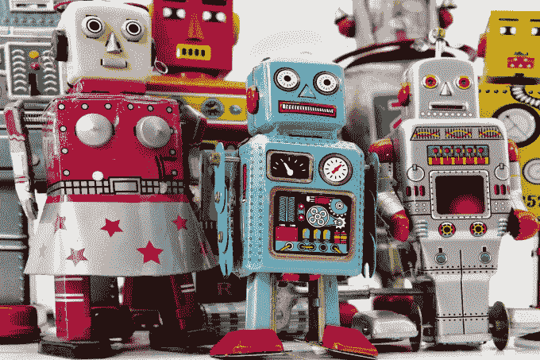

# 欢迎来到后 app 世界？

> 原文：<https://web.archive.org/web/https://techcrunch.com/2016/04/30/welcome-to-the-post-app-world/>

More posts by this contributor

我们已经爱上了应用程序。很难看到如此受欢迎的东西消失在过去，但如果真的发生了呢？如果在更好的东西出现之前，应用只是移动网络的一个迭代，会怎么样？

随着围绕脸书 F8 会议的一系列声明，也许这一时刻终于到来了。

我们正在见证机器人的崛起吗？

自 2010 年以来，“已经有了一个应用程序”。然而，这种兴奋似乎正在消退。在你自己的主屏幕(地球上最有价值的不动产)上，有哪些新的应用程序正在使用这个空间？

每卖出一部 iPhone，就有 119 个应用被下载。然而，在任何一个月，我们使用的应用程序都不到这些应用程序的四分之一。平均来说，一个应用程序在下载后的三天内会失去 77%的用户。我们最喜欢的五个应用占据了我们 80%的会话时间。

在过去的几年里，“点击下载”的展示广告已经随处可见。似乎每个零售商的移动商务策略都是开发 iPhone 或手表应用。对于许多第一次上市的人来说，这似乎是一场淘金热。回想起来，也许我们的信念更关注技术改变习惯的力量，而不是对消费者需求的同情。

当然，app 也有局限性。或许苹果公司做过的最好的营销是将“计算机程序”这一无聊的概念转化为令人兴奋的应用程序。它们在许多用途上表现出色。银行或航空应用程序在迅速提供个人安全信息方面做得非常好，这是一种重要信息的微型门户。

话又说回来，随着即时通讯和语音控制的兴起，应用程序似乎越来越不能解决一切问题。

**迫使一个可怕的选择**

应用程序提供了一种越来越糟糕的方式来获取我们想要的东西。苹果自信地说电视的未来是应用程序，这是愚蠢至极的。他们只不过是复制了电视频道世界的虚假的、不合时宜的结构。

我看 AMC 还是绝命毒师？我想看超级碗还是调到哥伦比亚广播公司？现代关系是与内容，而不是馆长或管道。你能想象下载 20 个唱片公司的应用程序来获得我们的音乐，然后需要在它们之间切换吗？

通讯也是一样。回到 2006 年，我可以给我的联系人列表中的任何人打电话或发短信:这是一个简单的选择。现在有了 Viber、Line、微信、Instagram、Facebook Messenger、Twitter 和其他一百万种联系某人的方式，我首先需要选择应用程序，然后选择我想要联系的人……然后希望这是他们正在使用的应用程序。

当我想去机场的时候，我总是想要一辆车带我去。我不想选择供应商，也不想选择汽车的大小和目的地。

这就引出了未来的第一个机制:聚合。

**聚合**

我的电视有四个遥控器，在播出后观看《约翰·奥利弗》需要我通过卡夫卡式的菜单按九个按钮。

我渴望有一天，单个应用程序可以成为一种内容类型的门户。这类似于我用 Spotify 听我喜欢的所有音乐，或者用 Twitter 看我可能需要的所有新闻。我看到应用程序把我们关心的东西放在最前面。

Apple TV 希望做到这一点，但苹果没有合适的合作伙伴来吸引世界上所有的内容提供商。如果商业模式能够被开发出来，我认为拥有地图的大型门户网站将会崛起，成为所有旅行、酒店、活动和地点的主要访问点。这将与另一个门户网站，以访问我所有的网络和接触他们的方式，以及额外的零售和内容的门户网站。

**应用的互联网**

然后我看到我们在应用程序中的旅程是一个链接。消费者可能会在 Facebook Messenger 上开始讨论电影时间，然后根据我们的位置在 feed 中看到建议的电影。

通过触控 ID 和苹果支付，购买和下载门票将直接发生在 Passbook 上。然后，他们可以在 Opentable 中预订晚餐，通过应用程序内的即时消息预订时间，最后订购一台优步带他们去那里。所有这些体验都将在一个应用环境中实现:无缝、安全和个性化。

互联网可能很快成为一个完全个性化的应用。

**流媒体**

我们可能想从我们不太关心的零售商那里订购不经常使用的商品，或者只存在于国外的酒店网站。为此，我们将应用流视为一种体验的模拟器。我们的应用程序互联网可能是由我们手机上现有的应用程序组成的，但除此之外，我们将使用流式传输的临时应用程序来提供这样的界面。

**新导航**

这就是人工智能和机器人走到一起的地方。

通知层可能会成为我们浏览网页表面，而不是深入体验和发现它的关键方式。人工智能、机器学习、共享数据和来自 Google Now、Cortana 和 Siri 的丰富分析等技术的结合可以自动化我们生活的许多方面。

我们需要更少地将互联网视为我们去的地方，而是更多地将通知层视为手机认为与我们相关的建议提示的地方。

下雨了，我们要迟到了，这是预订优步的提示；当我们醒来时，通知屏幕上的天气预报；难得一见的 8 点 晚餐时段因迟到取消；飞机晚点起飞……最好通知我们一下。

**语音**

我们最终需要考虑一个没有屏幕的世界。Echo 就是这种设备的一个例子，一些可穿戴设备也是如此。我们如何在没有大型不动产的情况下，使用声音、触觉反馈或其他机制来传授知识？这是一个全新的 UI 设计师团队需要考虑的挑战。

应用程序会一直存在。机器人不会杀死它们，但我们即将进入一个混合时代，一些应用程序将成为通往一切的门户:它们将允许我们选择我们想要的东西，而不是谁给我们