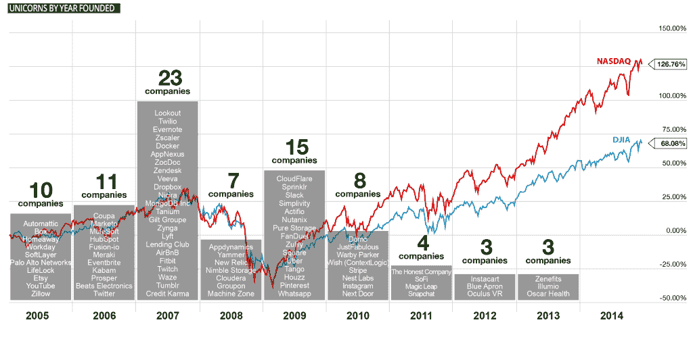

# 欢迎来到 2015 年独角兽俱乐部:向十亿美元公司学习 

> 原文：<https://web.archive.org/web/http://techcrunch.com/2015/07/18/welcome-to-the-unicorn-club-2015-learning-from-billion-dollar-companies/>

自从我们写了第一篇分享我们对过去十年中美国最成功的风险投资支持的科技公司的分析的文章以来，一年已经过去了。

正如我们在[的原始帖子](https://web.archive.org/web/20221203071750/https://beta.techcrunch.com/2013/11/02/welcome-to-the-unicorn-club/)中所写的那样——许多企业家和支持他们的风险投资者寻求建立价值 10 亿美元或更多的大型、有影响力的公司。我们称这些公司为“独角兽”,因为它们取得的成就似乎非常困难、罕见，而且相对来说未经研究。

这个 10 亿美元的门槛很重要，因为从历史上看，顶级风险投资基金只从少数超级成功的公司中获得所有权回报。随着大多数传统基金的规模扩大，它们需要更大的“出口”来提供可接受的回报(牛仔风险投资不同——我们的设计很小，尽管我们很乐意投资独角兽)。

艾琳·李是

[Cowboy Ventures](https://web.archive.org/web/20221203071750/http://www.cowboy.vc/)

这是一个种子期基金，支持企业家通过软件重塑工作和个人生活。

More posts by this contributor

例如，要想只返还 4 亿美元风险基金的初始资本，这可能意味着需要在退出时拥有两家不同的 10 亿美元公司的 20%，或者在公司被收购或上市时拥有一家 20 亿美元公司的 20%。

这个帖子和术语引起了比预期更多的关注。这是一个很好的惊喜——这是一个特殊事物的特殊词汇，我们喜欢它不是传统的商业行话。

一些人甚至担心，对“独角兽”的追求既令人讨厌，又可能在某种程度上改变了科技估值的性质。对此，我们要强调两点:

首先，我们的项目使用估值作为过滤器(一个公认不完美的过滤器)来识别和学习我们这个时代发展最快的科技公司。我们的目标是学习，而不是列清单。也不是鼓励公司优化时点账面估值，如果不可持续的话，这将带来很多负面影响。

第二，如上所述，今天的传统风险公司规模庞大，需要独角兽退出来提供回报。一些投资者可能会抱怨企业家想要“独角兽估值”。但说实话，大多数投资者也想要它们，并支持这些公司的大规模资本化。(稍后将详细介绍。)

因此，我们的数据是基于公开来源，以及一个时间快照(这有一定的局限性)，这里是一个新的学习和加强的经验教训的总结，来自一组更新的公司 ¹ :

## 我们最新分析的摘要

1)我们发现 **84 家美国公司属于我们所谓的“独角兽俱乐部”，**比我们上一篇帖子增长了令人瞠目结舌的 115%。这一增长很大程度上是由“**纸上独角兽**”驱动的，即尚未出现“流动性事件”的私营公司但是，这些公司仍然非常罕见:我们的名单只是**。14%的风险投资支持的消费者和企业科技初创公司**。

2)在过去十年中，平均每年**有八只独角兽诞生**(2003-2013 年间为四只)。从 2005 年到 2015 年的十年间，还没有一个超级独角兽**(价值超过 1000 亿美元)诞生，但**现在已经有九个“十个玉米”**(价值超过 100 亿美元)，是我们上一篇文章的 3 倍。**

3) **以消费者为导向的公司驱动我们集合中的大部分价值**:更多的公司和更高的每家公司的平均价值。他们筹集了大量私人资本。

4) **企业化公司较少，募集民间资本较少**；企业融资的增加降低了它们从私人融资中获得的回报。

5) **就商业模式而言，电子商务公司驱动了我们集合中的大部分价值，但具有最低的“资本效率”。**“企业和受众公司在我们这一套的市场份额有所下降，而 **SaaS 公司的市场份额有了明显的增长**。我们还增加了一个新类别:物联网/消费电子产品。

6)这是一个漫长的旅程，超出了授权期:对于 39%已经“退出”的人来说，在“流动性事件”发生之前，平均花费了~ **7 年时间——这还不包括我们名单中仍为私有的 61%。这些“私人独角兽”的资本效率低得惊人，这可能会影响创始人、投资者和员工的未来回报。**

7)振作起来，硅谷的“老人”:**受过良好教育、精通技术、30 多岁、经验丰富、有着共同历史的联合创始人团队**创造了最多的成功。二十多岁的创始人和成功的支点是少数；有献身精神的首席执行官们能够长期发展他们的公司，但却不能。

8) **旧金山作为湾区最有价值的科技公司的新中心，保持着主导地位**；像纽约和洛杉矶这样的城市越来越重要

9) **移民在当今科技公司的创建和价值创造中发挥着巨大的作用**。我们想知道，如果更容易获得工作签证，会创造多少价值。

高层的多样性仍然太少。从零开始，在性别问题上有了积极的进展；没有足够的种族和其他代表性不足的群体的数据。

## 一些更深入的解释和其他发现

1)欢迎来到由 84 名成员组成的独享独角兽俱乐部:最高的 14%

*   我们为我们的集合确定了 84 家公司(根据我们的定义，总部位于美国、风险投资支持的软件和互联网导向型公司成立于 2005 年，由公共或私人市场投资者估值超过 10 亿美元 ¹ )。**自我们一年半前的最后一次分析**以来，增长了惊人的 115%。
*   这些公司的总价值为 3270 亿美元，是我们上次分析的 2.4 倍(不包括脸书，其价值几乎是我们上次榜单的一半)。
*   推动总价值大幅增长的是公司数量，而非单个公司的估值。在我们的榜单上，公司平均价值为 39 亿美元，仅比去年增长了 8%。
*   **正是“纸上独角兽”的数量**极大地提高了总价值。私营公司现在占我们名单的 61%(对 36%)，总价值 1880 亿美元，平均价值 37 亿美元。
*   **为什么现在比 2013 年多了这么多“独角兽”公司**？一些想法:

a) **引人注目的产品** **比以往任何时候都更容易采用**通过庞大且不断增长的全球市场、智能手机和社交网络更快地传播信息。这推动了比以往任何时候都更令人兴奋的增长、采用和参与数字(A16Z 在底层基本面上的强劲表现[这里](https://web.archive.org/web/20221203071750/http://www.slideshare.net/a16z/state-of-49390473))。

b) **由于品牌、规模和/或网络效应，对赢家通吃市场的看法**，以及令人生畏的不断增长的现金储备(见[此处](https://web.archive.org/web/20221203071750/https://www.cbinsights.com/blog/ubers-car-hailing-competition/))驱使**投资者 FOMO** ，并要求以几乎任何价格投资于“赢家”(比尔·格利对此有很好的见解[此处](https://web.archive.org/web/20221203071750/http://blogs.wsj.com/digits/2015/02/20/bill-gurley-fomo-in-the-private-ipo-market-fuels-valuations/))。

c) **具有竞争力的后期资本**来自比以往更多的来源——后期基金、早期投资的公共投资者和全球策略。这些投资者的资本成本通常较低，这使得他们的回报比传统风险投资者低；他们通常会受到下跌保护，这是他们投资的一部分，并没有反映在估值中(芬威克对这一趋势的伟大分析[在这里](https://web.archive.org/web/20221203071750/http://www.fenwick.com/publications/pages/the-terms-behind-the-unicorn-valuations.aspx))。

充满活力的公开市场助长了乐观情绪:自我们上次分析以来，纳斯达克上涨了 32%。

**乐观的私人市场庇护着一群“纸独角兽”。**当公司私有化时，创始人可以与投资者分享更多关于他们未来梦想的信息；少报；这些股票缺乏流动性，限制了估值的短期变化。这些因素，加上上述原因，推动了**私人公司相对于公共公司估值的显著“多重通货膨胀”**(私人公司比公共公司更有价值，是用户数量、收入、EBIT 增长率的倍数)，包括来自[WSJ](https://web.archive.org/web/20221203071750/http://www.wsj.com/articles/how-tech-startups-play-the-numbers-game-1433903883)；
[边缘](https://web.archive.org/web/20221203071750/http://www.theverge.com/2015/6/10/8756837/startups-tech-bubble-profit-loss-ipo)；[Josh Kopelman](https://web.archive.org/web/20221203071750/https://medium.com/first-round-insiders/the-private-ipo-phenomenon-161fe1efae83)；[托马斯·通古兹](https://web.archive.org/web/20221203071750/http://tomtunguz.com/private-public-market-disparity-ramifications/)； [CB 洞见](https://web.archive.org/web/20221203071750/https://www.cbinsights.com/blog/sales-multiples-30-unicorns/)；[Depak Ravchanran](https://web.archive.org/web/20221203071750/http://medium.stfi.re/@deepak_rav/are-unicorn-valuations-bloated-d98e06bdbd48?sf=qzdgw)。

*   尽管增长了一倍，但要建立这样一家公司仍是极其困难和罕见的。如果说在过去的十年里有 6 万家软件和互联网公司获得了资助 ² ，那意味着**只有. 14%的公司变成了独角兽——或者说每 714 家**中就有一家。建造、为其工作或支持其的几率**比在大联盟比赛中接球更糟糕；但是，比死于鲨鱼攻击的机会更好**——所以我们已经得到了它，这很好。

2)在过去的十年里，平均每年有 8 只独角兽出生(2003-2013 年为 4 只)。2005-2015 年间，超级独角兽**还没有诞生(价值 1000 多亿美元)，但是**现在有 9 个“脱咖啡因的”**(价值 100 多亿美元)，是我们上一篇文章的 3 倍。**

*   创办独角兽的最佳年份是 2007 年(27%的公司成立)和 2009 年(18%)。在这 2 年中，我们组中有 45%的公司是初创的。
*   **2007 年和 2009 年**发生了什么？ *2007 年:*iPhone 的发布。到年底，美国自大萧条以来最严重的经济危机开始了；2009 年:就在几个月前，安卓发布了；“大衰退”的底部出现了——纳斯达克、标准普尔 500 指数和 DJIA 指数在过去十年中的最低点
*   创办一家独角兽公司的最佳时机可能是 a) **在一个具有分水岭意义的新技术平台发布之后**；以及 b) **在长期的公开市场低迷时期**。如果没有很多好的工作，降低的机会成本和相关的困难可能会催生伟大的创新和勇气。
*   值得注意的是，我们的团队中有一些非常年轻的公司，包括 Illumio、Oscar Health 和 Zenefits，它们都只有 3 年的历史。伟大的产品加上不断增长的全球移动市场的结合，可能加速了一些公司采用“逃逸速度”的时间，相应地，也加速了它们成为独角兽的时间。这种快速增长也可能意味着其他公司的快速下滑，如果客户不是超级投入和长期快乐的话。
*   正如我们之前所写的，**每一次主要的技术浪潮都催生了一个或多个“超级独角兽”**——随着时间的推移，这些公司会成长为价值>1000 亿美元的公司。
*   2000 年代的超级独角兽脸书的价值已经急剧上升——现在价值 2470 亿美元，**自从我们上次写信以来上涨了 102%** 。现在，它们的价值超过了去年榜单上所有其他公司*和我们当前榜单上所有消费类公司的总和。(PS: FB 在我们的分析中也已经‘老化’了，因为它现在已经 11 岁了)。*
*   现在有 9 家“deca coens”(用我们的行话来说，价值 100 亿美元的公司)，比我们上次的分析增加了 3 倍。值得注意的是，9 家公司中有 5 家主要是移动公司(优步、Twitter、WhatsApp、SnapChat、 [Pinterest](https://web.archive.org/web/20221203071750/http://venturebeat.com/2015/03/31/80-percent-of-pinterests-traffic-comes-from-mobile-devices/) )。
*   历史表明，2010 年将出现一两只超级独角兽，它们反映了这十年的关键技术浪潮，即移动网络。无论哪家公司来代表这一关键创新(优步？)的价值可能会像 FB、谷歌和 Amzn 在过去十年中一样继续加速增长。

3) **面向消费者的独角兽继续驱动我们集合中的大部分价值**:更多的公司，每家公司更高的平均价值。他们还筹集了大量私人资本。

*   **以消费者为导向的公司**(主要客户是消费者的公司)**贡献了我们榜单上**总价值的 72%(上次是 60%)，并占我们榜单上公司的 **55%。它们的平均价值为 51 亿美元。**
*   **十大最有价值的公司中有八家是面向消费者的**-**；消费类公司似乎比企业类公司达到了更高的顶峰。**
***   它们目前的价值约为平均募集私人资本的 11 倍(不包括 100 倍的异常值 WhatsApp、FitBit 和 YouTube 在我们上次的分析中，平均也是 11 倍。9x 是当前的中值)*   当创始人创办一家以超级成功为目标的公司时，他们可能没有意识到前面可能会有多少轮稀释；或者可能会增加多少美元的清算优先权(Heidi Roizen 在这里写了一篇关于这个[的精彩帖子)。](https://web.archive.org/web/20221203071750/http://heidiroizen.tumblr.com/)*   恰当的例子——我们名单上的消费公司在六轮私募融资中平均筹集了 5 . 35 亿美元(即 E 轮或更高的融资额),而我们上次分析的数字是 3 . 48 亿美元，增幅高达 54%**。我们名单上的七家消费品公司都筹集了超过 10 亿美元的私人资本。***   相对于筹集的私人资本(超过一半是通过收购筹集的)，一些以消费者为导向的公司令人惊讶地退出了:WhatsApp (325x！)、YouTube(144 倍)、Fitbit(132 倍)、Zillow(48 倍)和 Nest(40 倍)*   相反，我们 20%的面向消费者的公司估值为<4x the private capital raised: Evernote, FanDuel, Gilt Groupe, Groupon, JustFab, Lyft, SoFi, Tango, and Zynga**

 **4) **面向企业的公司筹集的私人资本要少得多**；但是增加的融资已经**严重降低了他们的资本效率。**

*   一般的**企业导向型公司**(主要客户是企业)价值**25 亿美元，不到一般消费型公司的一半。**
***   值得注意的是，他们筹集的**私人资本** **平均为 2.47 亿美元**，**比我们上次的分析增长了 79%** 。这种增长大大降低了他们的平均资本效率；从我们上次分析的 26 倍，到我们调查中的中型企业公司的 7.6 倍。*   相对于筹集的私人资本，一些优秀的面向企业的退出:Veeva、Workday 和 Softlayer (926x！87 倍、67 倍)*   相反，18%的企业导向型公司最近的估值是<4x their private capital raised: AppNexus, Automattic, Box, Cloudera, Lookout, MagicLeap and Simplivity.**

 **5)   **电子商务驱动了五种主要商业模式的最大价值**，并且**自我们上次分析以来，SaaS 公司已经显著增加了它们的市场份额**。我们还增加了第五个商业模式类别:消费电子/物联网。

*   **电子商务公司**(消费者通过互联网或手机支付商品或服务的公司；包括优步和 Airbnb 这样的公司)**继续驱动最大价值(36%)**；他们也筹集了最多的私人资金(平均 6 . 83 亿美元！)，并提供最低的融资倍数(平均 8 倍)。这可能是因为与其他类别相比，员工人数和营销成本增加，利润率下降，以及与公开市场可比的公司倍数下降，从而导致私人估值下降。
*   **受众公司**(消费者可以免费使用产品，公司通过广告或线索赚钱)驱动了**我们榜单上第二大价值(27%)**；他们占我们名单上公司的 17%,比上次的 28%有所下降；已经筹集了 3.52 亿美元；平均融资额的 16 倍。
*   **企业软件公司**(企业客户购买更大规模的软件，通常是“内部”的，而不是基于云的；或者硬件加软件)平均筹集了 2.68 亿美元，而**在我们榜单的“市场份额”**中从 26%的公司下降到 17%；他们为我们的清单贡献了 12%的价值，以及 17 倍的倍数。
*   **SaaS 公司**(基于云的软件，通常通过“免费增值”或包月模式提供)**已经增长到我们榜单的 31%**(对比 18%) **，以及我们榜单价值的 20%**。在我们的研究中，它们也是平均资本效率较高的公司之一，平均融资 2.67 亿美元，平均私人资本回报率为 18 倍(不包括 Veeva)。
*   我们增加了一个新的类别:**消费电子/物联网，**消费者为实物产品付费。五家公司占榜单的 6%;它们平均筹集了 2.66 亿美元，估值是募集私人资本的 18 倍。
*   重要提示—**我们的集合中有 32%具有广泛或局部网络效应的特征**，系统中的成员越多，产品/服务的价值就越高。

**6)** **对于 39%已经“退出”的人来说—****在“流动性事件”发生之前平均要过 7 年——这还不包括我们名单中仍为私有的 61%。这些“私人独角兽”的资本效率低得惊人**，这可能会影响创始人、投资者和员工的未来回报。

*   在创办公司时，许多创始人可能也没有意识到前方的旅程更像是一场超级马拉松，而不仅仅是一场比赛。我们名单上的 33 家公司平均花了 6.7 年的时间上市或被收购(不包括成立两年内被收购的离群者——恭喜 Instagram、OculusVR、YouTube——你是离群者中的离群者！).与消费类公司相比，企业公司的“流动性事件”时间要长一年。这是一个漫长的旅程，远远超出了传统的归属期。
*   只有 19 家上市(23%)。公开市场平均估值为 89 亿美元。这些公司在六轮私人融资和 3.29 亿美元私人资本后上市，以今天的估值(不包括 Veeva 和 Fitbit)计算，是私人资本的 20 倍。
*   **已收购 14 家(17%)** 。收购的最佳时机往往是“较低”的估值——平均为 15 亿美元，平均为 1.02 亿美元私人资本的 16 倍(不包括 WhatsApp 和 YouTube)。
*   考虑到如今私营公司的估值溢价，以及上市带来的不断增加的管理费用和季度与季度之间的压力，保持私营显然是这个市场的首选。我们的名单上有 51 家公司是私有的；到目前为止，他们平均已经在 6 轮以上的融资轮中筹集了 5 . 16 亿美元，与我们上次的分析相比，惊人地增长了 103%**(对比 254 美元)(作为背景，在《好日子》中，亚马逊在上市前筹集了 800 万美元，谷歌筹集了约 2600 万美元)。**
*   重要的是，**这些私营公司的估值与筹集的私人资本之比平均只有 8 倍**。除非这些公司在退出**时“增长超过”它们的估值，否则对于创始人、员工和投资者来说，这可能会导致流动性利润低于历史水平**。
*   什么时候会这样？鉴于我们的私营公司在过去几年已经筹集了多少资金，很可能有现金来资助 2-4 年以上的跑道。如果未来私人资本不再可用，这些公司将寻求公开发行或收购。有些人会展示战略上合理的指标，并有很棒的“上行”出场；其他人可能会看到清算优先权，这将对创始人和员工产生负面影响；其他人可能会应验谚语**“首次公开募股是新一轮下跌”**，这是我们名单上超过一半的上市公司的情况。或者更糟，有的可能变成“**单核体**”:))。
*   私人公司市盈率的下降也反映了风险投资的变化。十年前，最优秀的投资者因其 1500 万美元的投资获得了 20 倍的回报而受到称赞= 3 亿美元的回报。许多风险投资者和他们的有限合伙人现在会推迟投资，这被认为风险较小——并希望通过获得 5000 万美元后期投资的 6 倍回报来实现他们的 3 亿美元。

7)振作起来，硅谷的“老人”——**拥有清晰产品愿景的公司，以及受过良好教育、精通技术、拥有共同历史的 30 多岁的团队**创造了最多的成功；20 多岁的创始人、不断变化的首席执行官和“大支点”是少数。

*   我们这个圈子里的公司一般都不是由没有经验的高中辍学生创办的。**创办时平均年龄 34 岁**(和我们上一个岗位一样)。以观众为基础的公司创始人在创立时是 30 岁；电子商务创始人 32 岁；SaaS 的创始人是 35 岁；CE/IoT 创始人为 36 人；企业创始人是 39 岁。
*   值得注意的是，我们 10 家最有价值的消费品公司的创始人在创建公司时的平均年龄是 29 岁；有许多年轻的创始人(< 25 years old at founding) in our set: Airbnb, Automattic, Box, DropBox, Lyft, Snapchat, Tumblr. But the founders of the two most valuable enterprise companies were 45 years old on average.
*   **团队获胜:绝大多数公司(86%)有联合创始人:平均 2.6 人**。 **85%的联合创始人有着共同的历史**——从学校、工作到室友，大多数人之前曾一起工作过。
*   **如果一开始你没有成功……76%**的公司的创始人都有创业史和之前创建其他公司的记录。
*   只有 **12 家公司有唯一的创始人**，而且没有一家在我们的榜单前 15 名中。与我们上次分析的所有四家独资公司都出现流动性事件不同，这些公司中只有两家(New Relic 和 Tumblr)已经退出。
*   **绝大多数公司(92%)的创始人都是技术型的，90%的创始人都有在科技公司工作的经验**。由一个以前没有在科技行业工作过的人创办这样的公司是极其罕见的。少数公司的创始人之前没有在科技领域工作的经验，这些公司主要是面向消费者的公司，比如 Beats Electronics 和 Warby Parker。
*   **教育似乎很重要。**在我们的榜单中，大约一半的联合创始人受过良好的教育，毕业于美国“前 10 名”学校。但 19%的人也有一位从大学辍学的联合创始人。
*   **大多数创始 CEO 都在经历这个过程:74%的公司仍然由他们的创始 CEO 领导，**或者通过流动性事件由 CEO 领导。这充分说明了这些创始首席执行官的才华，他们从种子阶段开始，经过多次融资、领导团队变更、成百上千的团队成员，以及在许多情况下的全球扩张，建立了过去十年最成功的公司。
*   **26%的公司在此过程中更换了首席执行官**(相比之下，我们上一篇文章中的比例为 31%)。大型企业更换首席执行官的比例更高:大型企业的这一比例为 32%，而消费类企业的这一比例为 22%。
*   **83%的公司都在致力于他们最初的产品愿景**；只有 17%的公司在一个大支点上显著改变了产品焦点。
*   **消费者支点比企业更普遍**。在我们最后的分析中，只有 4 家(或 10%)公司“改变”了他们最初的产品愿景；而且都是消费品公司。“支点俱乐部”现在包括 Slack 和 MongoDB 这样的企业公司；以及 FanDuel、Lyft、Nextdoor、Wish 和 Twitch 等消费类公司。

8) **旧金山作为最有价值的科技公司的新中心，保持着它的统治地位；像纽约和洛杉矶这样的城市越来越重要。**

*   在我们的调查中，40%的公司都在旧金山(上一篇文章中是 38%)；SF 半岛是 23%的家；东湾占 4%，湾区共有 67%的公司**(对比 69%)**
***   纽约是第二重要的地理位置，在我们的榜单中，有 12 个城市(14%)位于纽约，高于 8%。*   **房子里的腊。洛杉矶现在有六家公司:Snapchat、Beats Electronics、OculusVR、TrueCar、JustFab 和 the Honest Company。***   **波士顿、奥斯汀和西雅图**是额外的枢纽，分别有 3 家、2 家和 2 家公司。**

 **9) **移民在当今科技公司的创建和价值创造中发挥着巨大的作用**。

*   据我们所知，大约 50%的榜单中至少有一位联合创始人出生在另一个国家。这些都是非凡的人，他们在很多情况下讲着不同的语言，在其他地方接受教育，然后在美国创造了数十亿的价值。我们很感激这些创始人和/或他们的家人知道如何进入我们的国家并在这里工作——我们想知道，如果其他拥有出色技术和创业技能的人更容易获得签证在这里工作，会创造多少就业机会和更多价值。
*   (如果你想知道:创始人来自的最常见的**国家以 I** 开头:印度、伊朗、爱尔兰和以色列，此外还有我们的好邻居加拿大)

10) **在 2015 年**，高层的多样性仍然太少，但在性别方面有了积极的发展。

*   在我们的上一份榜单中，没有女性首席执行官。因此，我们欢迎榜单上有两位女性首席执行官的公司:Houzz 和 Gilt Groupe。女性联合创始人占 10%的公司(高于 5%): CloudFlare、EventBrite、FanDuel、Gilt Groupe、Houzz、NextDoor、Kabam 和 The Honest Company。因此，虽然 2.4%的首席执行官不值得庆祝，但这是从零开始的进步。
*   从公开的信息中找出答案并不容易，但我们估计**在我们的调查中，大约 30%的公司在领导团队中没有女性**。我们可以确定的女性高层领导大多担任首席财务官、人力资源副总裁、总经理、销售和 CMO 职位；我们只能找到一些在产品或工程领域有女性领导者的公司，这似乎是一个很好的进步机会。向 Gilt Groupe、Lending Club、New Relic 和 ZenDesk 致敬，他们似乎是我们团队中性别最多样化的团队。
*   据我们所知， **~70%的公司在董事会层面没有性别多样性**。这似乎也是一个改善结果和从高层发出重要信息的巨大机会。我们不会点名那些领导团队或董事会不多元化的公司——但它们确实存在，我们希望它们关注这个[重要的结果和文化驱动因素](https://web.archive.org/web/20221203071750/http://www.scientificamerican.com/article/how-diversity-makes-us-smarter/)。像苏欣德·辛格·卡西迪的董事会名单这样的努力将有助于确定这些董事会的优秀候选人。
*   注意:我们无法像我们需要报告的那样跟踪种族或民族多样性；这是我们希望在未来的分析中跟踪的一个重要领域。

## 那么，这一切意味着什么呢？

我们从这一分析中得到的**最惊人的收获**是“纸上独角兽”的增长及其令人惊讶的低资本效率**。虽然我们认为一些增长是由于奇妙的市场基本面，但很大程度上似乎是由于公开交易的动力不足，激烈的竞争环境，以及私人资本涌向增长，导致公司专注于“快速做大”，也推动了估值与公开市场脱节。**

因为许多投资者通过优先股获得保护，而且许多创始人在后期阶段“拿走一些”**当纸上独角兽成为上市公司或被收购的独角兽时，如果退出价值和今天的私人市场股价之间存在负差距，非创始人员工可能会感到最痛苦和失望**。

(这让我们想到:虽然成为独角兽很酷，但你知道对创始人、员工和投资者来说什么才是真正酷的吗？当你的超级棒的公司退出时，使筹集的私人资本翻 20 倍。)

还有很多和我们上次分析一致的教训。这些公司大多是由联合创始人团队创建的，他们有清晰的产品愿景、共同的历史、在技术领域工作的经验、创业的记录，团队中还有一名技术创始人。所有人都有**的机会通过给他们的团队和董事会增加多样性**来改善他们的成果和文化。

而且，他们是由忠诚的领导者创建的**，这些领导者在未来十年或更长时间内都在走扩大业务规模的道路。一名创始人可能从一个杂乱的梦想开始，然后发展技能，带领数百批产品出货、跌宕起伏、连续融资和数千名员工，同时保持团队、投资者和董事会的信心，这种可能性似乎不大。**

这真的很了不起，这整个分析可能是对这些特殊的创始人和团队的颂歌，他们正在努力实现不可能的事情。

因此，我们继续向这 84 家公司致敬，他们以出色的产品取悦数百万客户，在筹款方面表现出色，并在我们所知的最残酷的招聘环境中招聘和留住团队成员。

他们是独角兽俱乐部中幸运/顽强/天才的少数，我们期待着更多地了解他们，以及他们未来的同胞。

*非常感谢[牛仔剧组](https://web.archive.org/web/20221203071750/http://www.cowboy.vc/team.html)的帮助:[乔安妮·袁](https://web.archive.org/web/20221203071750/https://www.linkedin.com/in/joanneyuan)、[诺亚·利希滕斯坦](https://web.archive.org/web/20221203071750/https://www.linkedin.com/in/noahl)、[米歇尔·麦克哈格](https://web.archive.org/web/20221203071750/https://www.linkedin.com/in/michellemchargue)和[雅典娜·沙巴里亚](https://web.archive.org/web/20221203071750/https://www.linkedin.com/pub/athena-chavarria/54/a9b/237)；和[硅谷洞察](https://web.archive.org/web/20221203071750/http://siliconvalleyinsight.com/)谁帮助播种我们的数据集。*

* * *

###### ¹ 我们的数据基于新闻报道、公司网站、CrunchBase、LinkedIn、维基百科和公开市场数据中的公开信息。它还基于一个时间快照(截至 2015 年 7 月 16 日)和当前的市场条件，这些条件在 2013 年被归类为相当“热”，现在可能被认为是“潮湿的”。需要强调的是，我们的数据集只包括总部位于美国、风投支持的软件和面向互联网的公司。像 SolarCity，Tesla，Theranos，SpaceX，FlipKart，小米，SuperCell，Arista Networks 和 Shutterstock 这样令人印象深刻的高估值公司不在我们的分析范围内。

###### 计算独角兽概率的分母很难。NVCA 表示，自 2005 年以来，超过 21，000 家互联网相关公司获得了资助；Mattermark 说 24000；CVR 称每年有 20，000 家公司得到天使投资*。因此，我们假设在过去十年中，大约有 6 万家软件和互联网公司得到了资助。*

 *###### ³ 我们对“十佳学校”的定义是根据[美国新闻&世界报道](https://web.archive.org/web/20221203071750/http://colleges.usnews.rankingsandreviews.com/best-colleges)

###### 我们要感谢一些从我们的数据集中毕业的优秀公司。

*   ###### 在我们的分析中“过时”的强大公司包括脸书、LinkedIn、ServiceNow、Splunk、Palantir、Fireeye、Yelp、Tableau Software、Hulu 和 Kayak

*   ###### 我们在 2012 年 11 月发表这份分析时，错过了一些令人印象深刻的公司；而有的也是在过去 1.5 年加入的，但之后就老化出局了；其中包括 Demandware、GrubHub、Indeed、Mandiant 和 Trulia。

*   我们跟踪的一些公司在发布前估值低于 10 亿美元，包括 Castlight Health、Fab.com、OnDeck、RocketFuel 和 Whaleshark Media。*******