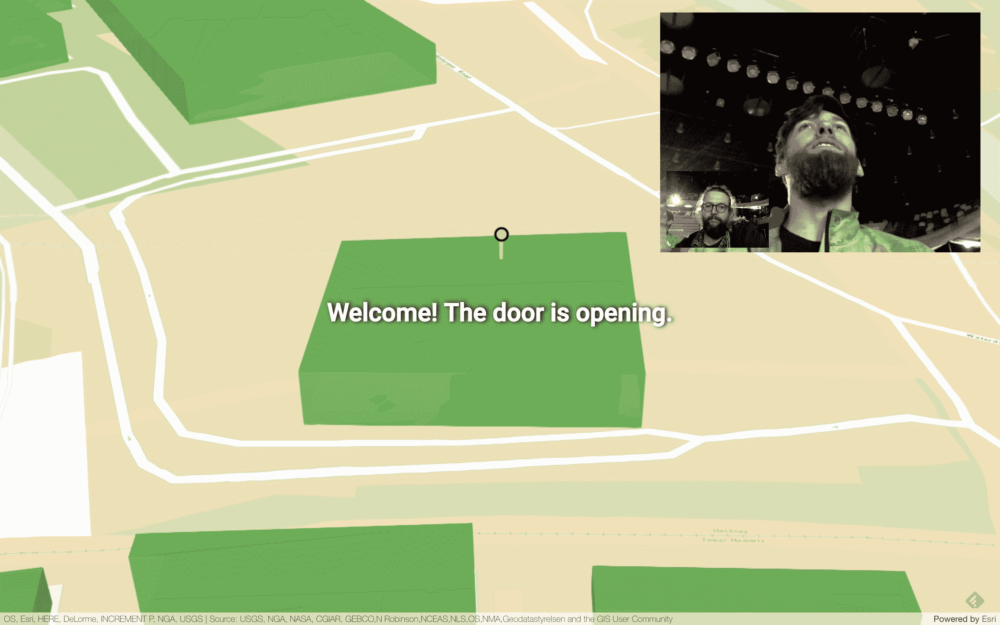

# Welcometo.site 希望成为您的虚拟接待员 

> 原文：<https://web.archive.org/web/https://techcrunch.com/2016/12/04/welcometo-site-wants-to-be-your-virtual-receptionist/>

# Welcometo.site 想成为你的虚拟接待员

在一个共同工作的空间或公司登记与某人见面通常是一件麻烦的事，涉及一些电话标记和来回。今天，我们的 [Disrupt hackathon 在伦敦](https://web.archive.org/web/20221225045809/https://disrupteu2016.devpost.com/?ref_content=default&ref_feature=challenge&ref_medium=portfolio)推出了许多项目，Welcometo.site 是其中之一，它希望让这变得更容易。它将 Cisco Spark 的消息和视频服务与来自 ArcGIS 和 PubNub 的实时 API 的地图结合到一个虚拟接待员中。

团队成员汤姆·谢伊(Tom Shea)曾在多家初创公司和合作空间工作过，而[汤姆·布尔](https://web.archive.org/web/20221225045809/http://ministryofstartups.co.uk/)目前正在开发一个更通用的访问控制系统，但对于黑客马拉松来说，他们是为了这个更易于管理的项目而合作的。

当您使用 Welcometo.site 时，您只需键入您想要会见的人的姓名，该服务将通过 Cisco Spark ping 您的联系人。你要见的人会在 Spark 上收到提醒，还可以通过视频与你联系。此外，您可以分享您的位置，并在 3D 地图上查看您的会议伙伴是否在大楼中。如果您的联系人不在，该服务可以访问您的团队目录来 ping 您团队中的其他人。

该团队告诉我，通过 Spark 进行视频通话有点麻烦，但至少在今天的演示中，它工作顺利。他们期望他们在黑客马拉松中开发的一些代码会流入这个访问控制系统。“令人惊讶的是——对于一个黑客马拉松项目来说——代码被持续的自动化集成、测试和部署很好地分解了，”布尔说。

