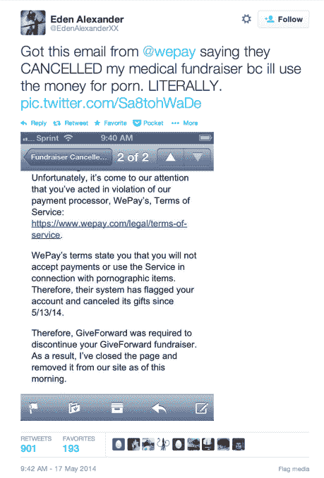
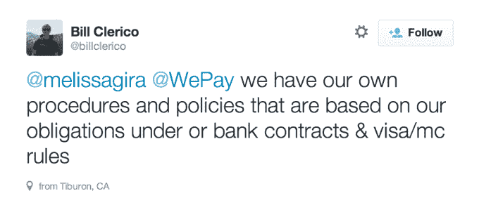

# WePay 扣留患病妇女的资金，原因是提供色情内容进行捐赠 

> 原文：<https://web.archive.org/web/https://techcrunch.com/2014/05/17/wepay-eden-alexander/>

信用卡处理商和众筹网站应该能够拒绝向成人艺人和性工作者提供资金吗？这是一个不幸情况的核心问题，在这种情况下，捐赠的医疗资金被一名患病妇女扣留。法律和道德问题常常纠缠在一起，助长了对那些靠成人工作谋生的人的歧视，或者至少使他们的生活复杂化，导致生活困难。

下面是发生的事情，根据 [亚历山大的推特](https://web.archive.org/web/20221208023358/https://twitter.com/EdenAlexanderXX) 和 [的报道。成年艺人伊登·亚历山大对一种药物有过敏反应，导致她需要严重的医疗护理。在 Alexander 的叙述中，医生认为她的病情是由于她的职业导致的药物滥用，并且没有给她适当的治疗，这使得她的病情更加严重。亚历山大随后在 GiveForward(现已移除)上为她的医疗账单发起了众筹活动，该网站使用 WePay 处理支付。](https://web.archive.org/web/20221208023358/http://therumpus.net/2014/05/eden-alexander-crowd-funding-and-discrimination-against-sex-workers/)

不幸的是，该运动的一名支持者在推特上提供裸照，以换取对亚历山大竞选活动的捐款，亚历山大转发了这一提议。

该转发被视为违反了 [WePay 的服务条款](https://web.archive.org/web/20221208023358/https://www.wepay.com/legal/terms-of-service) ，其中规定“您将不会接受与以下活动、物品或服务相关的付款或使用该服务:成人或成人相关服务，包括陪伴服务、成人按摩或其他成人娱乐服务；成人或成人相关内容，包括表演者或“凸轮女孩”；以及淫秽或色情物品。”WePay 的禁止使用清单很长，许多项目都有广泛的解释，包括该网站自己的起源故事。

WePay 随后扣留了一些捐赠给亚历山大的资金，并最终关闭了她的 GiveForward 页面。这不是它第一次对试图无辜使用这项服务的性行业人士强制执行 TOS。海湾地区的性工作者 Andre Shakti 因违反条款而被 WePay 冻结了参加女权主义色情奖的资金。

[亚历山大公开反对 WePay](https://web.archive.org/web/20221208023358/https://twitter.com/EdenAlexanderXX/status/467346891907141633) ，支持者 [联合她](https://web.archive.org/web/20221208023358/https://twitter.com/search?q=wepay%20%40edenalexanderXX&src=typd) 为 WePay 的行为感到羞耻。亚历山大声称她不知道她的转发会违反服务条款。

WePay 最终以一篇博文 作出回应，解释说它公布了 5 月 11 日至 14 日向亚历山大的捐款。WePay 的一名代表写道:“WePay 对 Eden Alexander 面临的情况非常同情，她的困难是深不可测的。我们真的很抱歉，围绕支付处理的规则是有限的，迫使我们做出艰难的决定。”亚历山大在 Crowdtilt 上建立了一个新的众筹活动，该活动仍在进行。

我们联系了 WePay 的首席执行官比尔·克莱里科，他告诉我 5 月 14 日之后的捐款已经退还给了捐赠者。至于为什么它的 TOS 禁止成人服务，为什么它必须执行它们，克莱里科写道:

“WePay 在政策执行方面面临来自合作伙伴和信用卡网络的严格审查，尤其是在涉及成人内容时。我们必须执行这些政策，否则我们将面临巨额罚款，或者我们服务的数十万商家面临倒闭的风险。我们非常抱歉这些政策增加了 Eden 面临的困难。我们提出帮助她建立一个符合我们政策的新活动，但我相信她的朋友们选择了与另一家公司合作。如果伊甸园愿意与我们进一步合作，我们将继续向袖手旁观提供帮助，我们正在审查我们的服务条款和帐户关闭流程，以了解我们如何避免未来出现类似情况。”

克莱里科还在推特上写道:

我接着问合伙人和发牌人的立场是出于法律还是道德的原因。Clerico 回应道:“我不认为我能推测他们为什么做出这样的决定，但是我知道这是这个行业中一个相对普遍的要求。至于 WePay 为什么禁止它，那是因为合同要求我们这么做。”

到目前为止，WePay 已经吸收了这种情况下的大部分反弹。它未能代表亚历山大与合作伙伴对抗，这或许是它应该做的。但如果有，它可能会遭遇关闭，这将影响其他用户为有价值的事业筹集资金。

WePay 的合作伙伴也应该受到谴责，他们拒绝接受与成人相关的资金转移。要么他们对成人行业的工作者做出了可悲的道德判断，要么他们跟随社会对性工作者的偏见，这种偏见已经渗透到我们的法律中。 [PayPal 已经多次冻结了与成人艺人相关的](https://web.archive.org/web/20221208023358/http://www.xojane.com/issues/how-paypal-discriminates-against-sex-workers)账户，并威胁要中断与他们合作的网站的整合。

[Crowdtilt 自己的服务条款](https://web.archive.org/web/20221208023358/https://www.crowdtilt.com/terms/us) 禁止“销售……色情物品”，需要注意的是。这意味着，如果亚历山大转发裸照投稿，谷歌也可能不得不取消她的活动。当被问及 Crowdtilt 会怎么做时，首席执行官詹姆斯·贝沙拉说:“我只能评论我们所知道的，那就是我们觉得这是一个正在遭受痛苦并需要帮助的人，我们想做正确的事情。”

可以理解为什么人们想要追求 WePay。该公司当然可以更加小心地处理这个问题，比如当 PayPal 迫使其从成人相关页面中删除支付处理器的集成时，Patreon 如何迅速和同情地进行沟通。WePay 似乎没有从之前冻结性工作者资金的事件中吸取什么教训。

这种情况，就像互联网开辟的新领域中的许多情况一样，暴露了许多灰色地带:转发是认可吗？法律义务胜过道德义务吗？至少，它应该让公司明白，执行服务条款不应该是自动完成的。它可能并不总是可扩展的，但我们必须在对待彼此的方式上保持人性化，即使是在网上。