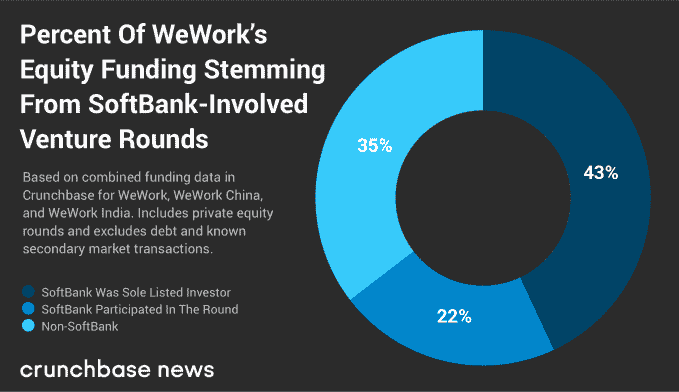
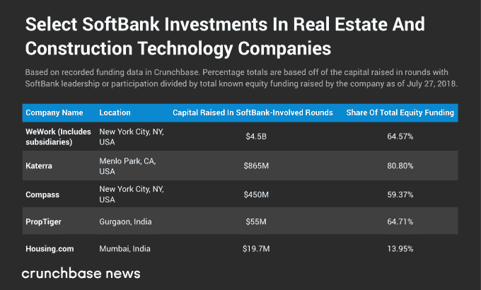

# WeWork 只是软银押注房地产的一个方面

> 原文：<https://web.archive.org/web/https://techcrunch.com/2018/07/29/wework-is-just-one-facet-of-softbanks-bet-on-real-estate/>

本周 [WeWork](https://web.archive.org/web/20230323182800/https://www.crunchbase.com/organization/wework) 宣布，其中国子公司——[WeWork China](https://web.archive.org/web/20230323182800/https://www.crunchbase.com/organization/wework)——[在由](https://web.archive.org/web/20230323182800/https://news.crunchbase.com/news/as-wework-china-raises-500m-more-a-refresher-of-the-firms-recent-fundraising/) [软银](https://web.archive.org/web/20230323182800/https://www.crunchbase.com/organization/softbank)[淡马锡控股据报道，该交易对共享工作空间和房地产管理公司中国分公司的估值为 50 亿美元，高于近一年前 2017 年 7 月 WeWork China 宣布的](https://web.archive.org/web/20230323182800/https://www.crunchbase.com/organization/temasek) [轮](https://web.archive.org/web/20230323182800/https://www.crunchbase.com/funding_round/wework-china-series-a--20086312) 的 10 亿美元(后钱)。

软银很少押注于某家公司。根据 Crunchbase 的数据，在撰写本文时，软银本身已经对 144 家不同的公司 进行了 [175 笔投资。其中，只有 23 家公司从软银获得了一轮以上的融资。WeWork 与其中国分公司一起，以 4 笔有记录的累计交易，在与软银投资部门合作最多的公司排名中并列第一。](https://web.archive.org/web/20230323182800/https://www.crunchbase.com/search/funding_rounds/field/organizations/num_investments/softbank)

话虽如此，软银的投资策略似乎是入股特定行业的领先公司。虽然有时很难判断这些股份占公司股权的比例有多大，但软银发现自己参与了许多公司迄今为止最大的几轮融资。

以 WeWork 为例。如果你看一下其主要公司实体和地区分支机构如 WeWork China[WeWork India](https://web.archive.org/web/20230323182800/https://www.crunchbase.com/organization/wework-india)筹集的所有股权融资，你会发现软银要么是唯一投资者，要么是本轮融资的牵头人，要么是向该公司提供大部分资本的银团参与者。

如果市场机会很大，软银通常会投资在该领域运营的区域性主导公司。毕竟，如果任何一家公司都难以获得全球主导地位，那么软银是如此之大，以至于它可以在地区领导者中占据一席之地，创建一个由在新兴行业中集体拥有大部分市场份额的公司组成的指数。

这是一个大胆的策略，涉及到冒一些大风险和开大额支票。因此，软银通常是一个行业中增长最快的公司的最大单一投资者(按承诺的美元计算)。

## 房地产只是一个主题

WeWork 只是软银房地产投资努力的一个方面。下表显示了软银在房地产和建筑领域的部分投资。它是根据软银(作为唯一投资者或更广泛的财团的一部分)参与的轮次投资金额来排名的。我们还展示了软银参与的融资占已知股权融资总额的百分比。

当然，软银在不断增长的大型细分市场中向成功的初创公司开出大额支票的策略不仅限于房地产。它涉及许多其他行业，包括电子商务和物流、保险和医疗保健，以及可能最具争议的打车和按需运输。

软银还拥有强大的人工智能公司组合，可以在未来某个时候进行调整。它投资了像 [英伟达](https://web.archive.org/web/20230323182800/https://www.crunchbase.com/organization/nvidia)[小概率](https://web.archive.org/web/20230323182800/https://www.crunchbase.com/organization/improbable)[大脑公司](https://web.archive.org/web/20230323182800/https://www.crunchbase.com/organization/brain-corporation)[Pentuum](https://web.archive.org/web/20230323182800/https://www.crunchbase.com/organization/petuum)等。再者，其在[Mapbox](https://web.archive.org/web/20230323182800/https://www.crunchbase.com/organization/mapbox)和 [巡航自动化](https://web.archive.org/web/20230323182800/https://www.crunchbase.com/organization/cruise) 都有利于 [SB 驱动](https://web.archive.org/web/20230323182800/https://www.crunchbase.com/organization/sb-drive) ，其自主车辆的努力。

软银是一切旧的都是新的案例之一。20 世纪 90 年代末，软银及其创始人孙正义是科技领域最大的投资者之一。当时，就像今天一样，孙正义的目标是在软银的投资组合中打造一种虚拟硅谷，一个共生、合作关系和商业伙伴关系出现的平台。鉴于该公司投资策略的主题性质，这种友好关系今天肯定有可能出现。但与此同时，孙正义因在第一次科技泡沫破裂时损失惨重而闻名。该公司能否在第二次竞争中脱颖而出，还有待观察。