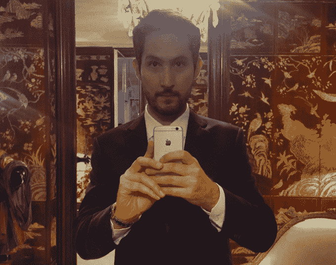

# Instagram 开始允许广告点击 

> 原文：<https://web.archive.org/web/https://techcrunch.com/2015/03/04/what-advertisers-want/>

Instagram 直到现在都不允许打开网址。它希望人们浏览照片，而不是网页。但 Instagram 表示，其广告商要求更生动的方式来影响那些“为他们的业务带来有意义的结果”的人。

品牌想要的是可衡量的影响力，而不是随随便便的影响力。与此同时，Instagram 的新广告吸引了需要人们点击购买的电子商务公司，以及像汽车公司这样需要不止一张图片来展示产品的大型广告商。

因此，Instagram 将首次开始显示可点击的链接，但只是在[其新的多照片转盘广告](https://web.archive.org/web/20230219195300/http://blog.business.instagram.com/post/112707530471/a-new-way-for-brands-to-tell-stories-on)中，它可以通过让你依次扫过四张品牌图片来讲述一个故事。包含这些链接的新“了解更多”按钮将在 Instagram 的内部浏览器中打开一个 URL，通过点击顶部栏，您可以快速跳回到该提要。

“这是一个伟大的新创意画布，”Instagram 货币化主管詹姆斯·夸尔斯告诉我。你可以在这个视频中看到可点击的轮播广告的外观和工作方式。

有些人可能会抱怨 Instagram 上的广告变得越来越强大，但正是它们产生的收入让这款应用免费。

[Instagram 于 2013 年 10 月首次开始展示广告](https://web.archive.org/web/20230219195300/https://techcrunch.com/2013/10/24/first-look-at-instagram-ads/)。它暂时遭到了用户的强烈反对，但抱怨最终平息了。大约四个月前，Instagram 引入了视频广告，这让迪士尼等公司感到高兴。

然而，直到现在，Instagram 的广告主要是针对寻求影响力的机构广告主，而不一定是即时销售。想想可口可乐或者像迈克高仕这样的时尚品牌。可点击的旋转木马将使 Instagram 的广告为更广泛的公司服务，这可能会迅速增加其收入。

上面你会看到一个承诺铅笔的旋转木马，这是一个建造学校的非营利组织。一张照片可能很容易滚动。但是，如果有人感兴趣，他们可以通过滑动查看该组织帮助的学生的更多照片，最后，点击了解更多按钮进行捐赠。

或者，一个时尚品牌可以在他们的第一张幻灯片上展示一个穿着全套服装的模特。但是滑动一下，你可以看到裙子、手袋和太阳镜的特写，最后还有一个购买这些商品的链接。或者，一家汽车公司可以在第一张图片中展示外观，在第二张图片中展示内部特征，然后是汽车行驶的动作镜头，并带有一个链接，以了解更多关于价格和当地经销商的信息。

Quarles 坚持认为“首次发布将有一个品牌重点”，解释说广告是为了让人们更多地了解一家公司，而不一定是立即购买其产品或注册某些东西。但是正如 Pinterest 展示的早期广告兴趣一样，零售商渴望将视觉社交网络转化为人们可以购买的目录。

用户可以通过旋转木马依次浏览多张照片，这些照片可以讲述一个故事

目前，这些广告将只包括照片，但 Instagram 正在考虑是否允许视频也出现在传送带上。它还会观察用户对多镜头格式的反应，以确定用户是否应该选择共享传送带。

序列故事在 Snapchat 上大受欢迎，Instagram 可能希望向所有人开放类似的创意媒体。这可能有助于它解决“未过滤订阅问题”，即你关注的过度分享者淹没了你最关心的人。相反，喜欢快门的用户可以将多张照片堆在一个转盘上，而不是淹没这些照片。

Instagram 的前四年专注于增长，并且取得了成效。照片分享社区现在有超过 3 亿用户。与脸书和 Twitter 等应用相比，拒绝将 URL 呈现为链接给了 Instagram 一种流畅的感觉，在这些应用中，你可以不断发现和打开其他地方内容的链接。这也有助于挫败垃圾邮件发送者和自我推销者。

肯定会有一些人抱怨说，如果你付费，你只能显示链接或多张照片。很多用户都愿意为他们的网站、其他网络上的内容或者他们最新的混音带增加流量。

但是太多的链接和传送带会稀释 Instagram 的滚动流量。这也是 Instagram 首席执行官凯文·斯特罗姆最终批准平台上所有允许的广告的原因。它希望保持东西整洁。如果 Instagram 真的想尊重它建立的文化，它会决定只允许旋转木马后续幻灯片上的链接，这样它们只有在人们参与广告时才可见。

首席执行官凯文·斯特罗姆仍然最终批准 Instagram 上的所有广告

脸书为收购它支付的 7 . 15 亿美元现在看来只是小钱。尽管如此，是时候开始偿还了，即使这会让用户体验有点脱节。Instagram 的广告[被设计成优雅的](https://web.archive.org/web/20230219195300/http://blog.instagram.com/post/63017560810/instagramasagrowingbusiness)，就像你“翻阅你最喜欢的杂志时”看到的那些光滑的图像

杂志广告的问题在于它们很难追踪，而互联网广告商想要的是一个经过证实的投资回报。脸书一直在用自己的广告产品进行销售测量。

现在，Instagram 的广告客户不仅会知道是否有人看到、喜欢或评论了他们的广告，还会知道人们是否浏览了多张照片并点击进入了他们的网站。这种衡量带来了信心，而信心带来了广告支出。Instagram 将变得更加丰富。