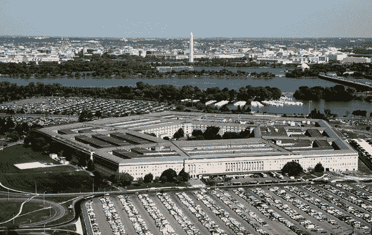
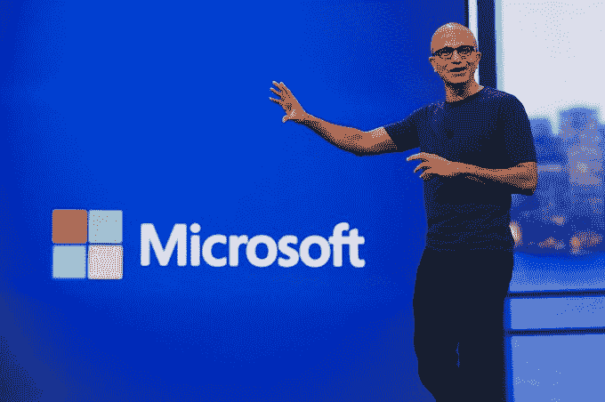
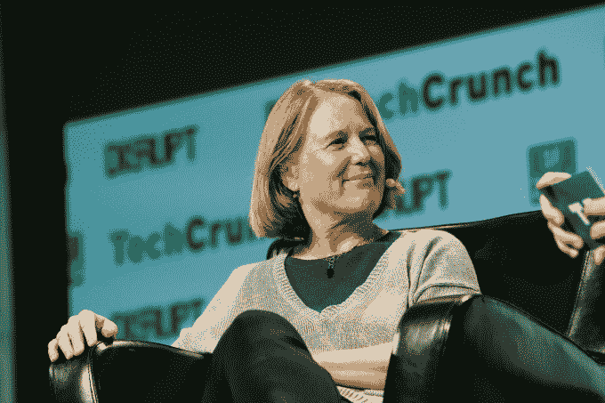
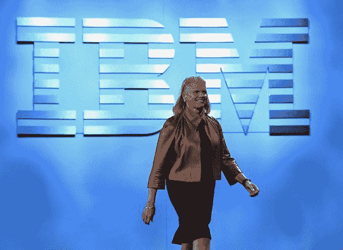
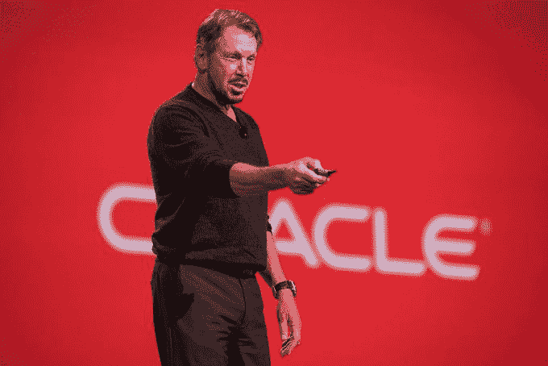

# 每家云公司能给五角大楼 100 亿美元的绝地云合同带来什么

> 原文：<https://web.archive.org/web/https://techcrunch.com/2018/09/29/what-each-cloud-company-could-bring-to-the-pentagons-10-b-jedi-cloud-contract/>

五角大楼将让一家云供应商非常高兴，它选择了 100 亿美元、为期十年的企业云项目的获胜者，该项目被称为联合企业防御基础设施(或简称为 JEDI)。该合同旨在为军方建立未来 10 年的云技术战略，因为它开始利用当前的趋势，如物联网、人工智能和大数据。

在十年内投入 100 亿美元可能不会完全改变一个预计很快就会达到每年 1000 亿美元的市场，但这足以让一个较小的供应商获得更大的知名度，并可能更深入地进入其他政府和私营部门的业务。云公司[当然认识到了这一点](https://web.archive.org/web/20230306020809/https://techcrunch.com/2018/09/15/why-the-pentagons-10-billion-jedi-deal-has-cloud-companies-going-nuts/)。

图片:Glowimages/Getty Images

这可以解释为什么他们[会绊倒自己](https://web.archive.org/web/20230306020809/https://wolfstreet.com/2018/07/01/google-microsoft-oracle-et-al-gang-up-on-amazon-for-10bn-pentagon-prize/)去改变合同动态，坚持，也许是正确的，多供应商的方法会更有意义。

看一看[招标书(RFP)本身](https://web.archive.org/web/20230306020809/https://www.fbo.gov/index?tab=documents&tabmode=form&subtab=core&tabid=48834ebc53422026828dc19dc681a6d2)，其中有几十份文件概述了各种标准，从安全到培训，再到单个合同本身的规格，这显示了该提案的复杂性。其核心是一套保密和非保密的基础设施、平台和支持服务，以及围绕便携性的其他组件。我们将在这里探讨的每个主要云供应商都提供这些服务。他们本身并不罕见，但他们每个人都带来了一套不同的技能和经验来承担这样一个项目。

值得注意的是，它不只是对技术印章感兴趣，国防部也在密切关注定价，并明确要求将适用于每个组件的具体折扣。RFP 流程将于 10 月 12 日结束，预计将于明年 4 月选出获胜者。

## 亚马孙

你对亚马逊有什么看法？他们是目前占主导地位的云基础设施供应商。他们的优势是过去获得了一份大型政府合同，当时[在 2013 年建造了中情局的私有云](https://web.archive.org/web/20230306020809/https://techcrunch.com/2013/10/07/amazon-web-services-wins-again-in-battle-to-build-the-cia-and-nsa-cloud/)，为他们的麻烦赚取了 6 亿美元。它提供了 [GovCloud](https://web.archive.org/web/20230306020809/https://aws.amazon.com/govcloud-us/) ，这是这个旨在托管敏感数据的项目的产品。

Amazon.com 董事长兼创始人杰夫·贝索斯。照片:德鲁·安格雷尔/盖蒂图片社

许多其他供应商担心这会让他们在这笔交易中占得先机。虽然五年是一段很长的时间，特别是在技术方面，但亚马逊已经加强了对市场的控制。见鬼，大多数其他参与者在 2013 年才刚刚开始建立他们的云业务。亚马逊于 2006 年[推出](https://web.archive.org/web/20230306020809/https://techcrunch.com/2016/07/02/andy-jassys-brief-history-of-the-genesis-of-aws/)，拥有其他公司所缺乏的成熟，他们仍在创新，每年[推出几十个新功能](https://web.archive.org/web/20230306020809/https://techcrunch.com/2017/12/02/aws-kept-the-announcements-coming-at-a-frenetic-pace-this-week/)。这使得他们很难与之竞争，但即使是最大的玩家也可以通过正确的游戏计划被击败。

## 微软

如果有人能挑战亚马逊，那就是微软。虽然他们有点晚了，但在过去几年里，他们已经弥补了这一点。他们增长很快，但就纯粹的市场份额而言，仍然远远落后于亚马逊。尽管如此，他们仍然可以为五角大楼提供很多东西，包括 Azure、他们的云平台和 Office 365 的组合，Office 365 是一种流行的商业套件，包括 Word、PowerPoint、Excel 和 Outlook 电子邮件。更重要的是，他们与国防部签订了一份价值 9 亿美元的丰厚合同，该合同于 2016 年签署，用于 Windows 和相关硬件。

微软首席执行官塞特亚·纳德拉摄影:大卫·保罗·莫里斯/彭博

Azure Stack 特别适合军事场景。这是一个私有云，你可以站起来拥有一个迷你私有版本的 Azure 公共云。在 API 和工具上完全兼容 Azure 的公有云。该公司还[拥有 Azure Government Cloud](https://web.archive.org/web/20230306020809/https://techcrunch.com/2016/10/18/microsoft-expands-its-azure-government-cloud-with-new-regions-and-certifications/) ，该云被美国政府的许多分支机构[认证使用，包括国防部第 5 级](https://web.archive.org/web/20230306020809/https://azure.microsoft.com/en-us/blog/microsoft-azure-government-is-first-commercial-cloud-to-achieve-dod-impact-level-5-provisional-authorization-general-availability-of-dod-regions/)。微软带来了多年来在大型企业和政府客户中工作的丰富经验，这意味着它知道如何管理这样的大型合同。

## 谷歌

当我们谈到云时，我们往往会想到三大巨头。这个群体的第三个成员是谷歌。自 2015 年以来，他们一直在努力建立他们的企业云业务，当时[他们请来了 Diane Greene](https://web.archive.org/web/20230306020809/https://techcrunch.com/2015/11/19/google-buys-bebop-and-names-diane-greene-to-lead-enterprise-cloud-effort/) 来重组云部门，并给他们一些企业信誉。他们的市场份额仍然相对较小，但他们目光长远，知道还有大量市场有待征服。

谷歌云负责人黛安·格林图片来源:

他们采取了一种开源的方法，将他们内部使用的许多工具开源，然后提供这些相同服务的云版本，声称谁比他们更知道如何管理大规模运营。他们有一个观点，这可以在这份合同的竞标中发挥作用，但当他们的一群员工反对时，他们也退出了与国防部的人工智能合同[称为项目 Maven](https://web.archive.org/web/20230306020809/https://gizmodo.com/google-plans-not-to-renew-its-contract-for-project-mave-1826488620) 。目前还不清楚在这里的竞标过程中是否会对他们不利。

## 国际商用机器公司

自 2013 年[收购 Softlayer](https://web.archive.org/web/20230306020809/http://www.latimes.com/business/technology/la-fi-tn-ibm-cloud-computing-softlayer-2-billion-20130604-story.html) 提供 it 基础设施服务以来，IBM 一直在使用其支票簿建立一个广泛的云服务平台，同时多年来增加软件和开发工具，并强调人工智能、大数据、安全、区块链和其他服务。与此同时，它一直试图充分利用他们的人工智能引擎沃森。

IBM 董事长、总裁兼首席执行官 Ginni Romett 摄影:Ethan Miller/Getty Images

作为 20 世纪的主要技术品牌之一，该公司在处理此类合同以及大型企业客户和政府方面拥有丰富的经验。尚不清楚这是否会转化为其最近开发的云服务，或者它是否拥有其他公司的云成熟度，特别是微软和亚马逊。从这个角度来看，要赢得这样一份合同，它的工作很艰巨。

## 神谕

甲骨文从去年春天就开始向任何愿意倾听的人[抱怨，据说包括总统](https://web.archive.org/web/20230306020809/https://www.bloomberg.com/news/articles/2018-04-04/oracle-s-catz-is-said-to-raise-amazon-contract-fight-with-trump)在内，称 JEDI RFP 不公平地偏向亚马逊，国防部坚决否认这一指控。他们甚至对这一过程本身提出了正式抗议。

这可能是一个障眼法，因为该公司进入云技术[较晚，花了几年时间才把它当作一个概念来认真对待](https://web.archive.org/web/20230306020809/https://itknowledgeexchange.techtarget.com/mobile-cloud-view/excuse-me-if-im-not-dazzled-by-the-oracle-cloud-announcement/)[，而且就市场份额而言，今天几乎没有注册](https://web.archive.org/web/20230306020809/https://techcrunch.com/2018/06/20/oracle-could-be-feeling-cloud-transition-growing-pains/)。它带来的是几十年来丰富的企业经验和过去 40 年中最受欢迎的企业数据库之一。

甲骨文公司董事长拉里·埃里森。照片:大卫·保罗·莫里斯/彭博

它最近开始在云中提供自我修复数据库，这可能对国防部有吸引力，但它的其他产品是否足以帮助它赢得这份合同仍有待观察。