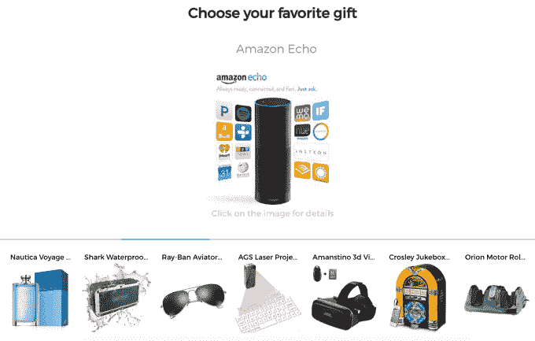
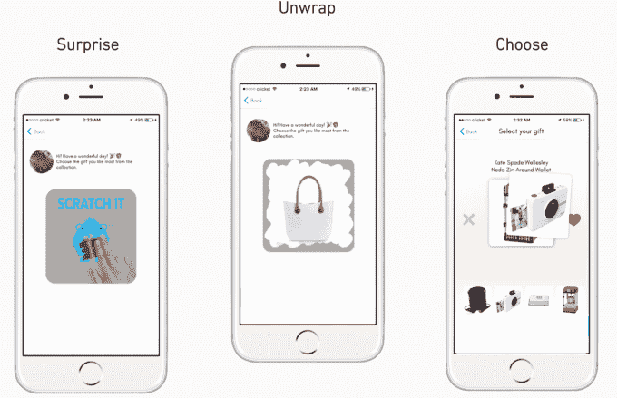
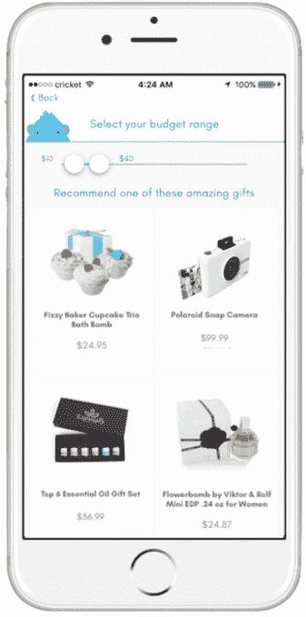

# 不知道他们想要什么？赠送可预先交换的精美礼物

> 原文：<https://web.archive.org/web/https://techcrunch.com/2016/11/22/what-gift-should-i-get/>

礼品卡是没有灵魂的，买错礼物会导致恼人的退货。但你可能不知道你爱的人更喜欢无人机、行动相机还是虚拟现实耳机。有了[爽快的礼物](https://web.archive.org/web/20230406143217/http://www.snappysapp.com/)，他们可以选择。Snappy Gifts 是一家新的创业公司，它提供了一种全新的方式，将猜测工作从慷慨中剔除。

挑选推荐的礼物或换成你更喜欢的礼物

你进入 [Snappy Gift 的应用](https://web.archive.org/web/20230406143217/https://itunes.apple.com/us/app/snappy-gifts-send-perfect/id1064613435?mt=8)，选择一个价格区间，然后从一系列礼物中进行选择，比如“小工具”、“烹饪”、“户外”或“青少年”然后，你可以指定一个合法品牌的建议礼物，如 DJI 无人机、亚马逊移动设备、GoPros、普拉达服装和凯特·斯派德钱包。无需预先付款，您就可以发送数字礼物。

接受者几乎可以刮开来展示建议的礼物。然后，他们可以接受它，或者在你的价格范围内，用它来替换其他任何东西。你会收到一封电子邮件，要求你以该礼物的标准零售价付款，然后 Snappy Gifts 会把它寄出去。Snappy Gifts 削减了制造商的折扣，并保持了批发价和要价之间平均 10%的利润率。

接受者几乎可以刮出他们建议的礼物

爽快的礼物有很多好处，尤其是当你不能亲自送一份礼物的时候:

*   没有时间浪费在实体店购物
*   不用担心你给他们买了错误的礼物，并强迫他们退回礼物
*   没有非个人的，反高潮的礼品卡，不显示他们可以得到什么
*   不要为他们会忘记使用的购物卡多付钱

因为 Snappy Gifts 精选了一些流行的品牌产品，所以即使你想不出要送什么，也很容易送一些很棒的东西。

爽快的礼物还是有点粗糙。这个设计需要润色，你只能从它的 iOS 应用程序发送礼物——而不是网络或 Android。该系列中有一些噱头更鲜明的形象拒绝礼物。如果送礼者是一个赖账者，接受者可能会选择一个永远不会得到付款和发送的礼物。

构思于特拉维夫、建造于旧金山的 [Snappy Gifts](https://web.archive.org/web/20230406143217/http://www.snappysapp.com/) 已经启动，但现在正试图筹集种子资金。它将不得不与[环线&环线](https://web.archive.org/web/20230406143217/https://www.loopandtie.com/)直接竞争，后者有一个华丽的网站，但蹩脚的礼物在价格上看起来像是敲竹杠。还有传统的送礼和礼品卡，以及像 Gyft、Giftagram、Swift Gift 和 Jifiti 这样的初创公司。但是这些都不能让人们很容易地选择他们想要的东西并很快得到。

赠送选择的礼物。