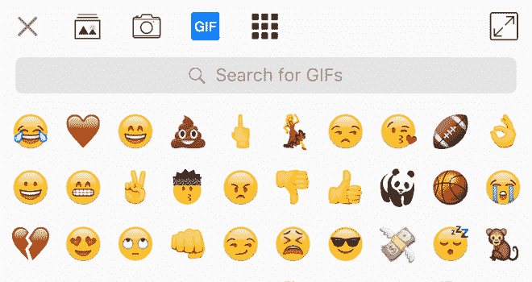

# 消息应用 Kik 开始提供品牌 gif 

> 原文：<https://web.archive.org/web/https://techcrunch.com/2016/02/02/what-is-this-a-gif-for-brands/>

品牌，启动你的 GIF 引擎。拥有超过 2 . 75 亿注册用户的聊天应用 Kik 给公司提供了一个机会，通过其消息服务上的[品牌 GIF 活动](https://web.archive.org/web/20221206071455/http://blog.kik.com/2016/02/02/branded-gifs-on-kik/)来增强他们现有的营销努力。

Kik 是[价值超过 10 亿美元](https://web.archive.org/web/20221206071455/https://beta.techcrunch.com/2015/08/18/kik-raises-50m-from-strategic-partner-tencent/)，在北美青少年中特别受欢迎，起步缓慢。它选择了[和](https://web.archive.org/web/20221206071455/http://www.zoolander.com/)[作为首批两个品牌 GIF 内容合作伙伴，因为它们最能代表它对娱乐(电影)和乐趣(动物 GIF)的关注。](https://web.archive.org/web/20221206071455/http://www.worldwildlife.org/)

Kik 上品牌 gif 的推出，与其他推广单位一样，是根据 reach 收费的，是在总部位于加拿大的公司[开始允许品牌在其平台](https://web.archive.org/web/20221206071455/https://beta.techcrunch.com/2014/11/06/kik-introduces-promoted-chats-to-let-brands-on-its-messaging-app-and-finally-make-money/)上运营官方账户大约 18 个月之后。它们使品牌能够运行与用户互动的机器人，以提供内容或通常使用由关键词触发的预定义聊天信息进行娱乐。Kik 认为，品牌 gif——不需要品牌拥有官方账户——打开了一个传播内容和娱乐的新渠道。

Kik 的产品策略师保罗·格雷在接受 TechCrunch 采访时表示:“我们的受众是青少年和年轻人，这对合适的品牌来说很有吸引力。”。“[品牌 GIFs 非常自然，它们自然地融入了对话。”

> 品牌 GIF 出现在 Kik 漂亮的表情符号 GIF 搜索引擎中，就像普通 GIF 一样，例如上面的 WWF 熊猫

在《超级名模》续集的案例中，格雷解释说，派拉蒙——过去在 Kik 上运营品牌账户——是基于动画 gif“在没有横幅广告的情况下让人们兴奋并分享电影”的想法而被出售的。换句话说，分享来自《超级名模 2》的 GIF 是一种更微妙的方式，来自朋友并且有趣，信息可能会对在线和离线营销活动产生更大的影响(或补充)。(Riffsy 首席执行官大卫·麦金托什最近提出,[gif 本身就是语言。)](https://web.archive.org/web/20221206071455/https://beta.techcrunch.com/2016/01/28/riffsys-david-mcintosh-on-why-gifs-are-a-language/)

格雷说，品牌 GIF 倡议将在未来几个月向更多的合作伙伴开放，但他警告说，Kik 将对合作伙伴进行选择。

“我们一直非常小心地推出产品，”他解释道。“我们根据季节性对(我们的总体库)gif 进行了大量更新。(使用品牌 gif)我们想非常小心地(和)与令人兴奋的品牌合作伙伴交谈。”

旋转 gif 的选择是一件很有意义的事情，但是可能并不明显。例如，Kik 添加了一系列以 DJ Khaled 为基础的 gif，他在 Snapchat 上的[滑稽动作使他成为病毒式热门人物](https://web.archive.org/web/20221206071455/https://beta.techcrunch.com/2015/12/30/dj-khaled-on-technology-entrepreneurship-and-snapchatting-his-keys-to-success/)，同时它最近还为即将到来的超级碗 50 决赛和 NBA 全明星赛推出了专用 gif。就品牌 gif 而言，格雷认为奥斯卡奖和 VMAs 是品牌可能利用 Kik 内部这一新选项的事件，假设它们首先通过了它的“酷”标准。

Kik 是聊天机器人的第一批先驱之一([它甚至收购了一个机器人](https://web.archive.org/web/20221206071455/https://beta.techcrunch.com/2016/01/05/facebook-messenger-bots/)背后的公司，这是一个现在被 [Slack](https://web.archive.org/web/20221206071455/https://beta.techcrunch.com/2015/12/15/trophy-emoji/) 、 [Facebook Messenger](https://web.archive.org/web/20221206071455/https://beta.techcrunch.com/2016/01/05/facebook-messenger-bots/) 和其他人所接受的概念。看看它处理品牌 gif 的方式是否会被其他公司复制，这将会很有趣。