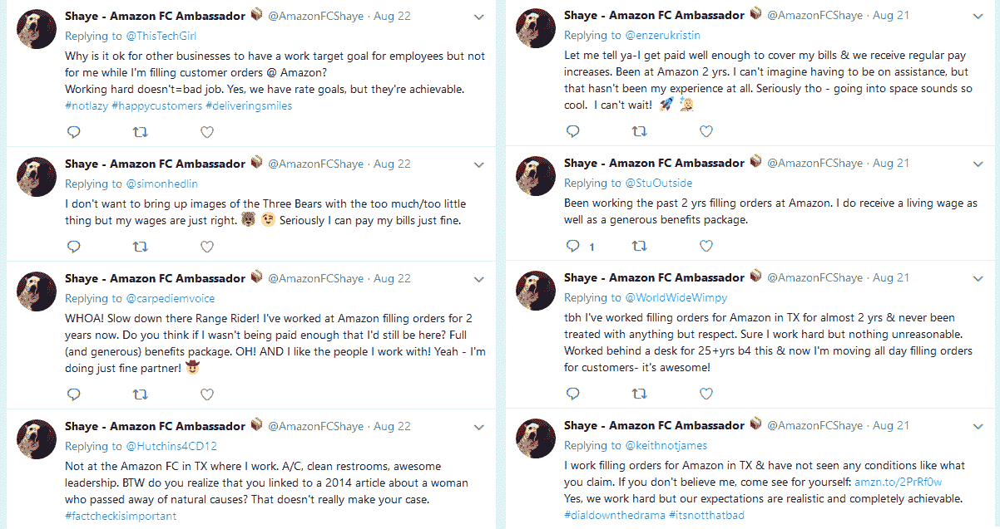

# 亚马逊无人机兴高采烈地捍卫仓库工作的这支怪异的 Twitter 大军是什么？

> 原文：<https://web.archive.org/web/https://techcrunch.com/2018/08/23/what-is-this-weird-twitter-army-of-amazon-drones-cheerfully-defending-warehouse-work/>

这是一个奇怪的小在线社区，令人困惑。亚马逊已经在 Twitter 上建立了一种令人不安的、斯戴福式的存在，其形式是几个绝对真实的现场工人的账户，他们复述谈话要点，并向世界保证该公司臭名昭著的惩罚性仓库工作一切正常。

在[花花公子鞋男](https://web.archive.org/web/20230203182348/https://twitter.com/bornwithatail_/status/1032677452475195392)说出这一现象后，[我找到了 15 个账号](https://web.archive.org/web/20230203182348/https://twitter.com/search?f=users&q=%22amazon%20fc%20ambassador%22&src=typd)(请不要辱骂他们——他们已经受够了)。所有的图片都以“亚马逊的微笑”为背景，还有一些是动物图片。都有相同的生物结构:“(*职位名称)* @( *仓库速记位置)*。(*持续时间)*亚马逊人。(*他们喜欢的东西的二三项清单*)。)“都有”FC 大使📦“以他们的名义。所有这些都链接到亚马逊仓库参观服务。

所有人都不停地传达乐观的信息，说在亚马逊仓库工作有多棒，并向每个人保证他们不是被迫这样做的。这些信息似乎都是从同一块布上剪下来的，通常都是按照相同的模式:

工人们说，他们作为大使没有得到报酬；这是一个他们自愿承担的“完全可选的角色”(**更新**:比那要复杂一点——见下文)。他们还自称是普通意义上的仓库员工。如果是这样的话，他们每小时花时间在推特上大肆宣扬他们做得有多好，这是在拿自己的数字冒险。

他们最常谈论的话题是如何上厕所、仓库宜人的温度、优厚的福利和合适的工资、友好的管理以及这份工作一点也不单调或累。例如，FC 大使卡罗尔(Carol)对成为一名采摘者感到非常高兴，而且显然是贝佐斯的崇拜者。

你几乎可以听到脸上的笑容。

我有一个朋友曾做过一段时间的拣货员，应该说是几年前了。他说这是他做过的最令人麻木但又最需要体力的工作。我理解有些人可能只是很高兴有一份全薪和福利的工作——我从不嫉妒任何人——但这些大使账户中展示的一致和高度做作的积极性似乎真的是另一回事。

毕竟，亚马逊在劳工问题上存在形象问题，这已经不是什么秘密了。多年来，报告描述了这些“履行中心”的艰苦劳动，在那里，基层员工必须满足不断增长的日常目标，他们的时间结构严格，晋升空间狭窄。就在最近，Gizmodo 的 Brian Menegus 讲述了几个关于该公司当前——而非过去——劳动条件的[T4](https://web.archive.org/web/20230203182348/https://gizmodo.com/on-amazon-s-time-1826570882)[精彩故事](https://web.archive.org/web/20230203182348/https://gizmodo.com/a-worrying-number-of-amazon-s-warehouse-workers-are-rep-1825387691),当然，在过去几年里，也有几十个这样的故事详细描述了剥削或普遍恶劣的工作条件。而且不仅仅是在美国。

当然，亚马逊可能已经改善了这些条件。他们当然想把这个信息传播出去。但是这些报道同样肯定不是他们看起来的草根宣传。(很自然，已经有一个恶搞账户，或者可能是其中一个大使逃脱了约束。)

我已经向亚马逊询问了这个项目的更多细节，以及仓库工人是如何获得*而不是*的报酬来监控 Twitter 的，定期用清晰的固定数据和人们可以想象如果他们的工作服藏着一个电击领他们会沉迷的那种被迫幽默来反驳批评者。如果有回音，我会更新这个帖子。

**更新**:亚马逊称这些“FC 大使是有在我们履行中心工作经验的员工。重要的是，我们要做好工作，让人们了解我们履行中心的实际环境，FC 大使计划以及我们提供的履行中心参观是其中的一个重要部分。”

这个项目几周前刚刚开始。显然总共有 14 个，而不是 15 个——要么是我数不清，要么是我把一个不活跃的或假的当成真的了。从昨晚开始，一些也从最初的收藏中消失了。

一位真正的前大使和三年佛罗里达州仓库经验丰富的克里斯·格兰瑟姆[向雅虎财经的郑秀晶·胡](https://web.archive.org/web/20230203182348/https://twitter.com/readkrystalhu/status/1033112717589204994)更详细地解释了这一点，他与 TechCrunch 分享了这些信息:

> 我在那里的时候，他们只是在(节前)旺季后获得了一天额外的带薪休假和一张礼品卡。这是我得到的。一天带薪休假(3 周后过期 lol)和一张价值 50 美元的亚马逊礼品卡。另外，他们给了我们午餐。冷盘和三明治面包。我绝对没有因为培训员工而得到更多的报酬。
> 
> 大使不是你每天都要做的“工作”，它只是你被训练去做的事情。你去上了 4 个小时的课，他们教你如何用一套说明教别人打结。这就是新员工应该被教导的方式。你应该按照设定好的协议从剧本开始教他们。成为大使是一种摆脱 10 到 12 个小时装卸卡车或打包箱子的方式。你可以先当一天大使，然后在接下来的三天里卸货。
> 
> 在那里的第一年后，我就不再做了，因为报酬不高。这是自愿的。你的经理挑选他们。一般来说，大使是部门里的“马屁精”。

如果这还不明显，克里斯已经不在亚马逊了，他很乐意说出自己的想法。谢谢你帮我们澄清这件事，克里斯。