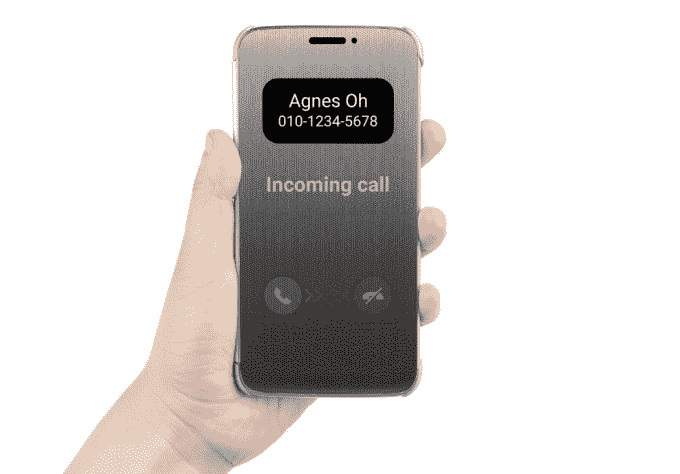
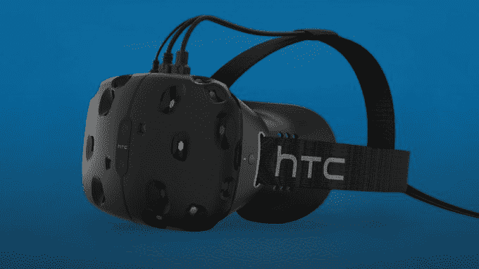
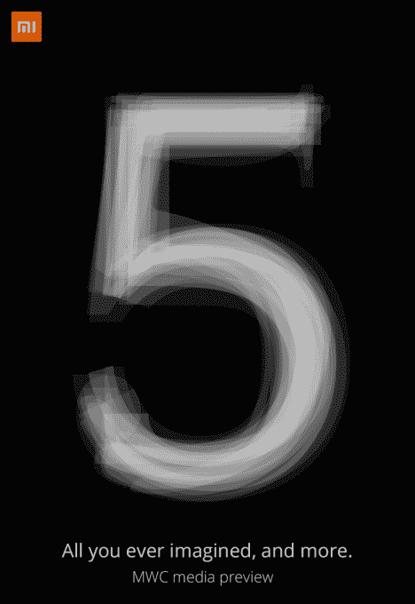
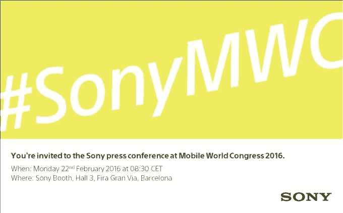

# MWC 2016 TechCrunch 展会上有哪些新的移动硬件值得期待

> 原文：<https://web.archive.org/web/https://techcrunch.com/2016/02/13/what-new-mobile-hardware-to-expect-at-mwc-2016/>

世界移动通信大会(Mobile World Congress)是专门关注移动设备的最大贸易展，将于一周后在巴塞罗那开幕，因此，在这一周的大部分时间里，我们将会发布一些主要关注硬件的重大消息，以下是这些消息的简要介绍…

**三星**

三星的大发现将是其 Galaxy 旗舰智能手机阵容的闪亮新成员——预计将有新的 **S7** 和 **S7 Edge** (其曲边屏幕变体)。泄露的消息表明，新旗舰将有[压敏屏幕](https://web.archive.org/web/20221207044641/https://beta.techcrunch.com/2015/12/14/game-of-clones/)——这是苹果的 3D 触摸附加功能——加上通过新的 USB Type-C 端口更快的充电，相机增强功能和[更强大的芯片组硬件](https://web.archive.org/web/20221207044641/https://beta.techcrunch.com/2016/01/22/forthcoming-samsung-galaxy-s7-benchmarks-leak/)。该公司也有可能重新考虑去年从旗舰产品中移除 microSD 卡插槽的(不受欢迎的)决定。安卓粉丝肯定希望如此。

此外，[三星 MWC 前新闻发布会的预告邀请函](https://web.archive.org/web/20221207044641/https://beta.techcrunch.com/2016/01/31/samsung-announces-galaxy-unpacked-event-teases-major-emphasis-on-mobile-vr/)对虚拟现实给予了充分的重视。因此，我们也期待围绕其 **Gear VR** 平台的一些实质性消息，很可能与新的旗舰产品相关联——因此，也许新的旗舰手机硬件中融入了一些新的 VR 功能，以激励买家今年购买不止一个而是两个新的三星套件。2016 年是虚拟现实重新启动的一年，因此三星将致力于利用炒作。虽然即将推出的 Oculus Rift 等全脂肪游戏 VR 头戴设备将因[过于昂贵而无法进入大众市场](https://web.archive.org/web/20221207044641/https://beta.techcrunch.com/2016/01/06/oculus-rift-headset-priced-at-599-for-consumers-ships-in-march/)，但三星的 Gear VR 平台提供了一种中等价位的选择，可以重新利用现有的智能手机硬件来提供一定程度的数字沉浸感——让人们在虚拟现实的水域中尝试，而无需翻转他们的小猪银行。

**LG**

韩国的 LG 多年来不得不屈居三星之后，但这并不意味着它不会在 MWC 发布会上大放异彩。该公司将在周日下午的一场活动中拆箱其最新旗舰产品**LG G5**——诚然，这比三星的大发布会提前了几个小时，以便 LG G5 能够在聚光灯下拥有自己的时刻。

我们已经知道 G5 将包括一个支持触摸的外壳——感谢 [LG 已经发布了这个消息](https://web.archive.org/web/20221207044641/http://www.lgnewsroom.com/2016/02/introducing-touch-enabled-quick-cover-for-yet-to-be-announced-lg-g5/)。这款保护套可以让用户接听电话、查看时间/日期和通知，而不必翻开保护套才能看到屏幕，这要归功于这款手机的常亮显示屏。这款保护套让人想起了 HTC 的 Dot View 保护套，它是在 2014 年春天与旗舰产品 [HTC One M8 智能手机](https://web.archive.org/web/20221207044641/https://beta.techcrunch.com/2014/03/31/htc-one-m8-review-the-new-best-android-smartphone/)一起发布的。正如他们所说，模仿是奉承的最真诚的形式。

关于 LG G5，我们还知道些什么？传言暗示金属一体式设计，这将是 LG 典型的塑料设计的一个进步；指纹扫描仪(可能还有虹膜扫描技术)；后置双摄像头，这将是另一个“受 HTC 启发”的时刻。

**HTC**

与往届 MWCs 不同，我们对来自台湾的 HTC 的新旗舰智能手机硬件不抱太大期望，该公司在今年的展会上没有举行正式的新闻发布会。考虑到该公司近年来为扭转手机市场的命运付出了多少努力，这并不奇怪。上个月，首席执行官 Cher Wang 甚至说虚拟现实对公司来说比手机更重要。因此，HTC 在 MWC 的发布会将重点放在它即将推出的 **Vive** VR 耳机上，这是它与游戏开发商 Valve 合作开发的。

我们已经知道 Vive 耳机将于 4 月在[发货，预购将于本月晚些时候开始，但我们预计该公司将在 MWC 花时间补充更多关于 Vive 盒子的细节，并具体透露英特尔的一个非常关键的信息:价格。](https://web.archive.org/web/20221207044641/https://beta.techcrunch.com/2016/01/11/htc-vive-pre-orders-will-open-on-february-29/)

**华为**

中国的华为可能没有三星的品牌魅力，但根据分析师[的说法，它最近一直在取得一些](https://web.archive.org/web/20221207044641/http://www.gartner.com/newsroom/id/3169417)[稳定的市场份额增长](https://web.archive.org/web/20221207044641/https://beta.techcrunch.com/2015/10/23/huawei-overtakes-xiaomi-to-top-chinas-smartphone-market-for-first-time-report/)。在 MWC，该公司计划于周日下午举行新闻发布会，称将推出“一款全新的华为设备，该设备将满足下一代移动创新的需求”。这有可能是一款新的旗舰智能手机——也就是去年 P8 的继任者**华为 P9** 。该公司还有一系列中端设备，也生产智能手表。这里有很多硬件选项。

**诺基亚**

啊谁不爱一个**通配符**。在过去的几年里，诺基亚的新闻发布会是 MWC 之前的硬件新闻发布会的主要内容，因为该公司多年来一直是移动领域最重要的力量。但是自从微软收购了诺基亚的手机制造部门后，正常的服务被中断了。然而，从今年开始，诺基亚重新获得了在智能手机上贴上自己品牌名称的能力——因此，我们有可能在今年的 MWC 新闻发布会上再次发布与硬件相关的公告。

或者它可以推出一个新的 5G 基站(或类似的)——given networks 是剩余公司的核心部门。例如，诺基亚已经宣布将在今年的展会上为运营商推出一个网络安全管理中心。

尽管去年夏天诺基亚首席执行官 Rajeev Suri 证实了该公司在 2016 年设计和授权手机的意图——假设它能找到合适的合作伙伴来推动手机市场的回归。它已经与富士康合作推出了一款安卓平板电脑([N1](https://web.archive.org/web/20221207044641/https://beta.techcrunch.com/2015/03/04/nokia-n1-hands-on/))，去年在 MWC 展示过。所以我们很快就会知道它现在是否也将这一策略扩展到了智能手机上。如果是的话，它真的是不畏艰险，直接与三星周日晚上的新闻发布会时间发生冲突。因此，对于这家前世界头号手机制造商来说，这要么是一次非常乐观的回归。或者是一个“这里没什么可看的”网络相关的新闻发布会…无论哪种方式，TC 都将在巴塞罗那找到答案。

**小米**

中国智能手机新贵小米将于周三在 MWC 举行其即将推出的旗舰智能手机小米 5 的新闻发布会，与此同时，小米也将在北京举行发布会。它没有对此含糊其辞，它的邀请函明确说明了军情五处的名字…

关于军情五处我们还知道些什么？小米全球副总裁雨果·巴拉上个月在一条推特[中证实，它将采用高通骁龙 820 处理器。](https://web.archive.org/web/20221207044641/https://twitter.com/hbarra/status/684775378997522432?ref_src=twsrc%5Etfw)

他还在推特上偷偷瞥了一眼主屏幕——它看起来像是支持双 SIM 卡，顶部有两个信号栏，加上 NFC 支持:

**索尼**

与许多 Android OEM 厂商一样，索尼在拥挤的智能手机市场上很难脱颖而出。因此，虽然它将在 MWC 举行新闻发布会，但它更低调，像去年一样安排在周一早上(当时它有一个带蓝牙键盘的[平板电脑](https://web.archive.org/web/20221207044641/https://beta.techcrunch.com/2015/03/02/xperia-z4/)和一个新的中档手机来炫耀)。目前，人们对索尼 2016 年 MWC 发布会的预期只是猜测。也许是一些新的 Xperia 平板电脑。或者是其[可穿戴设备](https://web.archive.org/web/20221207044641/https://beta.techcrunch.com/2015/01/05/sony-makes-the-smartwatch-3-slicker-opens-its-lifelog-api-and-debuts-a-wearable-running-coach/)系列的升级。在这一点上，一款真正尖端的索尼旗舰智能手机不太可能出现。

**微软**

我们预计今年的展会上不会有来自 Redmond 的任何重大消息，因为它几乎都在削减智能手机业务，在首席执行官塞特亚·纳德拉的领导下，移动制造部门继续裁员。在最新的收益报告中，微软指出[在其 Q2](https://web.archive.org/web/20221207044641/https://beta.techcrunch.com/2016/01/29/windows-phone-is-an-ex-platform/) 仅售出 450 万部 Windows Phone，低于上一季度的 1050 万部，以不变货币计算，基于手机的收入下降了 49%……哎哟。因此，预计微软今年将低调出席全球最大的手机展。

**黑莓**

另一个被安卓的统治地位撕成碎片的前移动巨头是黑莓。去年秋天，前身为 RIM 的公司发布了首款安卓智能手机 [Priv](https://web.archive.org/web/20221207044641/https://beta.techcrunch.com/2015/11/05/blackbrerry-priv/) 。一个触摸屏滑块，对智能手机输入选项采取了蛋糕和吃它的方法。有传言说，它有一个非滑块后续工程；即一款全 Qwerty 加触摸屏手机，代号为[维也纳](https://web.archive.org/web/20221207044641/http://www.zdnet.com/article/leak-another-blackberry-android-phone-this-one-called-vienna/)。因此，看看该公司今年是否会冒险在 MWC 推出第二款安卓设备，将是一件有趣的事情。该公司没有举行官方新闻发布会，这表明它不会推出任何旗舰硬件。这或许也表明，Priv 的销量不足以说服首席执行官陈志强，黑莓需要留在硬件制造业务中。时间会证明这一点。