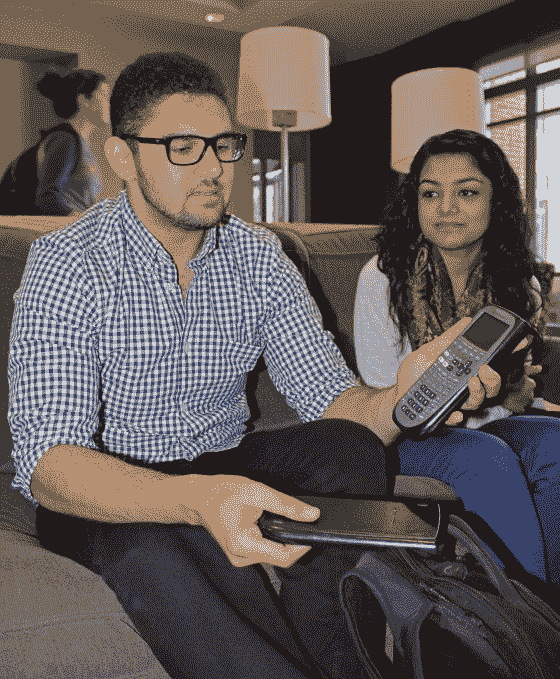
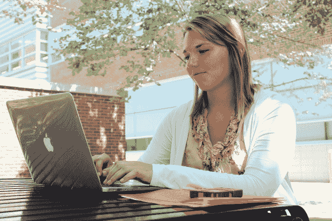
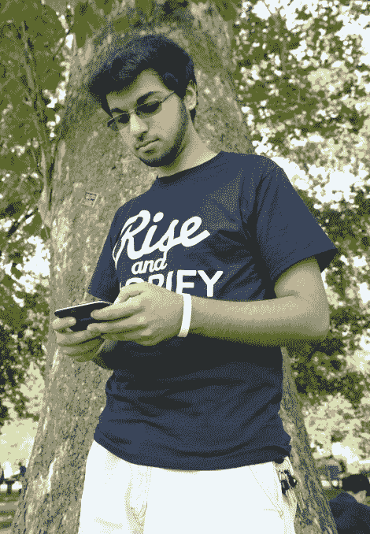
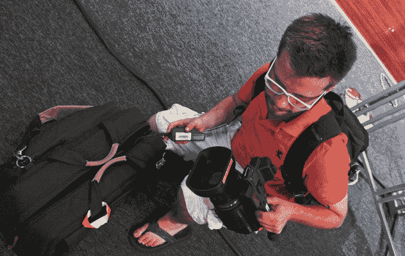

# 学生真正带回学校的东西 

> 原文：<https://web.archive.org/web/https://techcrunch.com/2014/09/01/what-students-really-carry-back-to-school/>

返校故事是点击素材。它们让营销人员感觉他们是在直接针对一群简单的标记。毕竟，什么时候你的生活比在年级变化或大学之旅的风口浪尖上更没有安全感呢？于是，这个世界发生了剧变，你寻找答案，有时在期刊的[页面中寻找答案，这些期刊提供葡萄酒充气机和咖啡订阅](https://web.archive.org/web/20221226094120/http://www.theverge.com/a/back-to-school-guide-2014)作为意义的潜在来源。但我在想:学生到底是带着什么回学校的？技术真的像我们想象的那样具有侵略性吗？

为了找到答案，我做了一个许多前校报人都熟悉的新闻练习:街上的人。我和[里蒂卡·沙阿](https://web.archive.org/web/20221226094120/http://thelantern.com/author/ritika-shah/)一起去了 OSU 校园，她是灯笼电视台的作家兼新闻总监，和我一起在校园里拍摄了一些照片并走近学生。

“我的手机就是我的生命，”化学工程专业的大四学生哈里斯·马利克说。“我没带笔记本电脑。我有一个七年前的 iPod，里面有我所有的音乐。”

他使用的大部分硬件都在他经常光顾的化学实验室里。他的朋友 Sana Nisar 是公共卫生专业的大二学生，她带着一台 Macbook Air，用来做笔记。他们都没有什么特别花哨的东西，只是一些日常使用的工具。马利克最奇特的技术？一个像铺路砖一样大的 TI-89 计算器。

亚伦·卡彭特(Aaron Carpenter)是机械工程专业的大一学生。他带着他的微软 Surface 来到学校。他还有一部手机没有给我们看。他使用 Surface 做笔记，并认为这对教科书会有帮助，但他还不确定。毕竟，那是他上学的头几天。

我已经离开大学超过 15 年了，这是一个振奋人心的想法。除了卡彭特运行的 Windows 版本之外，最大的不同是脱离了实体教科书。我们采访的许多学生都带了几本书，但萨拉·柯林斯(Sara Collins)在她的 Macbook 上的一个小窗口中阅读课文。

金融专业大一新生柯林斯说，她可以在 iPhone 上完成大部分工作。“不过，我通常都带着笔记本电脑，”她说。

我们研究中的一个异常者是 Adil Peerbhoy，一个杂耍不定的新生，他只带了一个 2011 年的三星人物。Peerbhoy 说他买不起智能手机，但他并不怀念它。“我希望能够使用社交网络，”他说，但他觉得自己的手机很好用，不需要升级。

我几乎为他感到难过。不得不忍受 2011 年的手机，这是任何现代社交媒体用户都不应该经历的不公。但他不介意。这只是一个工具，他说。

最后，我们采访了电影研究专业的大四学生弗朗兹·罗斯。Ross 与 Ritika 一起为 LanternTV 工作，他是一名专业的视频记者，或者至少是他在大学里能得到的最接近的职业。他每天都带着几磅重的装备——相机、三脚架和灯——并记录关于受托人、OSU 体育和学生活动的故事。简而言之，他一边上学一边工作。不同寻常的是，他的科技摄入量与我们采访的其他学生没有什么不同。虽然技术是他工作中不可或缺的一部分，但他并不携带独特的硬件或设备。他携带最基本的必需品。

教育在迅速变化，但工具是一样的。仍然有书，人们仍然带着笔和笔记本，一些学生决定完全不购买昂贵的技术。他们过得更好吗？更专注？效率更高？那不清楚。显而易见的是，普通学生可以放心地忽略当地报纸上的大多数返校传单。他们真正需要的是最基本的东西，随着需求的增加，可以买到更好的东西。我们生活在未来，但不是太远的未来。