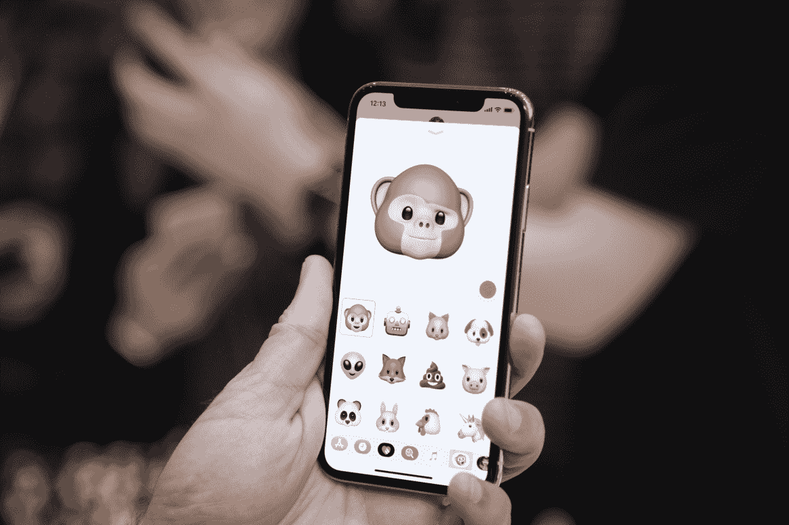
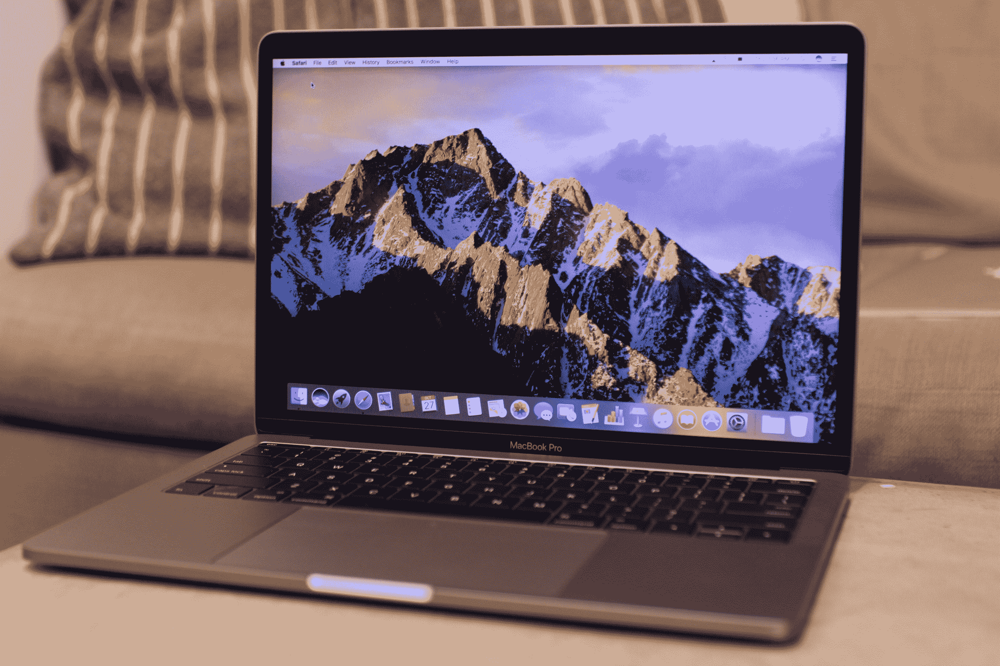
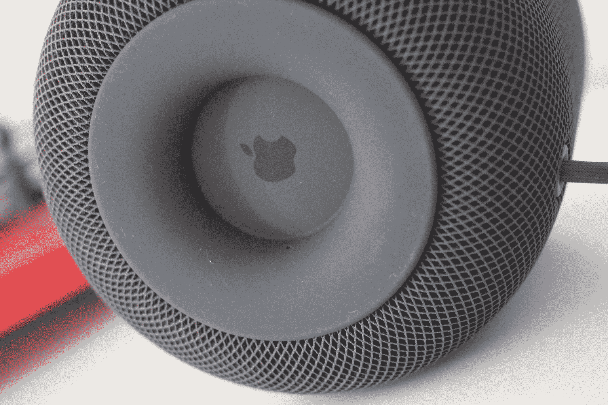

# WWDC 2018 TechCrunch 期待什么

> 原文：<https://web.archive.org/web/https://techcrunch.com/2018/06/01/what-to-expect-at-wwdc-2018/>

根据日历，不知怎么已经是六月了。这意味着苹果一年一度的全球开发者大会即将召开。事实上，事情在周一上午 10 点(太平洋时间下午 1 点)在圣何塞开始。

和以往一样，展会的主要焦点将集中在开发者身上——这就在名称上——但苹果也喜欢利用年度聚焦作为一个机会，在消费者方面做出一些重大宣布。和往常一样，iOS 和 MacOS 无疑将是展会的焦点，但 ARKit、Home Kit、Watch OS 和一些硬件也可能在展会上表现强劲。

苹果以前肯定让我们感到惊讶，但这里是我们对该公司下周将展示什么的最佳(有根据的)猜测。

## ios

该公司上周发布了其移动操作系统的最新更新。11.4 提供了对生态系统状态的一些关键见解，也许还能让我们一瞥苹果在继续建立其各种软件产品之间的联系时将走向何方。家是这次的关键，因为该公司增加了 AirPlay 和改进了 HomePod 功能等。

周一早上的日程安排中很可能会有对 iOS 12 的一瞥。从泄露、传言等声音来看，这次最新的重大升级更多的是增加操作系统的整体稳定性，而不是专注于最新的华而不实的功能——包括漏洞修复和帮助改进其前身中引入的更新。

也就是说，这一次 iOS 可能至少会有一些有趣的面向消费者的新功能。基于 NFC 的门解锁是更引人注目的传言之一，这一次，为苹果手机带来了更高度个性化的功能。

考虑到苹果公司一直专注于其可穿戴设备的一切，对个人健康的更大推动似乎是显而易见的。就在今天早上，一个关于新的数字健康功能的消息传开了，引起了人们对用户花在设备上的时间的强烈关注。如果“数字健康”真的被添加到这里，它将加入脸书和谷歌的行列，推动用户更深入地了解他们的硬件习惯。

## 马科斯

这次，苹果的桌面操作系统似乎不像它的手机操作系统那样受欢迎——但是老实说，还有什么新的吗？事实上，这方面最大的谣言是增加了所谓的“通用应用”，这进一步模糊了桌面和移动之间的界限。该系统将在两个操作系统上的应用程序之间提供无缝同步，允许用户在设备之间切换，从他们离开的地方开始。

尽管最近进行了更名，但 Wear OS 在谷歌 I/O 大会上几乎不受欢迎。但苹果自己的可穿戴设备对该公司来说是一个更加持续的成功故事。虽然该公司似乎不太可能实际展示新版本的手表本身，但我们可能会在 Watch OS 5 上一瞥。然而，可穿戴操作系统到底会是什么样子，目前还只是严格的猜测，尽管人们期待已久的 Spotify 的加入一直是传言，健身功能一如既往，似乎是显而易见的。

## 阿尔基特

说到没脑子，经过一年的大肆宣传，苹果可以利用增强现实方面的一些新闻。ARKIT 2.0 已经为该活动传言，为多个用户带来了共享相同 AR 环境的能力，以方便 IRL 多人游戏和其他活动。

## 五金器具

这是一次开发者大会，硬件从来不是会议的主要焦点，但它似乎总是悄悄溜进来。毕竟，苹果本周已经吸引了科技界的目光，那么为什么还要宣布一些新的产品呢？

新款 MacBook Pros 似乎是该活动的合理候选人。引擎盖下的新英特尔处理器是这方面最有可能的补充。然后是整个键盘部分。自 2016 年推出以来，新交换机一直令该公司头疼，包括故障率增加的报告和集体诉讼的阴影。现在是该公司推出全新 QWERTY 键盘的绝佳机会。

关于新 MacBook Air 的谣言一直在流传，这款产品已经消失了一段时间，尤其是在新标准 MacBook 发布之后。据说，曾经革命性的笔记本电脑的廉价版本将于今年某个时候问世，而 WWDC 可能就是合适的发射台。

鉴于苹果公司坚持的发布时间表，iPhone 在这里似乎不太可能出现，但就像 MacBook Air 一样，iPhone SE 也该更新换代了。或许该公司会把四英寸的 iPhone 扔进组合中，从而把事情搞得一团糟。

空中力量是另一个通配符。该公司在秋天宣布了它的全设备无线充电板，从那以后我们就再也没有听到它的任何消息，这与苹果公司完全不同。也许这次我们真的会得到一个发布时间表？名单上还有一款更新的 iPad Pro，它在苹果最近的教育活动中不见了，还有一款更便宜的 HomePod。后者似乎是最不可能的，但苹果的智能扬声器这次可能会受到一些人的喜爱。

