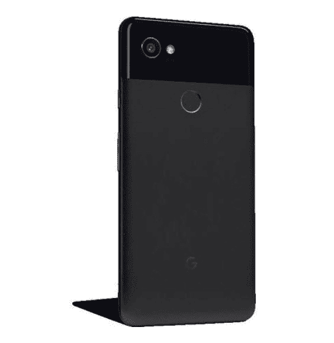
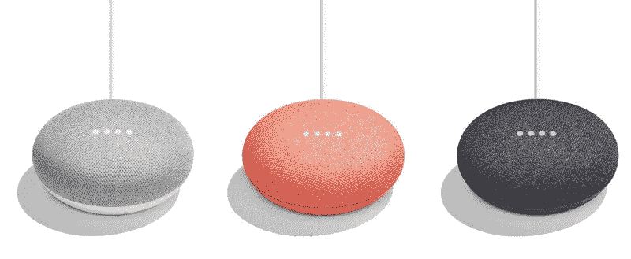
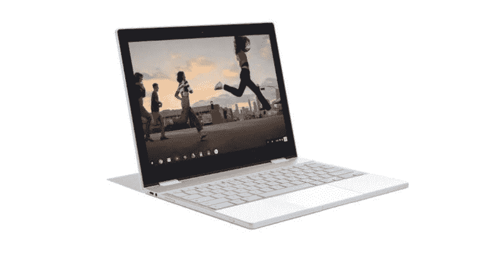
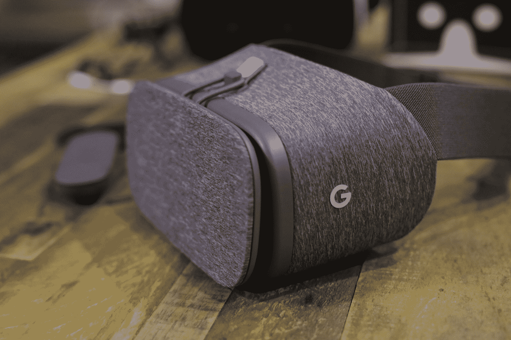

# 对谷歌 10 月 4 日的 Pixel 2 活动有何期待 

> 原文：<https://web.archive.org/web/https://techcrunch.com/2017/10/02/what-to-expect-from-googles-october-4-pixel-2-event/>

谷歌的大型硬件活动很快就要开始了——它将于 10 月 4 日，也就是下周三举行。但我们已经知道(或认为我们知道)相当多关于将被披露的内容，包括一些重大升级的全新 Pixel 智能手机，以及一些将大大充实谷歌更广泛的硬件组合的设备。

以下是下周谷歌在旧金山登台时我们可以期待的内容:

## 像素 2 和像素 2 XL

【T2

主要设备可能是新的 Pixel 和 Pixel XL 智能手机，这是谷歌去年发布的第一批自主设计的智能手机的续集。从谷歌的第一次尝试来看，后续应该是一套非常引人注目的设备。

从几个不同的方面来看，Pixel 2 XL 应该是两款新设备中更大的一款:与去年不同，谷歌将对其大屏幕设备进行一些改进，包括更薄的边框设计。据说它还有 QHD 屏幕，前后摄像头都有光学图像稳定功能。Android Authority 还报告说，它将有一个电子 sim 卡插槽，以及 IP67 防尘防水和更坚固的新大猩猩玻璃 5 显示屏。它还可能具有“可挤压”的侧面，这将允许用户在手持设备时按下以触发操作，如启动谷歌助手。

至于 Pixel 2，它将有很多相同的内部规格，但据说它有更大的边框，和 FHD 屏幕而不是 QHD-报道还声称它不会获得 Pixel 2 XL 一样的宽色域。

这两款设备听起来都应该是原始像素的引人注目的后续产品。谷歌的第一款智能手机也拥有业内最好的相机之一，很大程度上是由谷歌的软件 smarts 驱动的，所以预计这款设备也将在这方面赢得赞誉，并在相机质量上与刚刚发布的 iPhone 8 和 8 Plus 针锋相对。

## 谷歌主页

现在是智能语音助手季节，亚马逊推出了一系列新的 Alexa 和 Echo 设备。谷歌肯定会跟进对 Home 进行一些更新，这是一款智能扬声器，它于去年在 I/O 上首次亮相，并于 2017 年开始销售。

我们看到有传言称，可能会有一个迷你版的 Home，以 50 美元左右的价格与亚马逊的 Echo Dot 竞争，而且它还可能推出一个更大、更高端的版本。如果有一样东西 Home 可以使用，那就是声音更好的硬件版本——尤其是苹果的 HomePod 即将推出，并将于今年年底推出。

我还期待 Home 迄今为止的一些进展，以及现有设备的一些软件更新。

## Chromebook Luxe

对我来说，关于这次活动的一个更有趣的传言是谷歌高端像素 Chromebook 系列的回归。我们听说 Pixelbook 正在开发中，其价格标签更符合入门级 MacBooks，而不是大多数 Chromebook 设备，并配有触控笔配件。

泄露的 PIxelbook 已经在泄露的照片中捕捉到，看起来有一个可翻转的屏幕，可以完全转换为平板电脑，这支笔将单独零售约 100 美元。

零售价超过 1000 美元的 Chromebook 不太可能成为热卖品——ChromeOS 这些年来已经走过了很长的路，但还没到那种程度。但谷歌制造的优质 Chromebook 的回归可能有助于启动生态系统和扩散想法，实际上我是最初 Chromebook Pixel 硬件设计的超级粉丝，所以我很高兴看到这在适合度和光洁度方面的比较。

## 虚拟现实

虚拟现实是谷歌在其最后一批 Pixel 设备及其随附的 Android 操作系统中内置的东西。我们听说谷歌将更新其 Daydream VR 耳机，进行一些改进，价格略高。然而，我们还没有听到这些改进可能是什么。

谷歌最初也将 Daydream 定位为一个开放平台，其他人将构建耳机硬件来支持它，但我们在这方面没有看到太多。或许我们会得到关于 Daydream 的总体更新，以及 Pixel 2 硬件在改善内置 VR 体验方面的表现。

## 更大的

谷歌有很多事情要做，这个年度活动是它提供自 6 月 I/O 以来进展更新的大好机会。这意味着我们可以听到更多信息，包括 Assistant 的进展及其向其他硬件和设备的扩散，以及我们可以从该公司的 ARCore 方面期待什么，ARCore 是 Android 的 ARKit 等价物。

意想不到的事情:一个“超像素”超级溢价，第三部智能手机。最近有传言说这一点，但这几乎肯定是在转移视线:预计有两个新像素，而且只有两个，但这应该足够了。

我们将于 10 月 4 日美国东部时间晚上 12 点/太平洋时间早上 9 点开始直播此次活动，敬请关注所有更新。