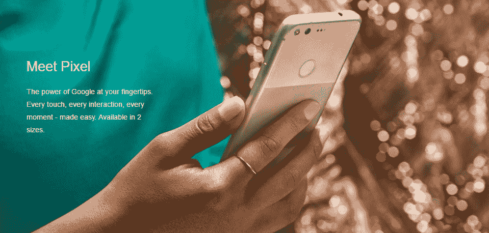
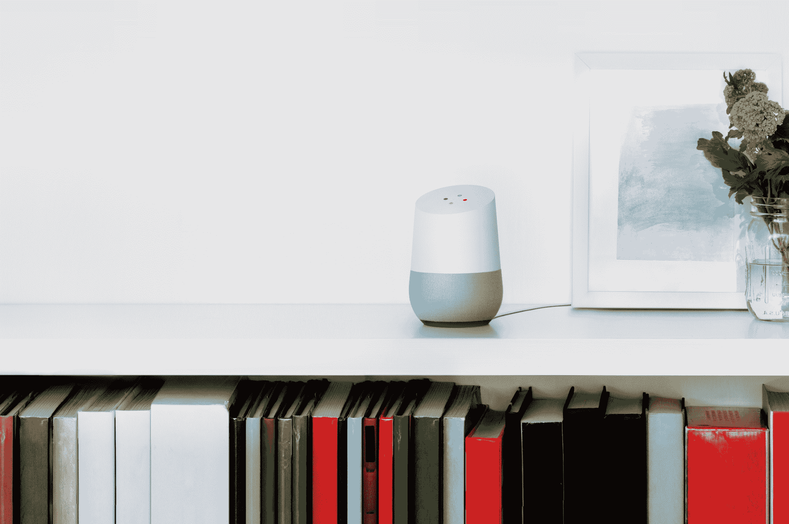
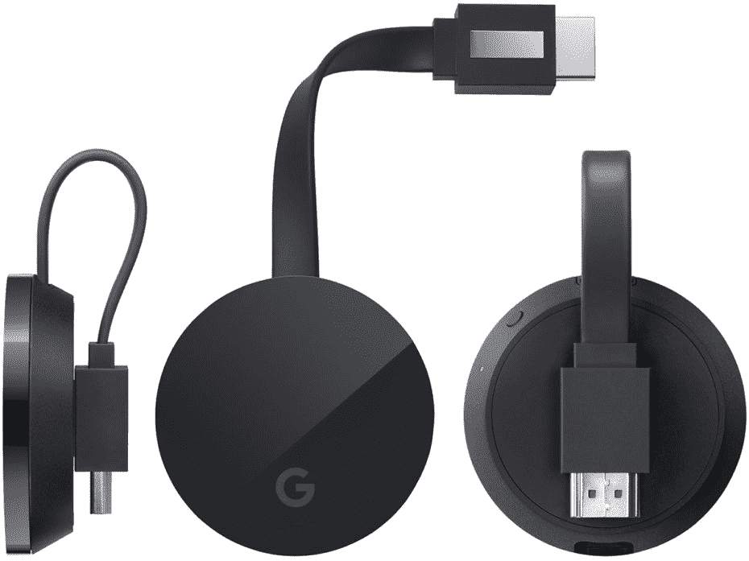
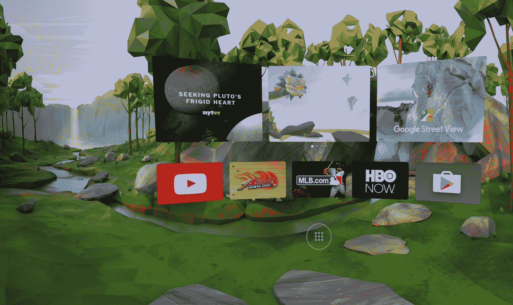
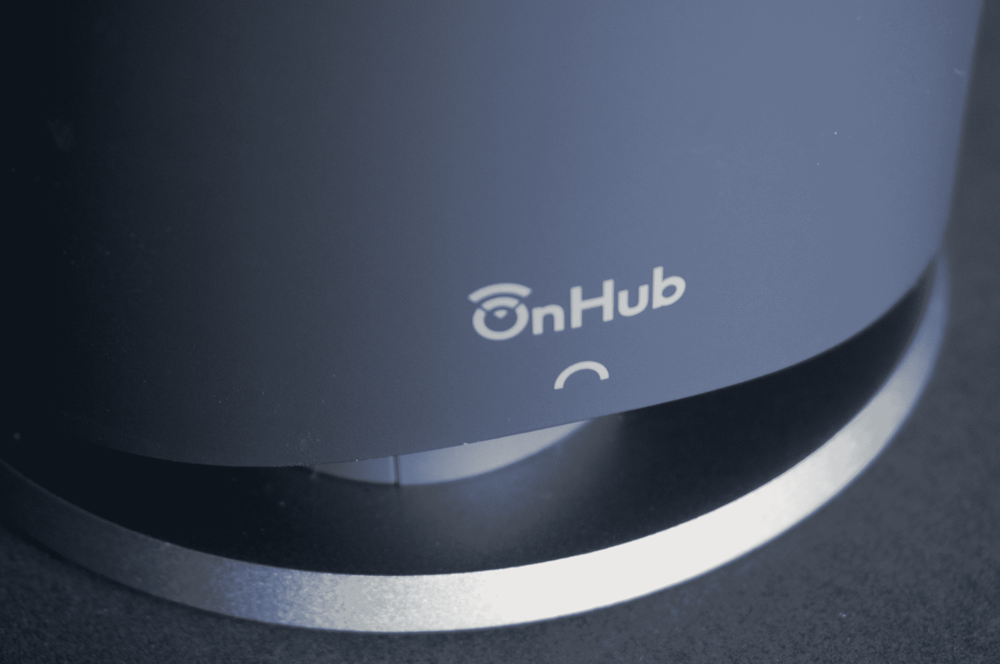

# 对谷歌 10 月 4 日的像素和硬件活动有什么期待

> 原文：<https://web.archive.org/web/https://techcrunch.com/2016/10/03/what-to-expect-from-googles-october-4-pixel-and-hardware-event/>

谷歌的 10 月大事件就在明天，传言称我们将会看到大量新硬件亮相，包括运行安卓系统的新 Pixel 智能手机(取代 Nexus 系列设备)。该活动还将告诉我们更多关于谷歌 Home 的信息，这是谷歌今年早些时候在 I/O 上预览的亚马逊 Echo 竞争对手，包括你什么时候可以得到一台。

下面是我们可以预期的细分，包括一些还没有泄露到极致的可能性。

## 谷歌 Pixel 和 Pixel XL

  谷歌的 Pixel 和 Pixel XL 智能手机是目前科技领域保守得最差的两个秘密，并将比之前的任何 Nexus 设备更多地归谷歌所有(尽管据称 HTC 是幕后供应商)。Pixel 和 Pixel XL 的规格相似，但标准版的显示屏为 5 英寸，而更大的 XL 将有 5.5 英寸的屏幕。

正如你所料，这些产品将拥有最新和最好的规格，包括来自高通的新骁龙 821 处理器，支持操作系统和应用程序的 4GB 内存，像素上的 1080p 高清屏幕，以及 XL 上的 2，560 x 1，440 或 2K 显示屏。两者都将拥有 1200 万像素的摄像头和指纹扫描仪，用于访问安全。

这听起来像是买家希望像在项目早期那样获得 Nexus 式的优惠，但他们运气不佳——有报道称这些宝贝的起拍价为 649 美元。传言称，类似于苹果自己的 iPhone 分期付款购买计划的融资计划，可能有助于减轻买家的负担。

我愿意接受这些产品的溢价定价，只要它们能在各方面提供行业领先的性能:Nexus 从未真正为其他 Android 制造商设立过标杆，甚至达到了最佳价值点，因此很高兴看到谷歌真正在展示 Android 在市场顶端的能力方面伸出了腿。

## 谷歌主页

几乎在一夜之间，Alexa 成为了家庭语音助手的黄金标准，因此谷歌必然会试图在那里夺回一些势头，特别是考虑到它很早就采用了“Ok，Google”语音命令界面。Home 就是这样一款产品，它是一款外形有点像空气清新剂的扬声器，但内置了谷歌助手(Google Assistant ),可以回答问题并接受命令。

Home 的预期价格为 129 美元，这将使它与亚马逊的产品保持一致，略低于 Echo，但高于 Dot，但这款支持蓝牙的设备还有一些额外的优势，因为它可以绑定到你的谷歌账户，而且它是一款现成的设备，可以从你的 iOS 和 Android 应用程序中下载内容。

今年早些时候，Home 在 I/O 上得到了预览，但我们希望明天就能知道它何时发货，或许还能获得更多关于它如何与你手机上的 Assistant 和 Allo 联系起来的细节。

## Chromecast Ultra

谷歌对电视流媒体类别的极简主义方法继续着这一传闻中的 Chromecast 进化，据说它支持 4K 视频流媒体，可能还支持 HDR。据报道，其价格将为 69 美元，仍远低于竞争对手，如最新的苹果电视。

Chromecast 的这一微小更新是谷歌轻手轻脚的流媒体方式的进一步延续；基本上，他们正在实现基本的技术改进，同时将内容/导航/界面留给用户已经更习惯的智能手机设备。加入 4K 是一种廉价且早期满足市场需求的方式，这对谷歌来说是明智的。

## 白日梦虚拟现实

谷歌已经透露，它的新虚拟现实平台，白日梦虚拟现实，是内置在安卓 7 (Nougat)中的，适合有支持它的规格的设备。但白日梦的一个关键要素将是用于虚拟现实体验的硬件耳机和控制器。

有传言称，谷歌将推出第三方白日梦虚拟现实耳机和控制器，为第三方选择奠定基础。或者它可能只是为这个平台推出第一批有形的合作伙伴产品。无论哪种方式，我们都有希望得到白日梦的更新，以及我们如何开始使用它——这可能是消费者虚拟现实的下一个重要时刻，如果它明年被包含在足够多的设备中，并且原始设备制造商尽他们所能来支持它。

## 谷歌 WiFi

据报道，谷歌已经拥有 OnHub 路由器，但它将在明天的活动中推出一款新的路由器设备,该设备旨在成为一个可扩展的家庭覆盖网络的支柱。这款售价 129 美元的设备将能够与其他设备配对，形成一个灵活、易于使用和配置的扩展网络，类似于 Eero 等设备。

【T2

OnHub 的整个目的是为最终用户提供一个非常简单的路由器体验，并根据谷歌的主要产品为用户提供一些额外的好处。制造一个新的、低成本的模块化选项来补充现有的阵容听起来是一个好主意，但这个传言的价格点和性质使得它看起来似乎可以实际上被整合到 Google Home 中，并提供相同的便利性以及扬声器和助手功能。尽管如此，它似乎更有可能作为一个独立的产品与该设备共存，至少目前如此。

## 安卓重塑

许多迹象，包括 Android 和 Chrome SVP Hiroshi Lockheimer 的推文，表明我们将在这次活动中看到对 Android 的重大反思。这可能不仅仅是一个点的更新(毕竟我们刚刚得到了 Android 7.0)，而是对产品的重新配置，不仅仅是为智能手机提供动力。

Android 已经驱动了智能手机以外的许多设备，但谷歌将寻求让这一点更加明显，并以更加集中和有效的方式引导它沿着这些路线前进。此外，我们还可以看到所谓的 Andromeda Android 混合操作系统的首次亮相，它融合了 Chrome OS 的一些功能，可以使 Android 更适合桌面工作环境。

我们将在明天直播谷歌的活动，所以你可以在 TechCrunch 上关注所有的新闻。到目前为止，这很可能是谷歌硬件有史以来最重要的一天，所以它应该非常值得收听。