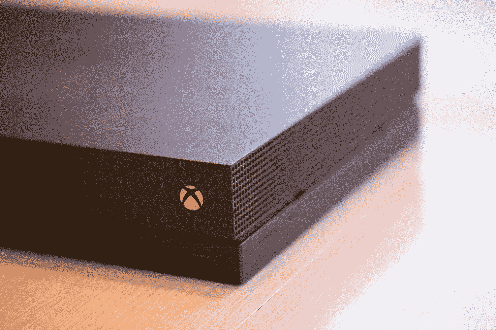
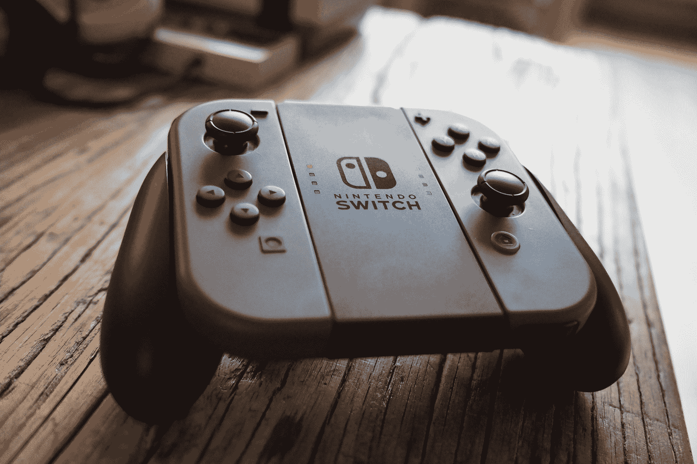
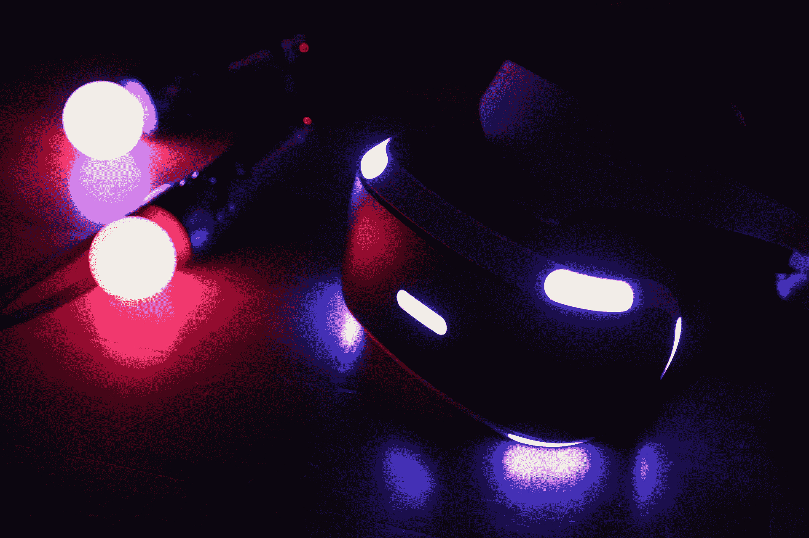
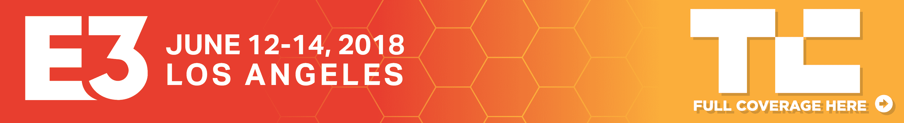

# E3 2018  对微软、任天堂和索尼有什么期待

> 原文：<https://web.archive.org/web/https://techcrunch.com/2018/06/07/what-to-expect-from-microsoft-nintendo-and-sony-at-e3-2018/>

现在是六月，这意味着是时候在洛杉矶市区度过一段美好时光了。E3 实际上要到下周二才真正开始，但许多重大新闻实际上会在周末微软、EA 和 Bethesda 的新闻发布会上公布。

从周六开始，视频游戏新闻将会铺天盖地而来。我们将在斯台普斯中心报道 E3 的所有事情，但与此同时，这里有一份我们期望在游戏世界最大的事件之一中看到的细目分类。

**T5【微软 **

微软的发布会是三巨头之首。坏消息:该公司刚刚证实了最近的一份报告，即打击 3 已被推迟到 2 月。真扫兴。对于那些渴望获得开放世界动作冒险的人来说，这是个坏消息，但无论如何，这个头衔几乎肯定会在活动期间受到一些人的喜爱。毕竟，自 2014 年以来，微软一直在谈论这个头衔。

如果没有某种光环头衔，这就不是一场正式的微软 E3 活动。《光晕 6》似乎是一种可能性——如果不是必然的话。最新的传闻是即将推出的游戏《光环无限》(Halo Infinity)，这可能是也可能不是 2015 年 lukewarmly 收到的《光环 5:守护者》的第一个直接后续。

新的《战争机器》和《极限竞速》的标题也被传言将会出现在这部大戏中。

*微软的活动将于周日下午 1 点开始。*

**任天堂**

有一点我们可以确定:一部  超级轰动的 Bros .片头即将切换。根据任天堂最近在 E3 专注于一款关键游戏的习惯，这似乎是一个安全的赌注，即心爱的格斗游戏将获得公司的最大份额的关注。

《银河战士 4》和《耀西》看起来对这个大事件来说是显而易见的，还有最近宣布的神奇宝贝游戏《我们走吧，皮卡丘》和《我们走吧，Eevee》。哦，有人说堡垒之夜是开关吗？谣言工厂还建议了一个明星福克斯赛车冠军，甚至 N64 经典版。

任天堂将于太平洋时间周二上午 9 点以一个预先录制好的演示开始这场表演。

**索尼**

索尼已经通过向游戏世界宣布今年的活动将不会有硬件新闻来抑制猜测。也就是说，仍然会有大量的软件火力。

自 2016 年以来，小岛秀夫的死亡搁浅就一直出现在这些节目中。即便如此，这个游戏仍然是一个谜。预计下周会看到更多，因为标题成为索尼演示的一个标杆。小岛康誉肯定已经在社交媒体上谈论它，包括令人信服地赞扬已故的乔伊部门主唱伊恩·柯蒂斯。

在去年的展会上首次亮相后，索尼公司已经确认《我们最后的人(下)》将在 E3 再次亮相。人们热切期待的续集似乎主要集中在埃莉的复仇之旅上。

漫威的《蜘蛛侠》定于 9 月上映，在一些严肃的舞台上，这似乎是显而易见的。彼得·帕克这次将回归蜘蛛网，并将有许多著名的蜘蛛迷客串，包括迈尔斯·莫拉莱斯和玛丽·简·沃森，他们将作为一个可玩的角色。

索尼在太平洋时间周一下午 6 点开始工作。

