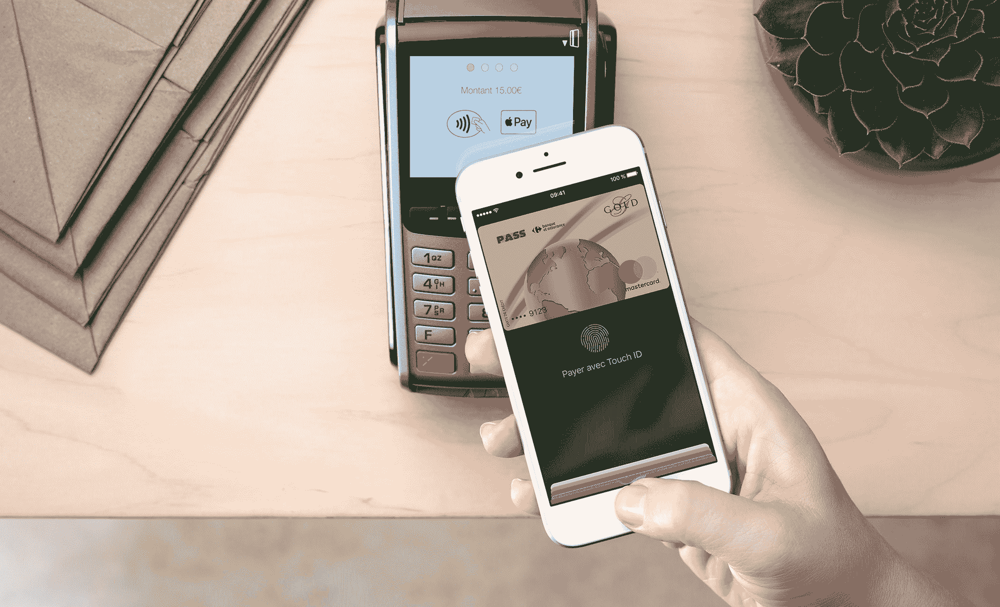
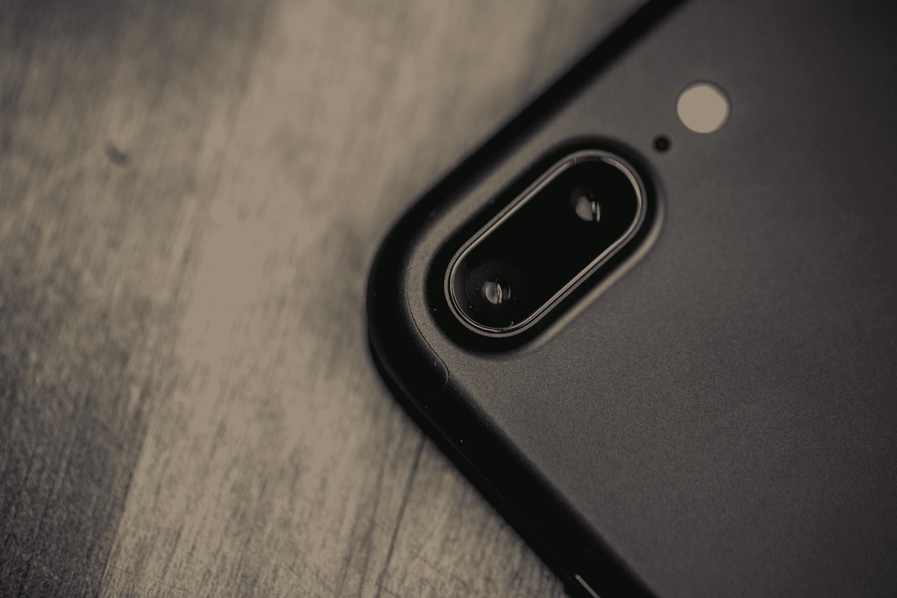
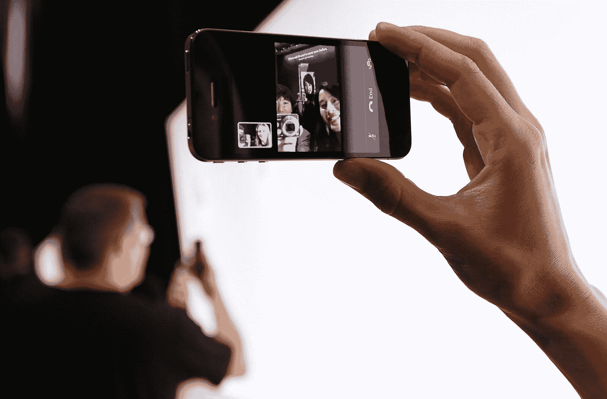

# 对 iPhone 8、iPhone 8 Plus 和 iPhone X 有什么期待

> 原文：<https://web.archive.org/web/https://techcrunch.com/2017/09/10/what-to-expect-from-the-iphone-8-iphone-8-plus-and-iphone-x/>

经过几个月的传言和泄露，下一代 iPhone 即将在苹果全新的[史蒂夫·乔布斯剧院](https://web.archive.org/web/20230226002758/https://techcrunch.com/gallery/what-to-expect-from-the-steve-jobs-theater-at-the-new-iphone-reveal/)亮相。

那么，目前我们知道些什么？作为苹果近年来的典型泄露，我们已经听到了关于新设备每一部分的信息，但是，和往常一样，一切仍然悬而未决。最近几周，屏幕、摄像头、价格——甚至是名字都成了争论的话题。

由于本周末发生的[大规模 iOS 11 软件泄露](https://web.archive.org/web/20230226002758/https://techcrunch.com/2017/09/09/animated-3d-emoji-coming-to-iphone-8-per-ios-11-firmware-leak/)，后一点似乎有所澄清。原来这么多名字流传的原因很简单:苹果发布了一系列手机。除了预期中的 iPhone 8 和 iPhone 8 Plus，我们还可能会有第三款手机:[iPhone X](https://web.archive.org/web/20230226002758/https://techcrunch.com/2017/09/09/animated-3d-emoji-coming-to-iphone-8-per-ios-11-firmware-leak/)。以下是迄今为止我们对手机的了解。

## 价格

令苹果懊恼的是，这将是这款手机讨论最多的新功能之一。三星因将 [Note 8](https://web.archive.org/web/20230226002758/https://techcrunch.com/2017/09/05/samsungs-galaxy-note-8-is-a-cautious-return-for-the-worlds-best-phablet/) 定价在不到 1000 美元而受到抨击，传言是真的，与库比蒂诺所做的相比，这根本不算什么。各种报告都将高端机型的价格定在 1000 美元至 1200 美元左右。当然，iPhone 8 和 8 Plus 几乎肯定会以更低的价格定位，而苹果从来不以节约成本著称。但这将符合最近价格飙升的趋势，因为公司希望用旗舰功能来区分自己。

## 显示

毫不奇怪，屏幕将成为这个笨重价格标签的主要驱动力——一个熟悉的名字在涨价。苹果将其高端机型转移到有机发光二极管，可能会将液晶显示器的每台设备成本从 50 美元左右提高到 125 美元左右。那么，升级能给你带来什么呢？更准确的色彩、更好的屏幕均匀性以及改进的电源管理等特性。这听起来并不多，但如果 LGV30 是任何迹象，它将是一个令人震惊的事情。

当然，还有缺口。Essential 的第一部手机让我们对这一点有所准备，但屏幕顶部的切口在新 iPhone 上看起来更明显。也就是说，在我们的体验中，我们并没有发现使用手机对[有什么大的坏处。设计是苹果 DNA 的核心，毫无疑问，该公司一直在想办法让它在很大程度上不被注意。预计首先在公司自己的应用上过渡是最容易的，因为第三方会努力跟上设计。好消息是，将有更多的屏幕空间挤在一个更小的外形中，包括一个几乎无边框的设计。](https://web.archive.org/web/20230226002758/https://techcrunch.com/2017/09/04/how-the-essential-phone-won-me-over-completely/)

## 照相机

当然，根据参考设计，双摄像头预计将再次出现在这里——不过这一次，它们将垂直堆叠，而不是水平堆叠。这里最大的升级是深度感应大大提高。虽然它应该使相机在散景效果上更好，但它的意义要大得多。

虽然蒂姆·库克(Tim Cook)给了虚拟现实一点爱(包括为 HTC 和 Oculus 的手机开发)，但他长期以来一直表示，他预计 AR 在短期内会大得多。如果自从 ARKit 程序上线以来，我们所看到的 ARKit 程序[的泛滥有任何迹象的话，我们可以在这方面期待一些真正令人惊讶的事情。但是，真正逼真的增强现实体验将需要更强大的板载深度传感。从它的声音来看，至少 iPhone X 将是传递这一信息的手机。](https://web.archive.org/web/20230226002758/https://techcrunch.com/2017/08/29/a-preview-of-the-first-wave-of-ar-apps-coming-to-iphones/)

## Face ID

面部解锁一直是新手机发布前最一致的传言之一，这个周末，它似乎终于有了一个名字: [Face ID](https://web.archive.org/web/20230226002758/https://techcrunch.com/2017/08/07/iphone-8-could-scan-your-face-even-if-your-phone-is-on-a-table/) 。同样的泄露还指向了一个设置该功能的动画，其中涉及用户对着摄像头移动他们的脸——这与我们多年来在指纹扫描设置过程中所做的没有什么不同。

与此同时，通过 HomePod 发现的一个漏洞指出，该功能(当时的代号为:珍珠 ID)能够解锁手机，即使[平放在桌子上](https://web.archive.org/web/20230226002758/https://techcrunch.com/2017/08/07/iphone-8-could-scan-your-face-even-if-your-phone-is-on-a-table/)。Face ID 似乎也可能在发布时或即将发布时与第三方应用程序进行一些整合。

面部扫描的加入可能对我们熟悉的指纹扫描仪/home 键意味着一些事情。在转向更安全的“taptic engine”一代人之后，苹果可以转向 iPhone 屏幕上的虚拟扫描仪——类似于三星在其 Galaxy 设备上所做的。新出现的传言也预示着 x 上指纹扫描仪和 home 键的终结。这将是一个大胆的举动，而且根据苹果采用的技术的功效，这也是一个潜在的安全问题。正如我们上周在一篇文章中指出的那样，三星等公司并不认为他们自己的[面部解锁功能](https://web.archive.org/web/20230226002758/https://techcrunch.com/2017/09/06/dont-rely-on-face-unlock-to-keep-your-phone-secure/)与更先进的生物识别技术不相上下。

也就是说，泄露的设置过程指向一款受益于添加深度传感摄像头的手机——苹果肯定渴望将这种技术带入手机，因为它致力于提高 ARKit 应用程序的兴奋度。增加更复杂的图像和深度阅读，最终会使用一张简单的图片欺骗 Face ID 变得更加困难。

## 有效性

这肯定会成为批评者的另一个症结。许多报道称(我们也独立证实了), iPhone X 将会比它的低端产品更晚上市。这似乎是苹果公司选择在高端机型上使用这些有机发光二极管设备时出现的又一个问题。实际上推迟多长时间仍然悬而未决——该公司很有可能因为担心错过时机而不提预计到达时间。推迟可能会影响苹果的底线，促使更多的人购买更便宜的型号，但第一次就做对还有很多事情要说。