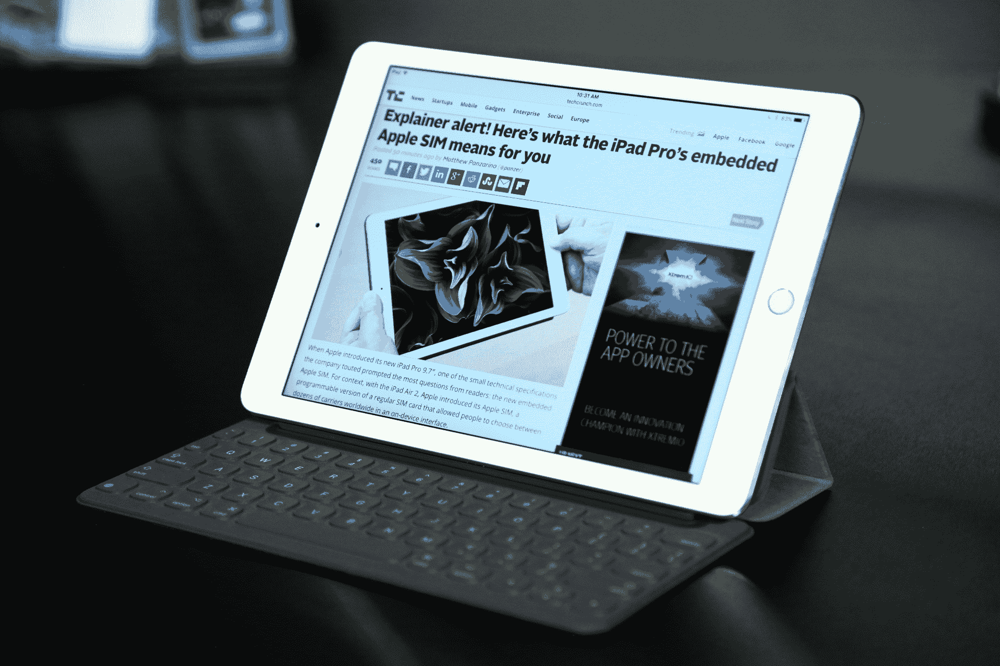
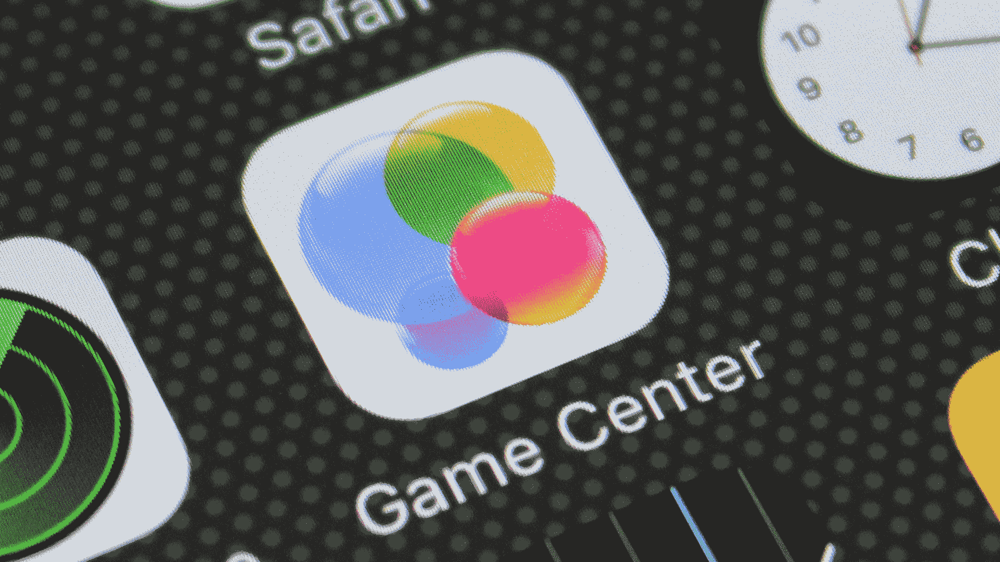

# WWDC 2017 TechCrunch 期待什么

> 原文：<https://web.archive.org/web/https://techcrunch.com/2017/06/03/what-to-expect-from-wwdc-2017/>

又到了一年中的这个时候。成千上万的开发人员将会来到南湾开发他们的软件。苹果世界的其他人将在周一早上关注 WWDC 的主题演讲，蒂姆·库克和他的公司将展示该公司各种操作系统的最新升级。

从早期泄露的消息来看，该展会也将比大多数全球开发者大会更专注于硬件，对一些关键产品线进行了一些更新，并据报道增加了一个 Echo 竞争对手，最终将 Siri 真正带到客厅。事实上，大部分的谣言和猜测都是与设备相关的。

当然，我们将在 6 月 5 日到那里，从太平洋时间上午 10 点/美国东部时间下午 1 点开始，现场直播事件的进展。与此同时，这里有一些我们期待在大型活动中看到的展示。

## 五金器具

硬件并不总是 WWDC 的赠品，但今年很可能是财富的尴尬。

Siri 扬声器 : 这已经成为至少一年前的谣言了。据报道，苹果一直在悄悄地(或者说，不那么悄悄地，真的)开发自己版本的亚马逊 Echo/谷歌 Home，以及对其长期存在的智能助手 Siri 进行一些关键的调整。该公司已经通过 Home Kit 和 iOS 10 Home 应用程序关注联网家庭有一段时间了，但它真正需要的是一个将所有这些联系在一起的硬件。

目前，苹果电视已经接近拥有一个家庭中枢了。但是，尽管该系统具有语音集成功能，但它不是 Echo 或 Home 等始终监听扬声器集线器的理想替代方案。除此之外，关于这款设备的细节非常少，但你可能会预计，相对于竞争对手，该系统将是一款更高端的产品，因为，嗯，苹果还是苹果。

早期的报道指出了虚拟环绕声之类的东西，表明与 Echo 和 Home 不同，苹果将专注于扬声器质量之类的东西，而不是仅仅制造一种声音次要于在家中插入智能助手的产品。这也意味着我们可以期待 Siri 的一些关键更新，它似乎在最近几年已经失去了苹果的关注。

**iPad Pro 10.5:** 在发布会之前，另一个持续不断的传言是，苹果公司在最近几个月似乎精简了一些东西之后，将为其 iPad 系列增加另一个屏幕尺寸。据称，10.5 英寸的 iPad Pro 将与其 9.7 英寸的兄弟产品具有相似的尺寸，这是由于大大减少了边框。苹果仍指望 Pro 能与 Surface line 这样的二合一产品竞争，这在低迷的平板电脑市场上是一个罕见的亮点。

**MacBook Pro 和 Air Spec Bumps:** 距离苹果首次对 MacBook 进行有意义的更新还不到一年，因此任何对该系列的升级都很可能只在内部进行。根据展会前的传言，英特尔的 Kaby Lake 处理器是当今的潮流，意味着更快的速度和更好的电池寿命。据报道，这些芯片也将用于 MacBook Air，标志着苹果长期被忽视的笔记本电脑的期待已久的升级(尽管是小升级)。

## 软件

很多。这么多软件。所有的软件。据说苹果的所有操作系统这次都将得到一次有意义的更新。但具体的功能是非常少的，而且在活动开始前相距甚远。

**iOS 11:** 撇开 Siri 扬声器不谈，iOS 可能会成为主题演讲的核心，这是一次开发者大会。虽然 10 ^(周年纪念日的 iPhone 8 几乎肯定至少要到秋天才会亮相，但看起来我们可能会第一次真正尝到 iOS 11 的味道。它的实际形状目前还不确定，但是已经有一些漏洞出现了。当然，Siri 是显而易见的，考虑到预期的 hub 公告，以及苹果公司保持领先于 Alexa、Assistant 等产品的努力。预计苹果的人工智能将在周一占据中心舞台。随着新 iPad Pro 的推出，平板电脑版本的操作系统据说将获得一些专业级别的更新，如多用户登录和对 Apple Pencil 的扩展支持。一个改良版的音乐似乎也是一个可能的赌注，尤其是在苹果推动更多视频内容的时候。)

macOS/watchOS/tvOS: 这三个操作系统都有望在这一次得到重大更新，尽管这里的细节还是很少。预计 watchOS 和 tvOS 领域将会出现最大的变化。至于 watchOS，Apple Watch 是苦苦挣扎的可穿戴设备类别中一个罕见的亮点，该公司无疑希望在今年晚些时候新设备上市之前引起轰动。特别值得注意的是，苹果最近对设备上所有健康事物的关注。