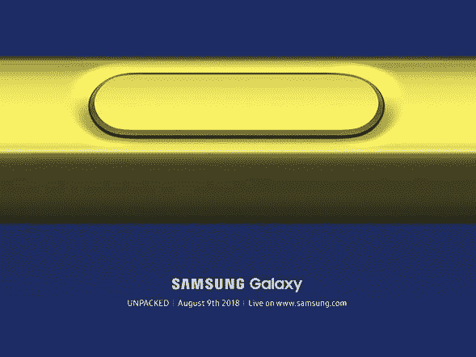

# 我们对 Note 9 的了解

> 原文：<https://web.archive.org/web/https://techcrunch.com/2018/08/04/what-we-know-about-the-note-9/>

一些公司对产品严守秘密，就像它们是核密码或流行可乐的成分。其他人似乎不太关心整件事，只要它让人们说话。根据[到目前为止我们从 Galaxy Note 9 上看到的](https://web.archive.org/web/20230307140202/https://techcrunch.com/2018/07/18/the-galaxy-note-9-is-leaking-out-all-over-the-place/)，三星似乎坚定地属于后一个阵营。

当然，需要指出的是，在周四的 Unpacked 发布会之前，我们不会*真正*知道这款新手机到底是什么。但是，我们真的知道这是怎么回事，因为，我的意思是，看看这些泄漏。

也就是说，可能仍然有足够的理由关注这一事件。鉴于该公司选择不等待宣布 [Galaxy Tab，S4](https://web.archive.org/web/20230307140202/https://techcrunch.com/2018/08/01/samsung-thinks-the-galaxy-tab-s4-can-replace-your-laptop/) 可能会在未来几个月宣布更多重大产品。

在过去的几周和几个月里，有各种各样的其他传言，包括围绕一款新的[三星 Gear](https://web.archive.org/web/20230307140202/https://techcrunch.com/2018/07/10/samsungs-galaxy-watch-trademark-fuels-speculation-about-a-wear-os-device/) 手表的许多猜测，这款手表可能会在同一场活动中首次亮相。

另一方面，Note 9 几乎已经站起来宣布它的存在。除了你标准的一系列谣言之外，三星方面也有一些令人震惊的泄露，包括一名高管在公开场合使用新设备，以及三星在 YouTube 上发布了一个[宣传视频](https://web.archive.org/web/20230307140202/https://techcrunch.com/2018/08/03/samsungs-official-launch-video-for-the-galaxy-note-9-has-also-now-leaked/)。

以下是我们目前所知的关于即将推出的平板手机的信息。

**设计/展示**

据说，自上一代设备以来，设计语言没有太大变化——事实上，这可能是 DJ Koh 认为他可以使用手机而不被注意的原因。然而，有一个主要的线索让观众知道，这位高管正在使用一些新的东西。

最初传言指纹传感器位于屏幕下方，实际上已经被移动了。然而，这一次，它在摄像头下方，而不是旁边——解决了 Note 8 设计的一个主要投诉，即用户在试图解锁设备时，会摸索相机镜头。

据报道，这里的尺寸也大致相同。这款设备的尺寸为 161.9 x 76.3 x 8.8mm 毫米，比前代产品略短，部分原因可能是顶部和底部的边框更薄。与此同时，显示屏比 8 的 6.3 英寸略大，为 6.4 英寸。

**电池/存储/性能**

https://www.youtube.com/watch?v=oWw7Jn9GVfY

三星从一开始就明确表示，电池寿命是这款新设备的主要关注点。该公司似乎证实了早期的传言，即这款手机将配备 4000 毫安时电池，在早期的预告片中公开嘲笑 iPhone 相对较小的产品(正如三星这些天的惯用手法)。

https://www.youtube.com/watch?v = XM2iiQNqnVs

这比 Note 8 高出了 700 毫安时，并将即将推出的手机推向了手机电池堆的顶端。在 Note 7 遭遇惨败后，这也与三星最近的电池谦虚趋势背道而驰。该公司进行了大量道歉，制定了严格的测试指南，手机购买公众似乎大多已经原谅并忘记了整个混乱。

与此同时，随后的宣传重点是额外的存储和性能增强。据传，一个巨大的 512GB 版本即将上市，毫无疑问将会花费一大笔钱。得益于 microSD 插槽，这一容量最高可增加至 1tb。

**摄像机**

这是显而易见的。相机更新几乎是每一款旗舰手机发布的焦点。也就是说，这是这款手机中为数不多的仍相对神秘的部分之一。

**S-Pen**

该公司钟爱的手写笔显然从一开始就是一个焦点。事实上，[打开的邀请函](https://web.archive.org/web/20230307140202/https://techcrunch.com/2018/06/27/samsung-will-probably-unveil-the-note-9-on-august-9/)展示了黄色背景上 S-Pen 按钮的特写。新泄露的视频证实了充满活力的新配色方案，至少应该使它更难丢失。

该公司还强烈暗示，S-Pen 的改进将是新手机的一个重点，但这些大多设法保持保密。建议的功能包括音乐播放和远程解锁等非绘图控件。

**耳机插孔**

https://www.youtube.com/watch?v=-O_MjXbX3VA

是的，还在。毕竟，就在几周前，公司[还在嘲笑苹果](https://web.archive.org/web/20230307140202/https://techcrunch.com/2018/07/23/samsung-is-probably-keeping-the-headphone-jack-around-for-the-galaxy-note-9/)，因为它固执地认为苹果需要一个“双重加密狗”来同时听音乐和给手机充电。它仍然是三星手机和 iPhone 之间的一个关键区别，因此，可能会持续一段时间。到目前为止，所有的泄露似乎都证实了这一点。