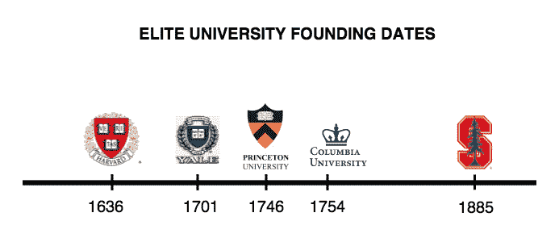

# 斯坦福和硅谷的相互依赖

> 原文：<https://web.archive.org/web/https://techcrunch.com/2015/09/04/what-will-stanford-be-without-silicon-valley/>

里蒂卡·特里卡撰稿人

More posts by this contributor

曾经有一段时间，斯坦福大学被认为是二流的工程学院。那是 20 世纪 40 年代初，国防部被逼 [调集](https://web.archive.org/web/20230213152620/http://steveblank.com/secret-history/) 一个绝密小组，了解并攻击二战时期德国的雷达系统。

美国科学研究负责人 Vannevar Bush 希望美国最好的无线电工程师斯坦福大学的弗兰德里克·特曼带领 800 名研究人员完成这项秘密任务。但是，他没有把团队驻扎在特曼自己的斯坦福实验室——一个屋顶漏雨的阁楼——而是被派到广受好评的哈佛实验室来执行这项任务。

很难想象斯坦福今天会被忽略为创新中心。斯坦福大学在声望和受欢迎程度上已经超过了一些常春藤盟校。它抹杀了精英是常春藤联盟独有的传统思维模式。几个世纪以来，斯坦福大学一直领先于顶级学校。在多个全球和全国排名中位列前 3([这里](https://web.archive.org/web/20230213152620/http://www.shanghairanking.com/ARWU2014.html) ， [这里](https://web.archive.org/web/20230213152620/http://www.forbes.com/sites/forbespr/2013/07/24/stanford-university-ranks-no-1-on-forbes-6th-annual-ranking-of-americas-top-colleges-measuring-student-satisfaction-and-post-graduate-success/) 和 [这里](https://web.archive.org/web/20230213152620/http://time.com/money/best-colleges/) )。

另外，调查结果显示，在过去几年里，斯坦福大学是大多数学生和家长的首选，超过了哈佛、普林斯顿和耶鲁。事实上，就连哈佛的学生 [也有](https://web.archive.org/web/20230213152620/http://www.thecrimson.com/admissions/article/2014/4/22/harvard-not-on-top/) 承认斯坦福的知名度显著上升。

但是在斯坦福的校园里发生了一些更有趣的事情……一些超越这些学术排名的事情。自古以来，学术界的目标就不是创建公司，而是为了知识而发展知识。

然而，斯坦福大学的工程学院在构建今天围绕它的科技繁荣中发挥了强大的作用。它不仅见证了硅谷一些最著名的创新，也是众所周知的发源地。

尽管斯坦福大学的师生在各个学科都取得了显著的成就，但他们在塑造创新时代的中心方面所扮演的角色可能是最杰出的——如果不是最独特的话——之一。当全世界的目光聚焦在硅谷蓬勃发展的科技领域时，斯坦福大学的附属关系在外围闪耀。

作为回报，其创业校友向该大学提供了最慷慨的捐赠，打破了 [的记录](https://web.archive.org/web/20230213152620/http://www.nytimes.com/2013/02/21/education/stanfords-fund-raising-topped-1-billion-in-2012.html) 成为第一所单年增加超过 10 亿美元的大学。与这个星球上的任何其他大学不同，斯坦福大学与硅谷有着共同的关系，拥有一个自我延续的创新周期。

但是这种相互依赖的根源是什么，在教育技术快速变化的空间中，这种依赖能持续多久？

## 弗雷德·特曼，斯坦福创业精神的根源

要真正理解斯坦福在建设硅谷中的作用，让我们重温二战，认识一下特曼。作为绝密军事任务的领导人，特曼了解他所在领域最前沿、最独家的电子研究。虽然政府渴望在电子防御技术上投入更多，但他看到斯坦福正在落后。

在给一位同事的信中，特曼 [预言](https://web.archive.org/web/20230213152620/https://books.google.com/books?id=e0bVC2FEoSwC&pg=PA73&lpg=PA73&dq=stanford+reputation+wwii&source=bl&ots=fuXhnGDZb0&sig=X3adv9D531mb3ZlcE2kSixm3-Ac&hl=en&sa=X&ved=0CDwQ6AEwBWoVChMIwoymzan2xgIVzSqICh3wgggm#v=onepage&q=stanford%20reputation%20wwii&f=false) 【斯坦福】有机会在西方取得类似于东方哈佛的地位。

战后，他通过获得赞助项目，吸引了一些最优秀的学生和教师到贫瘠的西部的斯坦福大学，这些项目帮助加强了斯坦福大学在电子学方面的声誉。感谢 [史蒂夫·布兰克](https://web.archive.org/web/20230213152620/http://steveblank.com/category/secret-history-of-silicon-valley/) ，这是一个很棒的形象化的例子，关于斯坦福如何通过战争基金第一次推动了它的创业引擎:

这种对推动同事和学生将他们的想法商业化的关注帮助推动了斯坦福大学工程学的发展。最终，斯坦福大学的声誉成长为军事技术资源，与哈佛大学和麻省理工学院齐名。

但是特曼对技术商业化的倡导超越了军事领域。随着冷战的开始，特曼推动建设了斯坦福工业园区，这是一个留给私营、尖端科技公司租赁土地的地方。这是同类中的第一个，著名的早期技术先驱如洛克希德，仙童，施乐和通用电气都在这里。

研究园是的完美配方

*   大学新的收入来源
*   将学术界和工业界的思想聚集在一起
*   激励学生创办自己的公司

你可能会说，斯坦福工业园区是一些最聪明的技术头脑最初的网络中心，融合了学术界和工业界，目标是推进技术知识。

他们有着和谐的关系，行业人士在斯坦福上兼职课程。作为回报，这些科技公司为斯坦福毕业生提供了很好的工作机会。

> 靠近硅谷并不是斯坦福与众不同的最重要因素，但肯定是最独特的因素。

从那时起，斯坦福大学与科技行业之间的桥梁就像钢铁一样坚固，因激发了许多学生的创业精神而臭名昭著。当然，最著名的故事是特曼和他的学生威廉·休利特和戴维·帕卡德的故事，他们获得了一种创新音频振荡器的专利。特曼力劝二人组拍摄他们突破性的商业广告。

最终，惠普(HP)诞生了，并搬进了研究园区，成为世界上最大的个人电脑制造商。迄今为止，他和已故的戴维·帕卡德以及他们的家族基金会和公司已经向斯坦福大学捐赠了超过 3 亿美元。

由于他们接近顶级创新，斯坦福大学的学者有机会发现行业中的技术变化，并通过发明新的研究突破来获利。例如:

*   **计算机图形公司:** 学生们被集成电路技术和超大规模集成电路能力的可能性迷住了。几何引擎是计算机生成图形背后的核心创新，是在斯坦福大学校园开发的。

*   **Atheros:** Atheros 推出了第一个无线网络。特蕾莎·孟在政府的资助下，为士兵们建造了一个电池寿命延长的低功耗 GPS 系统。这导致了成功的低功耗无线网络，最终成为 Wi-Fi。

这些只是从斯坦福的土地上诞生的一些最具突破性的技术创新中的几个:谷歌、太阳微系统公司、雅虎。、思科、Intuit……这样的公司不胜枚举，超过 40，000 家。

斯坦福大学也以人才济济而闻名。例如，第一批 100 名谷歌员工也是斯坦福大学的学生。而今天，[1/20](https://web.archive.org/web/20230213152620/http://www.independent.co.uk/student/news/the-billionaire-factory-why-stanford-university-produces-so-many-celebrated-web-entrepreneurs-8706573.html)谷歌人来自斯坦福。

## 靠近硅谷推动了它的科技创业精神

如果你沿着[斯坦福的研究园](https://web.archive.org/web/20230213152620/https://en.wikipedia.org/wiki/Stanford_Research_Park)的 700 [英亩](https://web.archive.org/web/20230213152620/https://en.wikipedia.org/wiki/Acre) 漫步，你不仅会看到像特斯拉和 Skype 这样的尖端公司，还会看到世界知名的科技律师事务所和研发实验室。从最纯粹的意义上来说，这是一个庞大的创新网络——是根除一个新生想法的最佳场所。

靠近硅谷并不是让斯坦福与众不同的最重要的因素，但肯定是最独特的因素。它是计算机科学创新者、资金雄厚的风险投资公司和天使投资者的温床。

至少在今天，每个想在科技领域“成功”的人都会去硅谷。就像特曼早期在斯坦福的日子一样，在这里你可以遇到拥有合适资源的合适的人，他们可以帮助你将美国企业家梦变成现实。

看看每年越来越多的 H-1B 签证申请人就知道了，他们中的大多数从事科技行业。2015 年申请人数超过 23 万，高于 2014 年的 17 万。前 11 个拥有最多 H-1B 签证的城市中，有 4 个都在硅谷。

此外，越来越多的非科技公司正在硅谷设立研发机构。分析师布莱恩·索利斯最近 [领导了一项针对 200 多家非科技公司的调查](https://web.archive.org/web/20230213152620/http://blogs.wsj.com/digits/2015/07/22/hacking-hq-new-study-looks-at-non-tech-innovation-centers/)；61%这些人中有 60%在硅谷工作过，这有助于他们“接触最新技术”

> 斯坦福大学的工程师们非常强调科技创业精神。

尽管如此，反对者还是经常指出媒体夸大其词，将斯坦福大学贬低为创业发电机。当然，斯坦福大学久负盛名的课程吸引了跨学科的顶尖教师和研究人员。但是，考虑到证据和轶事，斯坦福大学的工程师们显然非常重视科技创业。怎么可能不是呢？

斯坦福大学的校友迈克尔·哈里斯可以证明一种普遍的动力和激情。“这并不像媒体报道的那样占主导地位，”他说，“但也有一些事实。”

总的来说，斯坦福的学生对创造对世界有实际影响的真实事物感兴趣。事实上，硅谷就在这里，学生可以通过朋友、教授、学校等获得相当好的机会。对业内人士来说，这无疑是一笔巨大的红利。它让人们对在科技行业工作感到兴奋，并感到有动力和能力自己创业。

## 这种企业家精神正在演变成一种紧迫感

特曼早期强调将学术界开发的想法转化为可行的产品，这种做法如今也同样盛行——如果不是更盛行的话。最能说明问题的证据是，斯坦福大学的校园比其他任何校园都培养出更多的科技创业公司创始人。

但是更奇怪的是，一些学生，尤其是研究生部的学生，甚至没有完成他们的学位。支付数千美元获得计算机科学硕士学位，却要离开去创办一家创业公司，这是很有纪念意义的。甚至在本科阶段，哈里斯在大三后的那个夏天做了一次令人惊叹的实习后，就想过离开大学。

哈里斯说:“我要说的是，与学校相比，在工业界工作能更快地教会你更多关于如何在工业界做好工作的知识(可能是几个数量级)，”所以我并不认为人们不回到学校是疯狂的，除了一些公司似乎认为一张证明他们大学毕业的纸很重要的事实。”

当然，大多数人都完成了学位。但是不管大多数人是否坚持到底，这种离开的紧迫感是显而易见的。

> 斯坦福大学最终会颠覆使斯坦福大学区别于地球上任何其他大学的独特因素吗？

去年，六名斯坦福学生 [离开](https://web.archive.org/web/20230213152620/http://www.businessinsider.com/r-special-report-at-stanford-venture-capital-reaches-into-the-dorm--2014-12) 学校，到同一家创业公司工作。 [前年又有 20 个](https://web.archive.org/web/20230213152620/http://www.businessinsider.com/twenty-stanford-students-quit-school-to-work-for-a-startup-in-a-super-competitive-industry-2013-4) 因类似原因离开。显然，斯坦福令人垂涎的 StartX 项目对他们来说还不够。

StartX 是一个为期 3 个月的独家孵化器项目，旨在帮助满足那些希望将自己的商业想法推向市场的学生的需求，同时提供来自教师和行业专家的知名指导和支持，帮助最聪明的斯坦福人将他们的想法变成现实。

在最近的一次演讲中，斯坦福大学校长约翰·汉尼斯自豪地谈到这个项目，称之为学生们为创业挠痒痒的发射台。但当一名观众问他关于学生辍学的问题时，他说，“看，每一个 Instagram 成功，就有另外 100 个失败的照片分享网站。”他补充说，“到目前为止，所有的 StartX 项目学生都已经毕业——至少是所有的本科生。”

总的来说，近年来斯坦福的毕业率有所下降。斯坦福大学称，2009 年入学的学生中，90%在 5 年内毕业，而 5 年前的 5 年毕业率为 92.2%。这对斯坦福来说不是一件坏事。从一开始，斯坦福卓越的一个核心功能就是对学生的投资，以构建伟大的商业产品——从 Terman 的早期开始。

## 未来:如果没有硅谷，斯坦福将会怎样？

但是教育和硅谷都在改变。创新的本质将我们从精英机构和公司的砖墙中解放出来。

如果技术的最佳应用是使机会民主化，那么这个星球上的每一个人都应该能够负担得起斯坦福世界一流的在线教育。大规模开放在线课程(MOOC)和在线资源的兴起预示着教育的未来。

这是一个雄心勃勃的学生有机会自我教育的未来。在技术的前沿，包括斯坦福大学在内的教育机构开始通过在线课程材料来分散模型。

> 斯坦福与硅谷的关系不同于地球上的任何其他大学。

与此同时，硅谷可能引领了科技热潮，但它不再是唯一的科技中心。技术中心的爆发正在世界各地形成。在 H-1B 签证帽 上的一张 [中，我发现早期创业公司的顶级投资者已经在印度、中国和以色列开设了店铺，这三个国家是仅次于硅谷的全球最大科技中心。](https://web.archive.org/web/20230213152620/http://blog.hackerrank.com/h1-b-visa-cap-the-imminent-threat-to-us-tech-innovation/)

现实地说，1B 签证限额和城市基础设施实际上无法支撑硅谷的指数增长。创新的核心最终会转移，认为与硅谷的距离无关紧要。

另外——由于一些学生甚至还没有完成他们的学位——如果斯坦福大学计算机科学硕士学位的数千美元真的值得简历上的品牌名称或与碰巧居住在帕洛阿尔托的顶级初创公司创始人一起喝咖啡，这将是值得重新评估的。

但是，如果斯坦福毗邻硅谷推动了其创业精神，这有助于提升斯坦福的声誉和资金，那么当斯坦福雄心勃勃的初创企业创始人开始接受在线教育时，会发生什么？

斯坦福大学最终会颠覆让斯坦福大学区别于地球上任何其他大学的独特因素吗？还是斯坦福的校友将继续推动其自我延续的创新循环，并保持其作为创新中心的声誉？