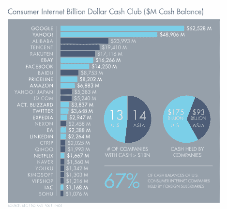
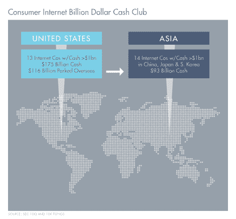

# 你会用 6000 亿美元做什么？

> 原文：<https://web.archive.org/web/http://techcrunch.com/2014/12/23/what-would-you-do-with-600b-in-cash/>

More posts by this contributor

钱启华撰稿人

**编者按:** *Eric Kim 和 Chi-Hua Chien 是 [Goodwater Capital](https://web.archive.org/web/20230129225341/http://www.goodwatercap.com/) 的联合创始人，这是一家早期风险投资公司，旨在为那些通过消费技术改变世界的企业家提供支持。*

消费互联网初创公司经历了长期的融资和估值热潮，但互联网巨头最近的战略投资和收购趋势令人惊讶。

谷歌牵头的 5.42 亿美元 Magic Leap 轮投资[、腾讯对口碑的 3.5 亿美元投资](https://web.archive.org/web/20230129225341/https://techcrunch.com/2014/10/21/magic-leap-tech/)[以及阿里巴巴对 Tango 的 2.15 亿美元投资](https://web.archive.org/web/20230129225341/https://techcrunch.com/2014/10/23/tencent-leads-350m-investment-in-chinas-koudai-gouwu-a-mobile-focused-rival-to-alibaba/)[等投资已经改变了处于后期阶段的消费互联网初创公司应该考虑其融资选择的方式。是什么推动了战略导向型投资的兴起？很简单，真的；都是钱的问题。](https://web.archive.org/web/20230129225341/https://techcrunch.com/2014/03/19/mobile-messaging-app-gaming-platform-tango-raises-massive-280-million-series-d/)

## **十亿美元现金俱乐部**

我们分析了所有现金余额(现金+短期+长期投资)大于 10 亿美元的消费互联网公司，发现了令人惊讶的结果。

*   十亿美元现金俱乐部中的 27 家公司的资产负债表上总共持有约 2680 亿美元的现金。
*   该俱乐部中超过一半(14 家)的公司位于亚洲，它们持有约三分之一的现金(930 亿美元)，而 13 家美国公司持有约 1750 亿美元。
*   加上苹果、微软和三星(在消费创业公司中越来越活跃)，提供了额外的 3370 亿美元现金。

在 27 家消费互联网巨头加上操作系统/设备制造商苹果、微软和三星之间，有近 6050 亿美元的火力坐在场边寻找新的机会。我们相信，这些巨大的资产负债表将在 2015 年和 2016 年产生一个非常活跃、极具竞争力的消费者互联网基金和 M&A 市场。

然而，一个经常被忽视的观点是现金在地理上的实际位置。美国消费者互联网公司 67%的现金余额由外国子公司持有。加上苹果和微软，实际上增加到 72%。这种影响是至关重要的——超过 3000 亿美元的现金不容易被这些美国公司配置到美国的投资和收购中。

## **你的下一个报价可能来自亚洲**

与此同时，在太平洋彼岸，亚洲科技公司正在参与一轮又一轮的高速增长，例如[阿里巴巴对 Lyft 的 2.5 亿美元投资](https://web.archive.org/web/20230129225341/https://techcrunch.com/2014/04/02/lyft-250m/)，以及腾讯对 Snapchat 的 6000 万美元支持。

最近的早期交易，如 Rakuten/PocketMath 和 Tencent/AltspaceVR，显示出亚洲战略参与者愿意在美国进行更高风险的押注。这只是全球科技公司之间可能发生的重大地理权力转移的冰山一角，对现金余额的更深入分析可以告诉我们为什么:亚洲互联网公司在美国有 1，730 亿美元可用于战略交易，而美国同行只有 1，220 亿美元。

值得注意的是，一些美国公司已经利用创造性债务发行有效地“获得”他们的外国现金([比较一下苹果和易贝的税收策略](https://web.archive.org/web/20230129225341/http://www.businessweek.com/articles/2014-04-30/as-apple-borrows-to-avoid-the-irs-ebay-chooses-to-pay-3-billion-tax-bill))，而亚洲公司在美国本土投资面临自己的限制。也就是说，美国的初创公司应该开始了解亚洲的战略，其中一些已经在硅谷设立了办事处。(分析包括苹果、微软、三星。)

虽然我们分析的 30 家公司中大多数都具有高度创新性，但它们也有积极收购潜在颠覆性公司的历史([谷歌+ Nest](https://web.archive.org/web/20230129225341/https://techcrunch.com/2014/01/13/google-just-bought-connected-device-company-nest-for-3-2b-in-cash/) 、[脸书+ WhatsApp](https://web.archive.org/web/20230129225341/https://techcrunch.com/2014/10/06/facebook-closes-whatsapp-acquisition/) 、[苹果+ Beats](https://web.archive.org/web/20230129225341/https://techcrunch.com/2014/05/28/apple-buys-beats-electronics-for-3b/) 、[乐天+ Viber](https://web.archive.org/web/20230129225341/https://techcrunch.com/2014/02/13/japanese-internet-giant-rakuten-acquires-viber-for-900m/) 、[雅虎+ Tumblr](https://web.archive.org/web/20230129225341/https://techcrunch.com/2013/05/20/its-official-yahoo-is-buying-tumblr-for-1-1b-promises-to-keep-it-independent/) 、[腾讯+ Riot Games](https://web.archive.org/web/20230129225341/http://www.pcmag.com/article2/0,2817,2379503,00.asp) 、[百度+ 91 无线](https://web.archive.org/web/20230129225341/https://techcrunch.com/2013/07/15/baidu-agrees-to-buy-chinese-android-app-distributor-91-wireless-for-1-9b/))。

经营快速增长的消费者网络和移动公司的企业家将不得不在他们对独立的渴望与现实之间进行平衡，即市场可能比以往任何时候都更愿意为他们的大规模客户采用支付费用。因此，如果你的下一个重大投资或战略收购机会来自亚洲，不要感到惊讶。